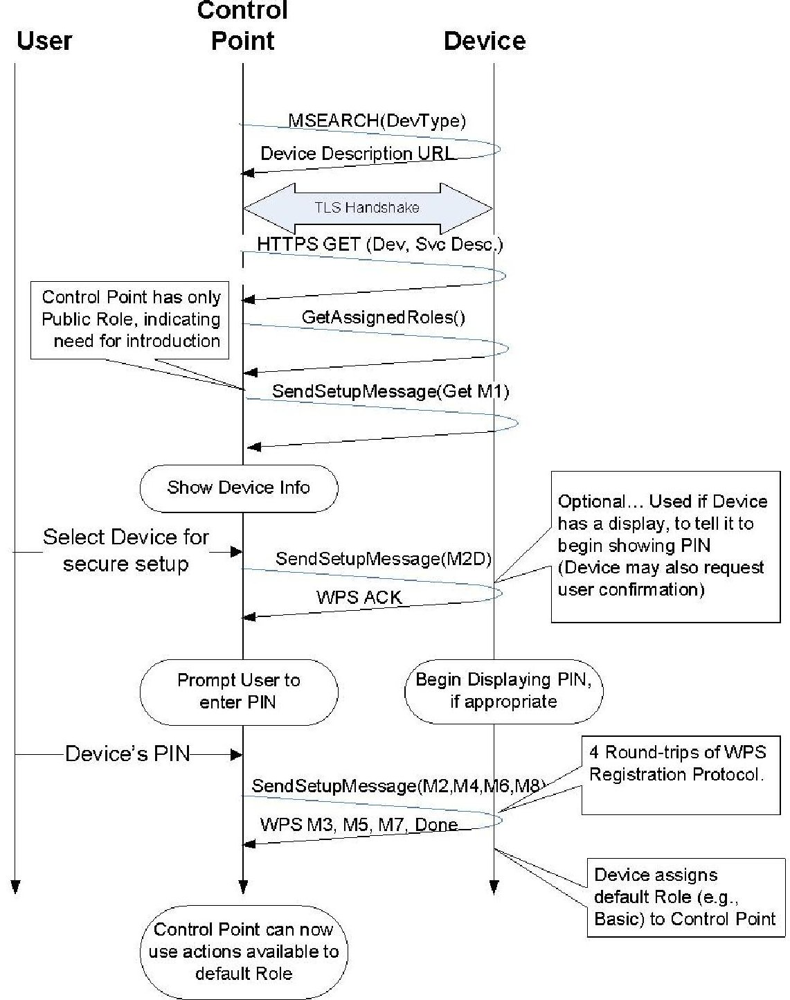
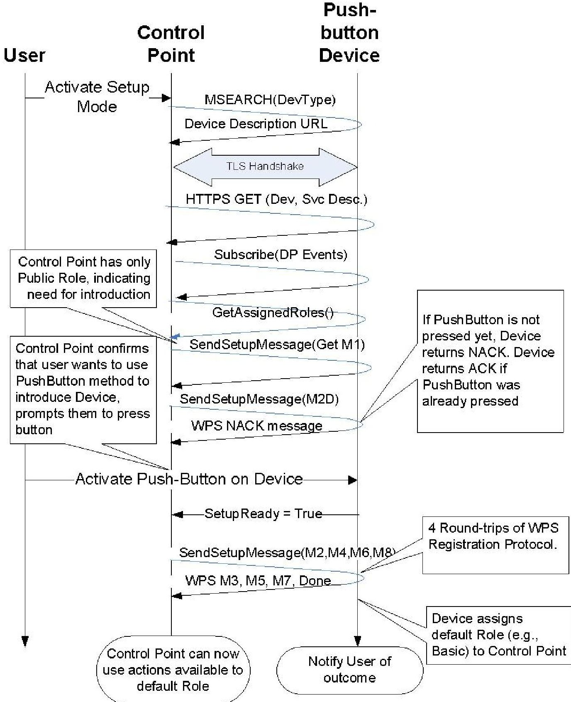
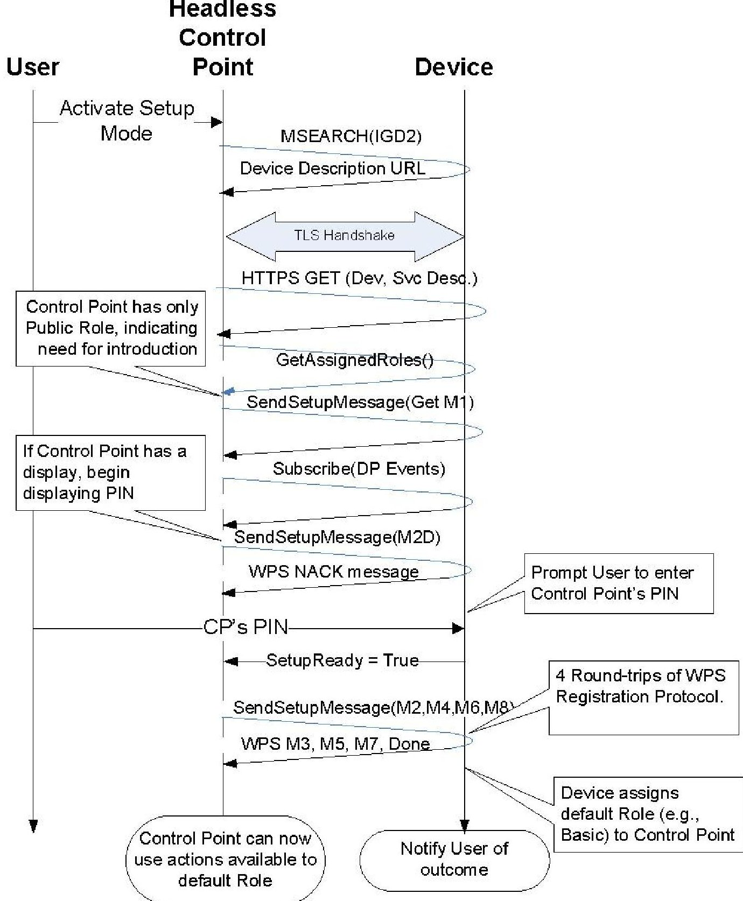
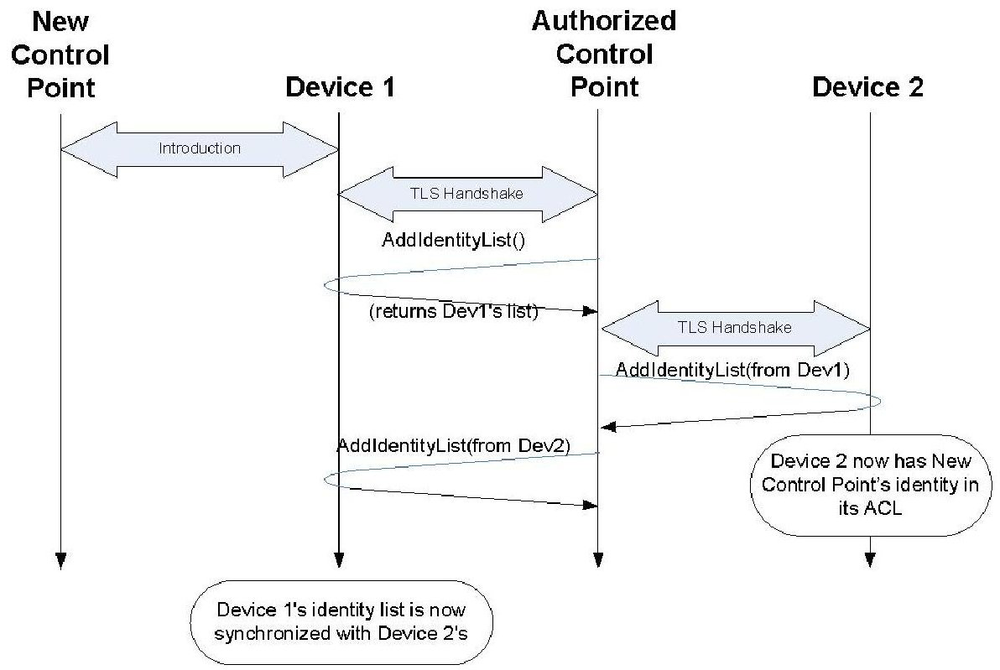
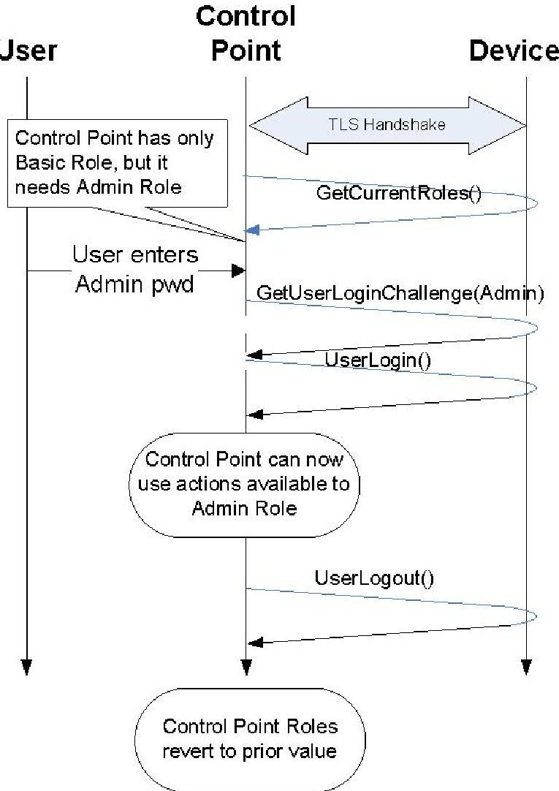
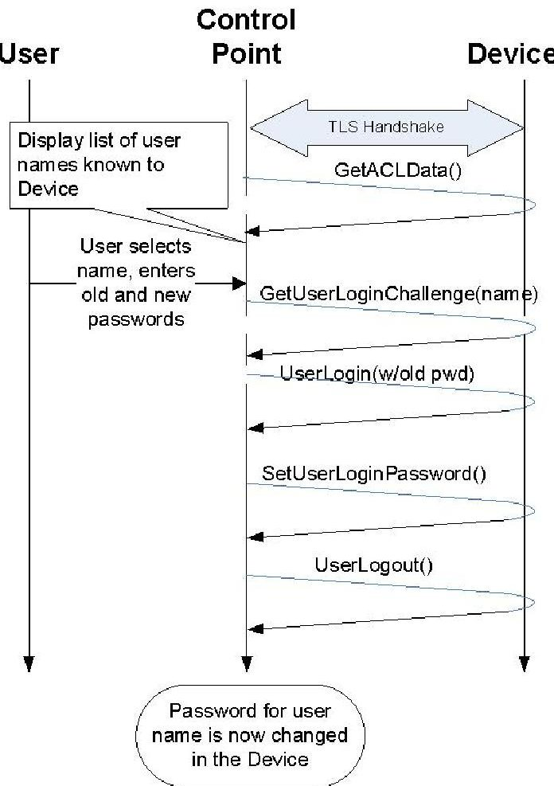
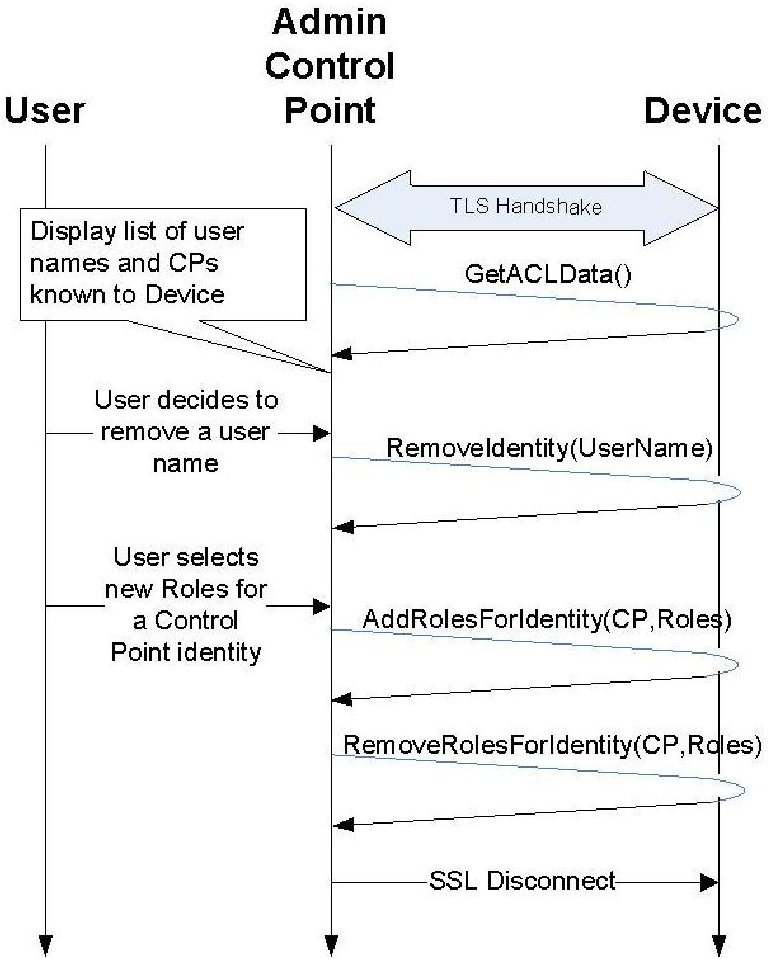

<div align="center">

# DeviceProtection:1 Service

</div>

For UPnP Version 1.0

Status: Standardized DCP (SDCP), Version 1.0

Date: February 24, 2011

Service Template Version: 2.00

This Standardized DCP has been adopted as a Standardized DCP by the Steering Committee of the UPnP Forum, pursuant to Section 2.1(c)(ii) of the UPnP Forum Membership Agreement. UPnP Forum Members have rights and licenses defined by Section 3 of the UPnP Forum Membership Agreement to use and reproduce the Standardized DCP in UPnP Compliant Devices. All such use is subject to all of the provisions of the UPnP Forum Membership Agreement.

THE UPNP FORUM TAKES NO POSITION AS TO WHETHER ANY INTELLECTUAL PROPERTY RIGHTS EXIST IN THE STANDARDIZED DCPS. THE STANDARDIZED DCPS ARE PROVIDED "AS IS" AND "WITH ALL FAULTS". THE UPNP $ ^{TM} $ FORUM MAKES NO WARRANTY, EXPRESS, IMPLIED, STATUTORY, OR OTHERWISE WITH RESPECT TO THE STANDARDIZED DCPS, INCLUDING BUT NOT LIMITED TO ALL IMPLIED WARRANTY OF MERCHANTABILITY, NON-INFRINGEMENT AND FITNESS FOR A PARTICULAR PURPOSE, OF REASONABLE CARE OR WORKMANLIKE EFFORT, OR RESULTS OR OF LACK OF NEGLIGENCE.

$ \textcircled{c} $ 2011 UPnP Forum. All rights reserved.

<table border="1"><tr><td>Authors *</td><td>Company</td></tr><tr><td>Vic Lortz (Security TF Chair)</td><td>Intel Corporation</td></tr><tr><td>Mika Saaranen (Gateway WC chair)</td><td>Nokia Corporation</td></tr></table>

## Contents

Contents

Contents...2

List of Tables...4

List of Figures...5

1 Overview and Scope...6

1.1 Introduction...6

    1.1.1 Motivation for Updating the UPnP Security Framework...6

    1.1.2 This service provides control points with the following functionality:...6

    1.1.3 This service does not provide the following functionality:...7

1.2 Access Control Model...7

1.3 Notation...7

    1.3.1 Data Types...8

1.4 Vendor-defined Extensions...8

1.5 References...9

    1.5.1 Normative References...9

    1.5.2 Informative References...10

2 Service Modeling Definitions (Normative)...11

2.1 Service Type...11

2.2 Terms and Abbreviations...11

    2.2.1 Abbreviations...11

    2.2.2 Terms...12

2.3 DeviceProtection Service Architecture...12

    2.3.1 Device Discovery and Control Layer Security...13

    2.3.2 Scope of DeviceProtection Access Control Policy...14

    2.3.3 Case Sensitivity of Names...14

    2.3.4 TLS Renegotiation Attack Protection...14

2.4 State Variables...14

    2.4.1 State Variable Overview...14

    2.4.2 SetupReady...14

    2.4.3 SupportedProtocols...15

    2.4.4 A_ARG_TYPE_ACL...16

    2.4.5 A_ARG_TYPE_IdentityList...19

    2.4.6 A_ARG_TYPE_Identity...20

2.5 Eventing and Moderation...22

2.6 Actions...22

    2.6.1 SendSetupMessage()...23

    2.6.2 GetSupportedProtocols()...24

    2.6.3 GetAssignedRoles()...25

    2.6.4 GetRolesForAction()...26

    2.6.5 GetUserLoginChallenge()...27

    2.6.6 UserLogin()...29

    2.6.7 UserLogout()...31

    2.6.8 GetACLData()...32

    2.6.9 AddIdentityList()...34

2.6.10 **RemoveIdentity()** ...36

2.6.11 **SetUserLoginPassword()** ...37

2.6.12 **AddRolesForIdentity()** ...38

2.6.13 **RemoveRolesForIdentity()** ...40

2.6.14 Relationships Between Actions ...41

2.6.15 Error Code Summary ...42

2.7 Service Behavioral Model ...42

3 Theory of Operation (Informative) ...46

3.1 Determining Roles Required for Actions ...46

3.2 Obtaining a Certificate ...46

3.3 Obtaining Required Role(s) ...47

3.3.1 Scenario 1: Control Point Initial Introduction for Role(s) ...48

3.3.2 Scenario 2: Push-Putton Control Point Introduction ...48

3.3.3 Scenario 3: Headless Control Point PIN Introduction ...49

3.4 Indirect Control Point Introduction ...50

3.5 Gaining Administrative Privileges ...51

3.6 Changing User Login Passwords ...52

3.7 Managing Roles of Identities ...53

4 XML Service Description ...55

Appendix A. Wi-Fi Protected Setup Introduction Protocol (Normative) ...62

Appendix B. Security Considerations (Informative) ...65

4.1 Discovery and Description ...65

4.2 Control ...66

4.3 Eventing ...67

4.4 Presentation ...67

## List of Tables

List of Tables

Table 2-1: Abbreviations...11

Table 2-2: DeviceProtection SSDP extension header...13

Table 2-3: State Variables...14

Table 2-4: Eventing and Moderation...22

Table 2-5: Actions...22

Table 2-6: Arguments for SendSetupMessage()...23

Table 2-7: Error Codes for SendSetupMessage()...24

Table 2-8: Arguments for GetSupportedProtocols()...24

Table 2-9: Error Codes for GetSupportedProtocols()...25

Table 2-10: Arguments for GetAssignedRoles()...25

Table 2-11: Error Codes for GetAssignedRoles()...26

Table 2-12: Arguments for GetRolesForAction()...26

Table 2-13: Error Codes for GetRolesForAction()...27

Table 2-14: Arguments for GetUserLoginChallenge()...27

Table 2-15: Error Codes for GetUserLoginChallenge()...29

Table 2-16: Arguments for UserLogin()...29

Table 2-17: Error Codes for UserLogin()...31

Table 2-18: Error Codes for UserLogout()...31

Table 2-19: Arguments for GetACLData()...32

Table 2-20: Error Codes for GetACLData()...34

Table 2-21: Arguments for AddIdentityList()...34

Table 2-22: Error Codes for AddIdentityList()...36

Table 2-23: Arguments for RemoveIdentity()...36

Table 2-24: Error Codes for RemoveIdentity()...37

Table 2-25: Arguments for SetUserLoginPassword()...37

Table 2-26: Error Codes for SetUserLoginPassword()...38

Table 2-27: Arguments for AddRolesForIdentity()...39

Table 2-28: Error Codes for AddRolesForIdentity()...40

Table 2-29: Arguments for RemoveRolesForIdentity()...40

Table 2-30: Error Codes for RemoveRolesForIdentity()...41

Table 2-31: Error Code Summary...42

Table 2-32: Connection and Authentication Sequence Table ...43

## List of Figures

Figure 3-1: Default WPS-based Introduction. ...48

Figure 3-2: Push-Button Control Point Introduction. ...49

Figure 3-3: Headless Control Point Introduction. ...50

Figure 3-4: Identity Data Synchronization. ...51

Figure 3-5: Gaining Administrative Privileges. ...52

Figure 3-6: Editing a Login Password. ...53

Figure 3-7: Managing Roles and Identities. ...54

## 1 Overview and Scope

This service definition is compliant with the UPnP Device Architecture version 1.0. It defines a service type referred to herein as DeviceProtection.

## 1.1 Introduction

The DeviceProtection:1 service is intended to provide roughly equivalent functionality to UPnP Security 1.0. The goal in introducing this new service is to address a variety of issues that have inhibited deployment of the earlier design in the industry. A brief overview of the motivation and requirements of this specification are given below.

## 1.1.1 Motivation for Updating the UPnP Security Framework

The UPnP Security DCP version 1.0 was published by the UPnP Forum in November, 2003. Since that time, product support and deployment of this standard has been extremely limited. A variety of factors have contributed to the lack of support:

- The user experience of the setup process was considered by some as too complex and cumbersome.

- Some of the advanced UPnP Security features depended upon security standards such as SPKI that were not widely supported in the industry.

- The UPnP Security 1.0 model is based on a "3 box" approach, requiring presence of a Security Console with a rich user interface. This dependency is a significant deployment obstacle.

- Lack of consensus within the UPnP Forum regarding deployment of UPnP Security increased the risks and reduced the benefits of implementation in products.

In addition to these issues, the following developments have occurred since the 1.0 release that have been taken into account in the new design.

- Wi-Fi networks have become prevalent in homes, and a new standard for setting them up securely has been established. This new standard, called Wi-Fi Protected Setup [WPS], is based on a simpler user experience than UPnP Security 1.0. The rapid adoption of WPS indicates that manufacturers believe the user experience of WPS is acceptable to the broad market.

- The DLNA has identified several new scenarios requiring security that have increased the urgency of developing a deployable framework for security in UPnP.

- New threats have emerged against home devices based on active attacks launched by malicious websites through browser extensions on home PCs.

- UPnP services for remote access to UPnP networks is being standardized based on VPN technology. This development provides an alternative approach to supporting secure remote access to UPnP devices.

## 1.1.2 This service provides control points with the following functionality:

- Device and Service Description - Security-aware Control Points can securely retrieve Device and service descriptions based on an SSDP extension header.

- Initial Introduction - Security-aware Control Points can securely introduce themselves to Devices and thereby establish basic access privileges for their Control Point Identity.

- Device and Control Point Authentication - Device authentication to the Control Point is accomplished via an X.509 server peer certificate exchanged in a TLS handshake. Control Point authentication to a device is accomplished via an X.509 client peer certificate exchanged in a TLS handshake. The certificate chains exchanged in the handshake are NOT required to be signed by a commercial Certificate Authority with well-known keys. Instead, it is expected that

Devices and Control Points will generate their own CA certificates. The DeviceProtection security model derives its trust basis from local peer-to-peer introduction procedures rather than pre-configured roots of trust. A Device implementation may support a more complex model that takes into account the certificate issuer in access control decisions. However, DeviceProtection does not provide any mechanisms for expressing or establishing access control policies based on trusted CAs. Therefore, access control policies based on trusted CA roots and longer certificate chains (which would require a separate TLS handshake) are outside the scope of DeviceProtection.

- User Authentication-A user can establish their username/password identity over a previously established TLS connection authenticated using Device and Control Point certificates.

- Privacy and integrity protection for SOAP services and Presentation Pages - Privacy and integrity protection is provided at the HTTPS transport level using standard TLS.

- Examination and manipulation of access control policy - an authenticated and authorized Control Point can read and configure a Device's access control policy for Control Point and/or User Identities.

- Enumeration of Roles supported by Devices - Roles are names associated with a set of access rights. When a Role or set of Roles is assigned to a Control Point Identity or User Identity, that identity is granted access rights associated with the Role(s).

## 1.1.3 This service does not provide the following functionality:

Explicit non-goals of the DeviceProtection service include:

- Platform security for UPnP devices - DeviceProtection does not address problems relating to internal compromise of the integrity of trusted devices.

- Digital rights management - DeviceProtection does not address enforcement of copy protection restrictions on digital media or other digital content.

- Code base trust - similar to platform security. DeviceProtection does not address problems associated with downloading, hosting, or verifying the integrity of code that generates UPnP messages.

- Application-specific security needs - DeviceProtection provides a set of mechanisms, but each device or application is responsible for deciding how to apply these mechanisms to solve domain-specific problems. For example, other UPnP DCPs may define their own specific requirements for using DeviceProtection.

- Policing/verification of security policy enforcement.

## 1.2 Access Control Model

The DeviceProtection access control model is based on an access control list (ACL) that assigns Device specific and service-specific Roles to Control Point and User Identities. Each Device maintains its own ACL, and there is no explicit support for automatically sharing or synchronizing ACLs across multiple Devices. Roles correspond to permissions to perform specific SOAP actions. The required Roles to perform an action MAY depend upon the values of arguments passed to the action. UPnP service specifications SHOULD include documentation of RECOMMENDED Roles to perform actions, but Devices MAY ignore those recommendations. Therefore, DeviceProtection also provides the ability to query a Device to discover the Roles required to perform specific actions. DeviceProtection uses its own services to prevent unauthorized modifications of the ACL.

## 1.3 Notation

- In this document, features are described as Required, Recommended, or Optional as follows:

The key words "MUST," "MUST NOT," "REQUIRED," "SHALL," "SHALL NOT," "SHOULD," "SHOULD NOT," "RECOMMENDED," "MAY," and "OPTIONAL" in this specification are to be interpreted as described in [RFC 2119].

In addition, the following keywords are used in this specification:

PROHIBITED - The definition or behavior is an absolute prohibition of this specification. Opposite of REQUIRED.

CONDITIONALLY REQUIRED - The definition or behavior depends on a condition. If the specified condition is met, then the definition or behavior is REQUIRED, otherwise it is PROHIBITED.

CONDITIONALLY OPTIONAL - The definition or behavior depends on a condition. If the specified condition is met, then the definition or behavior is OPTIONAL, otherwise it is PROHIBITED.

These keywords are thus capitalized when used to unambiguously specify requirements over protocol and application features and behavior that affect the interoperability and security of implementations. When these words are not capitalized, they are meant in their natural-language sense.

- Strings that are to be taken literally are enclosed in "double quotes".

- Words that are emphasized are printed in italic.

- Keywords that are defined by the UPnP Working Committee are printed using the forum character style.

- Keywords that are defined by the UPnP Device Architecture are printed using the arch character style.

- A double colon delimiter, "::", signifies a hierarchical parent-child (parent::child) relationship between the two objects separated by the double colon. This delimiter is used in multiple contexts, for example: Service::Action(), Action()::Argument, parentProperty::childProperty.

## 1.3.1 Data Types

This specification uses data type definitions from two different sources. The UPnP Device Architecture defined data types are used to define state variable and action argument data types [DEVICE]. The XML Schema namespace is used to define property data types [XML SCHEMA-2].

For UPnP Device Architecture defined Boolean data types, it is strongly RECOMMENDED to use the value "0" for false, and the value "1" for true. The values "true", "yes", "false", or "no" MAY also be used but are NOT RECOMMENDED. The values "yes" and "no" are deprecated and MUST NOT be sent out by devices but MUST be accepted on input.

For XML Schema defined Boolean data types, it is strongly RECOMMENDED to use the value "0" for false, and the value "1" for true. The values "true", "yes", "false", or "no" MAY also be used but are NOT RECOMMENDED. The values "yes" and "no" are deprecated and MUST NOT be sent out by devices but MUST be accepted on input.

## 1.4 Vendor-defined Extensions

Whenever vendors create additional vendor-defined state variables, actions or properties, their assigned names and XML representation MUST follow the naming conventions and XML rules as specified in [DEVICE], Section 2.5, "Description: Non-standard vendor extensions".

## 1.5 References

## 1.5.1 Normative References

This section lists the normative references used in this specification and includes the tag inside square brackets that is used for each such reference:

[DEVICE] - UPnP Device Architecture, version 1.0, UPnP Forum, October 15, 2008. Latest version available at: http://www.upnp.org/specs/arch/UPnP-arch-DeviceArchitecture-v1.0.pdf.

[PKCS#5] - PKCS #5 v2.0: Password-Based Cryptography Standard, March 25, 1999 Available at: ftp://ftp.rsasecurity.com/pub/pkcs/pkcs-5v2/pkcs5v2-0.pdf.

[ISO 8601] - Data elements and interchange formats - Information interchange -- Representation of dates and times, International Standards Organization, December 21, 2000. Available at: ISO 8601:2000.

[RFC 2119] - IETF RFC 2119, Key words for use in RFCs to Indicate Requirement Levels, S. Bradner March 1997.Available at: http://tools.ietf.org/html/rfc2119.

[RFC 3339] - IETF RFC 3339, Date and Time on the Internet: Timestamps, G. Klyne, Clearswift Corporation, C. Newman, Sun Microsystems, July 2002. Available at: http://tools.ietf.org/html/rfc3339.

[SHA-256] - FIPS Secure Hash Standard, August 1, 2002. Available at: http://csrc.nist.gov/publications/fips/fips180-2/fips180-2.pdf.

[RFC 4279] - IETF RFC 4279, Pre-Shared Key Ciphersuites for Transport Layer Security (TLS), P. Eronen, H. Tschofenig, December 2005. Available at: http://tools.ietf.org/html/rfc4279.

[RFC 5280] - IETF RFC 5280, Internet X.509 Public Key Infrastructure Certificate and Certificate Revocation List (CRL) Profile, D. Cooper, S. Santesson, S. Farrell, S. Boeyen, R. Housley, W. Polk, May 2008. Available at: http://tools.ietf.org/html/rfc5280.

[RFC 4122] - IETF RFC 4122, A Universally Unique Identifier (UUID) URN Namespace, P. Leach, M. Mealling, R. Salz, July 2005. Available at: http://tools.ietf.org/html/rfc4122.

[RFC 2246] - IETF RFC 2246, The TLS Protocol Version 1.0, T. Dierks, C. Allen, January 1999 Available at: http://tools.ietf.org/html/rfc2246.

[RFC 5746] - IETF RFC 5746, Transport Layer Security (TLS) Renegotiation Indication Extension, E. Rescorla, M. Ray, S. Dispensa, N. Oskov, February 2010. Available at: http://tools.ietf.org/html/rfc5746.

[RFC 3629] - IETF RFC 3629, UTF-8, a transformation of ISO 10646, F. Yergeau, November 2003 Available at: http://tools.ietf.org/html/rfc3629.

[WPS] - Wi-Fi Protected Setup Version 1.0h, December, 2006 Available at: http://www.wi-fi.org/wifi-protected-setup.

[XML] - Extensible Markup Language (XML) 1.0 (Third Edition), François Yergeau, Tim Bray, Jean Paoli, C. M. Sperberg-McQueen, Eve Maler, eds., W3C Recommendation, February 4, 2004. Available at: http://www.w3.org/TR/2004/REC-xml-20040204.

[XML SCHEMA-2] - XML Schema Part 2: Data Types, Second Edition, Paul V. Biron, Ashok Malhotra, W3C Recommendation, 28 October 2004. Available at: http://www.w3.org/TR/2004/REC-xmlschema-2-20041028.

## 1.5.2 Informative References

This section lists the informative references that are provided as information in helping understand this specification:

[DEVICE SECURITY] - DeviceSecurity:1, UPnP Forum, November 17, 2003.

Available at: http://www.upnp.org/specs/sec/UPnP-sec-DeviceSecurity-v1-Service.pdf

[SECURITY CONSOLE] - SecurityConsole:1, UPnP Forum, November 17, 2003.

Available at: http://www.upnp.org/specs/sec/UPnP-sec-SecurityConsole-v1-Service.pdf

## 2 Service Modeling Definitions (Normative)

## 2.1 Service Type

The following service type identifies a service that is compliant with this specification:

urn:schemas-upnp-org:service:DeviceProtection:1DeviceProtection:1

DeviceProtection service is used herein to refer to this service type.

## 2.2 Terms and Abbreviations

## 2.2.1 Abbreviations

<div align="center">

Table 2-1: Abbreviations

</div>

<table border="1"><tr><td>Abbreviation</td><td>Description</td></tr><tr><td>ACL</td><td>Access Control List</td></tr><tr><td>CA</td><td>X.509 Certificate Authority</td></tr><tr><td>CN</td><td>Common Name</td></tr><tr><td>CP</td><td>Control Point</td></tr><tr><td>DCP</td><td>Device Control Protocol</td></tr><tr><td>DLNA</td><td>Digital Living Network Alliance</td></tr><tr><td>HMAC-SHA-256</td><td>A cryptographic hash algorithm that uses a secret key</td></tr><tr><td>HTTPS</td><td>HyperText Transfer Protocol Secured</td></tr><tr><td>PRF</td><td>A pseudo random function</td></tr><tr><td>PSK</td><td>Pre-Shared Key</td></tr><tr><td>SHA-256</td><td>A cryptographic hash algorithm</td></tr><tr><td>SOAP</td><td>Simple Object Access Protocol</td></tr><tr><td>SPKI</td><td>Simple Public Key Infrastructure</td></tr><tr><td>SSDP</td><td>Simple Service Discovery Protocol</td></tr><tr><td>TLS</td><td>Transport Layer Security [RFC 2246]</td></tr><tr><td>UCS</td><td>Universal Character Set</td></tr><tr><td>UDA</td><td>UPnP Device Architecture</td></tr><tr><td>URL</td><td>Uniform Resource Locator</td></tr><tr><td>URN</td><td>Unique Resource Name</td></tr><tr><td>UTF-8</td><td>UCS Transformation Format 8 bits</td></tr><tr><td>UUID</td><td>Universally Unique IDentifier</td></tr><tr><td>VPN</td><td>Virtual Private Network</td></tr><tr><td>WPS</td><td>Wi-Fi Protected Setup</td></tr><tr><td>X.509</td><td>An ITU-T standard for a public key infrastructure. DeviceProtection requires use of X.509v3 as specified in [RFC 5280].</td></tr></table>

<table border="1"><tr><td>Abbreviation</td><td>Description</td></tr><tr><td>XML</td><td>eXtensible Markup Language</td></tr></table>

## 2.2.2 Terms

## 2.2.2.1 Device Identity (certificate Identity)

A Device Identity is the identity of a UPnP Device that implements the DeviceProtection service. A Device Identity is a UUID value derived from a hash of the Device's X.509 server peer certificate (not the CA certificate), in accordance with the algorithm given in Section 4.3 of [RFC 4122]. See Section 2.6.8.2 of this specification for detailed information regarding deriving Device Identity UUIDs. The same UUID value MAY be used for both the Device Identity and the normal UPnP Device UUID, but this is NOT required.

## 2.2.2.2 Control Point Identity (certificate Identity)

A Control Point Identity (also referred to as its certificate Identity) is a UUID value derived from a hash of the Control Point's X.509 client peer certificate (not the CA certificate), in accordance with the algorithm given in Section 4.3 of [RFC 4122]. See Section 2.6.8.2 of this specification for additional information.

## 2.2.2.3 Certificate Exchange

During the TLS handshake, both Control Point and Device authenticate by exchanging X.509 certificates. Both the Device and Control Point (TLS server and client) MUST provide certificates. A complete certificate chain with length 2 MUST be provided. This means the chain MUST include a self-signed root certificate and either a server or client certificate (for the Device and Control Point, respectively).

The certificates MUST be X.509 v3 certificates with an RSA key of either 1024 bits or 2048 bits.

## 2.2.2.4 User Identity

The identity of a human user operating a Control Point. User identities consist ofUsername/Password pairs.

## 2.2.2.5 Role

A name used to identify a set of access rights. When a Role is assigned to a Control Point Identity or User Identity, that identity is granted access rights associated with the Role. Vendor-specific Name

A Vendor-specific Name is a name of a DeviceProtection entity such as a Role that is prefixed with a Vendor Domain Name followed by a colon (such as "example.com:"). The Domain Name component protects against name collisions and resulting ambiguity of interpretation.

## 2.2.2.6 Introduction Protocol

An Introduction Protocol is a protocol designed to support an initial exchange of cryptographic data that can be used subsequently for secure communications.

## 2.2.2.7 Identity List

An Identity List is a data structure containing a list of references to Control Point and User Identities.

## 2.3 DeviceProtection Service Architecture

This service is designed to be embedded in any device type that exposes sensitive information or UPnP control operations that need to be protected from unauthorized access. Other DCPs and standardization forums (for example, the DLNA) should develop Security Considerations for DCPs to document security risks and specify requirements associated with their services, including use of DeviceProtection. This documentation should also specify the access control levels (Roles) required to use their functionality. The generic DeviceProtection service defines three Roles for its own use (Public, Basic, and Admin). Other

DCPs and device vendors are free to re-use the Roles defined by DeviceProtection and/or define additional Roles as needed. Any Control Point is implicitly considered to have role Public in addition to any other Roles that are explicitly assigned to it.

DeviceProtection is designed to allow a device to expose some parts of its services to legacy and unauthenticated Control Points and restrict other parts to only authenticated and authorized Control Points. A Device can also simultaneously support both types of Control Points. UPnP actions that require authenticated access MUST be accessible ONLY via HTTPS URLs. Publicly-available actions MUST be accessible over both HTTPS and legacy HTTP URLs. For DeviceProtection:1, TLS version 1.0 [RFC 2246] MUST be supported. A Control Point and Device are also permitted to negotiate and use a more recent version of TLS, if both sides support it.

## 2.3.1 Device Discovery and Control Layer Security

DeviceProtection does not provide any security for the SSDP protocol itself. An active attacker on the network can make his rogue device discoverable and can try to prevent discovery of legitimate devices. However, the DeviceProtection architecture can protect the device and service discovery and control actions performed subsequent to SSDP.

To add security while preserving compatibility with legacy Control Points, root Devices and embedded Devices that directly contain the DeviceProtection service MUST include the SSDP extension header SECURELOCATION.UPNP.ORG in addition to the normal SSDP LOCATION URL. Both of these URLs MUST point to the same device description document but with different port numbers. Relative URLs MUST be used in the device description document, and this document MUST NOT include a URLBase element.

If a root Device does NOT contain DeviceProtection, but an embedded Device within it does contain DeviceProtection, then the root Device is NOT required to include SECURELOCATION.UPNP.ORG. However, if any containing Device includes the DeviceProtection service, then all embedded Devices within it are also required to include SECURELOCATION.UPNP.ORG, even if those embedded Devices themselves do not include the DeviceProtection service. The DeviceProtection service and associated ACL of the closest containing Device determines access control for the services of an embedded Device, as described in Section 2.3.2.

The SECURELOCATION.UPNP.ORG header MUST provide a base URL with "https:" for the scheme component and indicate the correct "port" subcomponent in the "authority" component for a TLS connection. Because the scheme and authority components are not included in relative URLs, these components are obtained from the base URL provided by either LOCATION or

SECURELOCATION.UPNP.ORG. Thus, the same device description document can be used for both unsecure and secure control points.

Security-aware Control Points SHOULD use the URL from the header SECURELOCATION.UPNP.ORG to retrieve the device description document and service description documents over TLS. Control Points MUST use the base URL from SECURELOCATION.UPNP.ORG combined with a relative ControlURL to invoke protected actions.

When a protected action is invoked, a Device MAY return different argument values from actions depending upon the Role(s) currently assigned to the CP. For example, a Device MAY return different or more complete data to a CP with administrative rights than a normal CP even though they both successfully invoke the same action. The DeviceProtection service itself does not specify Role-dependent return values, but other DCPs are permitted to do so.

<div align="center">

Table 2-2: DeviceProtection SSDP extension header

</div>

<table border="1"><tr><td>Header</td><td>Value</td><td>Description</td></tr><tr><td>SECURELOCATION.UPNP.ORG</td><td>Single URL</td><td>Same syntax and semantics asLOCATIONheaderexcept theURLMUSThaveanhttps:prefix</td></tr></table>

## 2.3.2 Scope of DeviceProtection Access Control Policy

Each instance of the DeviceProtection service maintains a corresponding access control policy expressed in an Access Control List (ACL) that applies to the DeviceProtection service and other services within the same root Device or embedded Device. The ACL for an access-controlled service MUST be kept in the closest DeviceProtection service in the Device hierarchy. For example, if an embedded Device contains a DeviceProtection service, all other services in that embedded Device are governed by the ACL of that service. If an embedded Device does not contain a DeviceProtection service, then the ACL for services in that embedded Device MUST be placed in the closest containing Device or root Device.

## 2.3.3 Case Sensitivity of Names

Comparisons of the names of Protocols (such as WPS), User Identities, Passwords, and Roles are case-sensitive.

## 2.3.4 TLS Renegotiation Attack Protection

TLS Version 1.0 is known to be vulnerable to a man-in-the-middle attack that uses TLS session renegotiation to inject attack code. A technical description of the attack and mitigation approaches may be found at http://www.kb.cert.org/vuls/id/120541 and [RFC 5746]. For DeviceProtection, the Device MUST reject all requests for TLS renegotiation and SHOULD respond to such requests with a "no_renegotiation" alert. Enforcing this policy will protect against the attack. In the future, it is expected that mitigation strategies such as that described in [RFC 5746] will allow renegotiation to be safely supported again in the TLS standard and likewise with DeviceProtection.

## 2.4 State Variables

Note: For first-time reader, it may be more insightful to read the theory of operations in Section 3 first and then the action definitions before reading the state variable definitions.

## 2.4.1 State Variable Overview

<div align="center">

Table 2-3: State Variables

</div>

<table border="1"><tr><td>Variable Name</td><td>R/O1</td><td>Data Type</td><td>Reference</td></tr><tr><td>SetupReady</td><td>R</td><td>boolean</td><td>See Section 2.4.2</td></tr><tr><td>SupportedProtocols</td><td>R</td><td>string</td><td>See Section 2.4.3</td></tr><tr><td>A_ARG_TYPE_ACL</td><td>R</td><td>string</td><td>See Section 2.4.4</td></tr><tr><td>A_ARG_TYPE_IdentityList</td><td>R</td><td>string</td><td>See Section 2.4.5</td></tr><tr><td>A_ARG_TYPE_Identity</td><td>R</td><td>string</td><td>See Section 2.4.6</td></tr><tr><td>A_ARG_TYPE_Base64</td><td>R</td><td>bin.base64</td><td></td></tr><tr><td>A_ARG_TYPE_String</td><td>R</td><td>string</td><td></td></tr></table>

$ ^{1} \underline{R}=\mathrm{R E Q U I R E D}, \underline{O}=\mathrm{O P T I O N A L}, \underline{C R}=\mathrm{C O N D I T I O N A L L Y R E Q U I R E D}, \underline{C O}=\mathrm{C O N D I T I O N A L L Y}$ OPTIONAL, $ \underline{X}=\mathrm{N o n - s t a n d a r d}, \mathrm{a d d} \underline{-D} $ when deprecated (e.g., $ \underline{R-D}, \underline{O-D} $).

## 2.4.2 SetupReady

This evented state variable is used to signal the Control Point when the Device is ready to proceed with a setup operation.

## 2.4.2.1 Description

If SetupReady is 0 (false), this indicates that the device is busy or requires some user input before being ready to proceed with a setup operation. Specific details regarding what the user should do at this point are not indicated by SetupReady. Instead, the Control Point can obtain protocol-specific status information by invoking SendSetupMessage(). When conditions have changed such that the Device is ready to proceed with a setup operation, it signals this to the Control Point by changing SetupReady to 1 (true). Note that even if SetupReady is 1 (true), this is no guarantee that the setup operation will succeed. The CP should simply use changes in the state of SetupReady as input to help it decide when to invoke SendSetupMessage().

If a Device determines that it is not ready to run a setup protocol that is being attempted by a CP, then it MUST signal this situation by setting SetupReady to 0 (false). If multiple concurrent setup operations are underway, then the value of SetupReady reflects the most recent status change corresponding to any of those operations. This introduces a degree of ambiguity in the interpretation of SetupReady, and this ambiguity is an intentional choice to simplify the design. The likelihood of such conflicts is expected to be very low, and a CP MUST in any case be designed to operate correctly if SetupReady does not provide a reliable indication of when to attempt a setup operation. The CP SHOULD only treat SetupReady as a hint that can help it avoid polling or otherwise burdening the Device with excessive calls to SendSetupMessage().

For example, if a CP attempts to perform a WPS introduction with a Device and receives a WPS DeviceBusy error (NACK) via SendSetupMessage(), the CP SHOULD reflect this status in its user interface and wait until SetupReady becomes true before trying again to run WPS. Please refer to Figure 3-3 for an example.

Note also that a CP MAY choose to ignore the value of SetupReady and use some other method (such as a timer or user input) to decide when to invoke a setup operation.

## 2.4.3 SupportedProtocols

## 2.4.3.1 Description

This state variable is an XML document containing a list of protocols supported by the Device. Each protocol advertised in this way consists of one or more protocol type element <Introduction> and one or more elements <Login>, each with an embedded <Name> element. An <Introduction> element with the <Name> element of "WPS" MUST always be included. A <Login> element with the <Name> element of "PKCS5" MUST always be included. Additional <Introduction> and <Login> elements MAY be included. The ordering of the sub-elements is arbitrary, and CPs MUST NOT depend upon the ordering. Note that protocol names are case-sensitive.

Additional elements MAY also be included within <SupportedProtocols>. The ordering of the subelements is arbitrary, and CPs MUST NOT depend upon the ordering.

The following example shows a generalized "template" for the format of the SupportedProtocols XML Document. The example shows fields that need to be filled out by individual implementations in the vendor character style.

```xml

<?xml version="1.0" encoding="UTF-8"?>

<SupportedProtocols xmlns="urn:schemas-upnp-org:gw:DeviceProtection"

xmlns:xsi="http://www.w3.org/2001/XMLSchema-instance"

xsi:schemaLocation="urn:schemas-upnp-org:gw:DeviceProtection

http://www.upnp.org/schemas/gw/DeviceProtection-v1.xsd">

  <Introduction><Name>WPS</Name></Introduction>

  <Introduction><Name>Vendor-specific protocol</Name></Introduction>

  <Login><Name>PKCS5</Name></Login>

  <Login><Name>Vendor-specific protocol</Name></Login>

</SupportedProtocols>

```

OPTIONAL. Case sensitive.

<SupportedProtocols>

REQUIRED. MUST include a namespace declaration for the DeviceProtection service Common Datastructures Schema ("urn:schemas-upnp-org:gw:DeviceProtection"). MUST include the following elements:

<Introduction>

REQUIRED. MUST appear at least once. MUST include exactly one instance of the following element:

<Name>

REQUIRED. The format of this element is a case-sensitive name of the Introduction protocol. The name of the default Introduction protocol defined by the Forum is WPS. Protocol names other than names defined by the Forum MUST be Vendor-specific Names.

<Login>

REQUIRED. MUST appear at least once. MUST include exactly one instance of the following element:

<Name>

REQUIRED. The format of this element is a case-sensitive name of the User Login protocol. The default Login protocol name for DeviceProtection is PKCS5. Login protocol names other than names defined by the Forum MUST be Vendor-specific Names as defined in Section 0.

Note that since the value of SupportedProtocols is XML, it needs to be properly escaped (using the normal XML rules: [XML] Section 2.4 Character Data and Markup) before embedding in a SOAP response message.

```xml

<?xml version="1.0" encoding="UTF-8"?>

<SupportedProtocols xmlns="urn:schemas-upnp-org:gw:DeviceProtection"

xmlns:xsi="http://www.w3.org/2001/XMLSchema-instance"

xsi:schemaLocation="urn:schemas-upnp-org:gw:DeviceProtection

http://www.upnp.org/schemas/gw/DeviceProtection-v1.xsd">

  <Introduction><Name>WPS</Name></Introduction>

  <Introduction><Name>Some.org:SomeProtocol</Name></Introduction>

  <Login><Name>PKCS5</Name></Login>

</SupportedProtocols>

```

## 2.4.4 A ARG TYPE ACL

## 2.4.4.1 Description

This virtual state variable is introduced to provide type information for the ACL argument in the GetACLData() action. This data structure encodes the access control policy of a particular Device. Additional vendor-defined elements MAY also be included within <ACL>.

The following example shows a generalized "template" for the format of the ACL XML Document. The example shows fields that need to be filled out by individual implementations in the vendor character style.

```xml

<?xml version="1.0" encoding="UTF-8"?>

<ACL xmlns="urn:schemas-upnp-org:gw:DeviceProtection"

xmlns:xsi="http://www.w3.org/2001/XMLSchema-instance"

xsi:schemaLocation="urn:schemas-upnp-org:gw:DeviceProtection

http://www.upnp.org/schemas/gw/DeviceProtection-v1.xsd">

  <Identities>

    <User>

      <Name>Name of a user</Name>

      <RoleList>List of Roles for this user</RoleList>

    </User>

  </Identities>

```

<table border="1"><tr><td>&lt;User&gt;</td><td>&lt;Name&gt;Name of a user&lt;/Name&gt;</td></tr><tr><td>&lt;RoleList&gt;List of Roles for this user&lt;/RoleList&gt;</td></tr><tr><td>&lt;/User&gt;</td></tr><tr><td>&lt;CP introduced=&quot;1&quot;&gt;</td><td>&lt;Name&gt;Name in this CP&#x27;s certificate&lt;/Name&gt;</td></tr><tr><td>&lt;Alias&gt;Alias for this CP&lt;/Alias&gt;</td></tr><tr><td>&lt;ID&gt;UUID derived from a hash of this CP&#x27;s certificate&lt;/ID&gt;</td></tr><tr><td>&lt;RoleList&gt;List of Roles for this CP&lt;/RoleList&gt;</td></tr><tr><td>&lt;/CP&gt;</td></tr><tr><td>&lt;CP&gt;</td><td>&lt;Name&gt;Name in this CP&#x27;s certificate&lt;/Name&gt;</td></tr><tr><td>&lt;ID&gt;UUID derived from a hash of this CP&#x27;s certificate&lt;/ID&gt;</td></tr><tr><td>&lt;RoleList&gt;List of Roles for this CP&lt;/RoleList&gt;</td></tr><tr><td>&lt;/CP&gt;</td></tr><tr><td>&lt;/Identities&gt;</td></tr><tr><td>&lt;Roles&gt;</td><td>&lt;Role&gt;</td></tr><tr><td>&lt;Role&gt;</td><td>&lt;Name&gt;Name of Role supported by this implementation&lt;/Name&gt;</td></tr><tr><td>&lt;/Role&gt;</td><td>&lt;Role&gt;</td></tr><tr><td>&lt;Role&gt;</td><td>&lt;Name&gt;Name of Role supported by this implementation&lt;/Name&gt;</td></tr><tr><td>&lt;/Role&gt;</td><td>&lt;Role&gt;</td></tr><tr><td>&lt;/Roles&gt;</td></tr></table>

## </ACL>

## <?xml|>

## <ACL>

OPTIONAL. Case sensitive.

REQUIRED. MUST include a namespace declaration for the DeviceProtection service Common Datastructures Schema ("urn:schemas-upnp-org:gw:DeviceProtection"). MUST include exactly one instance of each of the following elements:

## <Identities>

REQUIRED. MUST appear exactly once. MUST include zero or more instances of the following elements, in arbitrary order:

## <User>

OPTIONAL. Includes the following sub-elements:

## <Name>

REQUIRED. This element contains the name of the User. Spaces are permitted in User names. For comparison purposes, multiple adjacent white space characters are compressed into a single space character.

## <RoleList>

REQUIRED. The format of this element is a space-separated list of Role names. Each Name in this list MUST also be present in exactly one <Name> sub-element of a <Role> in the <Roles> element. Spaces are NOT permitted in Role names.

## <CP>

OPTIONAL. Includes the following attributes and sub-elements:

## introduced

OPTIONAL. Attribute of type xsd:boolean, Indicates whether or not the CP was introduced directly with the Device. A value of "1" (one) indicates that the CP has been directly introduced. A value of "0" (zero) indicates that Device did not learn about the CP's Identity through direct pairwise introduction. If omitted, defaults to "0".

## <Name>

REQUIRED. The format of this element is a string matching that of the CP's certificate.

## <Alias>

OPTIONAL. The format of this element is a supplemental name of the CP that users can set without requiring changes to the CP's certificate.

## < ID >

REQUIRED. Contains a string representation of a UUID derived from a hash of the CP's certificate. The < ID> MUST NOT include a "uuid:" prefix.

## <RoleList>

REQUIRED. The format of this element is a space-separated list of Role names. Each Name in this list MUST also be present in the <Name> sub-element of exactly one <Role> in the <Roles> element list.

## <Roles>

REQUIRED. MUST appear exactly once. MUST include one or more of the following elements:

## <Role>

REQUIRED. This element MUST contain exactly one <Name> sub-element.

## <Name>

REQUIRED. This element contains the name of a Role supported by the Device. Role names MUST NOT contain spaces. Role names not defined by the Forum MUST be prefixed, vendor-specific Names as defined in Section 0. Forum-defined Role names MUST be defined in service specifications and/or DCP-specific security considerations documents published by Working Committees.Role names defined by UPnP Working Committees MUST be prefixed with the WC moniker followed by a colon (for example, "av:"). Role names defined by the DeviceProtection service do not include a prefix. Each Role name MUST have length no longer than 64 characters, including the prefix (if any).

Note that since the value of A_ARG_TYPE_ACL is XML, it needs to be properly escaped (using the normal XML rules: [XML] Section 2.4 Character Data and Markup) before embedding in a SOAP message.

## Example:

```xml

<?xml version="1.0" encoding="UTF-8"?>

<ACL xmlns="urn:schemas-upnp-org:gw:DeviceProtection"

xmlns:xsi="http://www.w3.org/2001/XMLSchema-instance"

xsi:schemaLocation="urn:schemas-upnp-org:gw:DeviceProtection

http://www.upnp.org/schemas/gw/DeviceProtection-v1.xsd">

  <identities>

    <User>

      <Name>Administrator</Name>

      <RoleList>Admin</RoleList>

    </User>

    <User>

      <Name>Mika</Name>

      <RoleList>Basic</RoleList>

    </User>

    <CP introduced="1">

      <Name>ACME Widget Model XYZ</Name>

      <Alias>Mark’s Game Console</Alias>

      <ID>ad93e8f5-634b-4123-80ca-225886a5c0e8</ID>

      <RoleList>Admin Basic</RoleList>

    </CP>

    <CP>

      <Name>Some CP</Name>

```

```html

    <ID>3543d8e6-3b8b-4456-81cb-f12886b5b044</ID>

    <RoleList>Public</RoleList>

  </CP>

</Identities>

<Roles>

    <Role><Name>Admin</Name></Role>

    <Role><Name>Basic</Name></Role>

    <Role><Name>Public</Name></Role>

</Roles>

</ACL>

```

## 2.4.5 A ARG TYPE IdentityList

## 2.4.5.1 Description

This virtual state variable is introduced to provide type information for various action arguments that contain lists of DeviceProtection Identities.

The following example shows a generalized "template" for the format of the Identities XML Document. The example shows fields that need to be filled out by individual implementations in the vendor character style.

```xml

<?xml version="1.0" encoding="UTF-8"?>

<identities xmlns="urn:schemas-upnp-org:gw:DeviceProtection"

xmlns:xsi="http://www.w3.org/2001/XMLSchema-instance"

xsi:schemaLocation="urn:schemas-upnp-org:gw:DeviceProtection

http://www.upnp.org/schemas/gw/DeviceProtection-v1.xsd">

  <User>

    <Name>Name of a user</Name>

  </User>

  <CP introduced="1">

    <Name>Name in this CP’s certificate</Name>

    <Alias>Alias for this CP</Alias>

    <ID>UUID derived from a hash of this CP’s certificate</ID>

  </CP>

  <CP>

    <Name>Name in this CP’s certificate</Name>

    <ID>UUID derived from a hash of this CP’s certificate</ID>

  </CP>

</identities>

```

## <?xml>

OPTIONAL. Case sensitive.

## <Identities>

REQUIRED. MUST include a namespace declaration for the DeviceProtection service Common Datastructures Schema ("urn:schemas-upnp-org:gw:DeviceProtection"). MUST include zero or more instances of the following elements, in arbitrary order:

<User>

OPTIONAL. MUST include exactly one instance of the following elements:

<Name>

REQUIRED. This element contains the name of the User. Spaces are permitted in User names. For comparison purposes, multiple adjacent white space characters are compressed into a single space character.

## introduced

OPTIONAL. xsd:boolean, Indicates whether or not the CP was introduced directly with the Device. A value of "1" (one) indicates that the CP has been directly introduced. A value of "0" (zero) indicates that Device did not learn about the CP's Identity through direct pairwise introduction. If omitted, defaults to "0".

<Name>

REQUIRED. The format of this element is a string matching that of the CP's certificate.

## <Alias>

OPTIONAL. The format of this element is a supplemental name of the CP that users can set without requiring changes to the CP's certificate.


*Identity and certificate data structure*</div>

REQUIRED. Contains a string representation of a UUID corresponding to a hash of the CP's certificate. No "uuid:” prefix is used in the content of the <ID> element.

Note that since the value of A_ARG_TYPE_IdentityList is XML, it needs to be properly escaped (using the normal XML rules: [XML] Section 2.4 Character Data and Markup) before embedding in a SOAP response message.

## Example:

```xml

<?xml version="1.0" encoding="UTF-8"?>

<identities xmlns="urn:schemas-upnp-org:gw:DeviceProtection"

xmlns:xsi="http://www.w3.org/2001/XMLSchema-instance"

xsi:schemaLocation="urn:schemas-upnp-org:gw:DeviceProtection

http://www.upnp.org/schemas/gw/DeviceProtection-v1.xsd">

    <User>

        <Name>Administrator</Name>

    </User>

    <User>

        <Name>Mika</Name>

    </User>

    <CP introduced="1">

        <Name>ACME Widget Model XYZ</Name>

        <Alias>Mark’s Game Console</Alias>

        <ID>ad93e8f5-634b-4123-80ca-225886a5c0e8</ID>

    </CP>

    <CP>

        <Name>Some CP</Name>

        <ID>3543d8e6-3b8b-4456-81cb-f12886b5b044</ID>

    </CP>

</identities>

```

## 2.4.6 A ARG TYPE Identity

## 2.4.6.1 Description

This virtual state variable is introduced to provide type information for various action argument that contain a reference to a DeviceProtection Identity.

The following example shows a generalized "template" for the format of the Identity XML Document. The example shows fields that need to be filled out by individual implementations in the vendor character style.

```xml

<?xml version="1.0" encoding="UTF-8"?>

<Identity xmlns="urn:schemas-upnp-org:gw:DeviceProtection"

xmlns:xsi="http://www.w3.org/2001/XMLSchema-instance"

xsi:schemaLocation="urn:schemas-upnp-org:gw:DeviceProtection

http://www.upnp.org/schemas/gw/DeviceProtection-v1.xsd">

```

```xml

<User>

  <Name>Name of a user</Name>

</User>

</Identity>

or

<?xml version="1.0" encoding="UTF-8"?>

<Identity xmlns="urn:schemas-upnp-org:gw:DeviceProtection"

xmlns:xsi="http://www.w3.org/2001/XMLSchema-instance"

xsi:schemaLocation="urn:schemas-upnp-org:gw:DeviceProtection

http://www.upnp.org/schemas/gw/DeviceProtection-v1.xsd">

  <CP>

    <ID>UUID of the CP’s certificate</ID>

  </CP>

</Identity>

<?xml>

OPTIONAL. Case sensitive.

<Identity>

  REQUIRED. MUST include a namespace declaration for the DeviceProtection service Common Datastructures

Schema (“urn:schemas-upnp-org:gw:DeviceProtection”). MUST include exactly one instance of only one of

the following elements:

<User>

  OPTIONAL. MUST include the following element:

  <Name>

    REQUIRED. This element contains the name of the User. Spaces are permitted in User

names. For comparison purposes, multiple adjacent white space characters are

compressed into a single space character.

<CP>

  OPTIONAL. MUST include the following element:

  <ID>

    REQUIRED. Contains a string representation of a UUID corresponding to a hash of the CP’s

certificate.

```

Note that since the value of A_ARG_TYPE_Identity is XML, it needs to be properly escaped (using the normal XML rules: [XML] Section 2.4 Character Data and Markup) before embedding in a SOAP response message.

```xml

<?xml version="1.0" encoding="UTF-8"?>

<!identity xmlns="urn:schemas-upnp-org:gw:DeviceProtection"

xmlns:xsi="http://www.w3.org/2001/XMLSchema-instance"

xsi:schemaLocation="urn:schemas-upnp-org:gw:DeviceProtection

http://www.upnp.org/schemas/gw/DeviceProtection-v1.xsd">

    <User>

        <Name>Administrator</Name>

    </User>

</Identity>

```

## 2.5 Eventing and Moderation

<div align="center">

Table 2-4: Eventing and Moderation

</div>

<table border="1"><tr><td>Variable Name</td><td>Evented</td><td>Moderated</td><td>Criteria</td></tr><tr><td>SetupReady</td><td>YES</td><td>NO</td><td></td></tr><tr><td>SupportedProtocols</td><td>NO</td><td>NO</td><td></td></tr></table>

## 2.6 Actions

Table 2-5 Table 2-5 lists the SOAP actions of DeviceProtection. Some of these actions are restricted to authenticated Control Points having the Basic and/or Admin Role. The RECOMMENDED Role required for each action is indicated in the table. Device manufacturers are permitted to establish different required Roles for actions, if they choose. Control Points can query the Roles required for specific actions in DeviceProtection or in other UPnP services by calling GetRolesForAction().

<div align="center">

Table 2-5: Actions

</div>

<table border="1"><tr><td>Name</td><td>DeviceR/O1</td><td>Control PointR/O2</td><td>RecommendedRoleList3</td><td>RecommendedRestrictedRoleList4</td></tr><tr><td>SendSetupMessage()</td><td>R</td><td>R</td><td>Public</td><td></td></tr><tr><td>GetSupportedProtocols()</td><td>R</td><td>R</td><td>Public</td><td></td></tr><tr><td>GetAssignedRoles()</td><td>R</td><td>R</td><td>Public</td><td></td></tr><tr><td>GetRolesForAction()</td><td>O</td><td>O</td><td>BasicorAdmin</td><td>Public</td></tr><tr><td>GetUserLoginChallenge()</td><td>O</td><td>O</td><td>BasicorAdmin</td><td>Public</td></tr><tr><td>UserLogin()</td><td>O</td><td>O</td><td>BasicorAdmin</td><td>Public</td></tr><tr><td>UserLogout()</td><td>O</td><td>O</td><td>Public</td><td></td></tr><tr><td>GetACLData()</td><td>O</td><td>O</td><td>BasicorAdmin</td><td>Public</td></tr><tr><td>AddIdentityList()</td><td>O</td><td>O</td><td>BasicorAdmin</td><td></td></tr><tr><td>RemoveIdentity()</td><td>O</td><td>O</td><td>Admin</td><td></td></tr><tr><td>SetUserLoginPassword()</td><td>O</td><td>O</td><td>Admin</td><td>Basic</td></tr><tr><td>AddRolesForIdentity()</td><td>O</td><td>O</td><td>Admin</td><td></td></tr><tr><td>RemoveRolesForIdentity()</td><td>O</td><td>O</td><td>Admin</td><td></td></tr><tr><td>...</td><td>...</td><td></td><td></td><td></td></tr></table>

$ ^{1} $ For a device this column indicates whether the action MUST be implemented or not, where $ \underline{R}= $ REQUIRED, $ \underline{O}= $ OPTIONAL, $ \underline{CR}= $ CONDITIONALLY REQUIRED, $ \underline{CO}= $ CONDITIONALLY OPTIONAL, $ \underline{X}= $ Non-standard, add -D when deprecated (e.g., $ \underline{R-D}, $ $ \underline{O-D}). $

$ ^{2} $ For a control pont this column indicates whether a control point MUST be capable of invoking this action, where $ \underline{R}= $ REQUIRED, $ \underline{O}= $ OPTIONAL, $ \underline{CR}= $ CONDITIONALLY REQUIRED, $ \underline{CO}= $ CONDITIONALLY OPTIONAL, $ \underline{X}= $ Non-standard, add -D when deprecated (e.g., $ \underline{R-D}, $ $ \underline{O-D}). $

$ ^{3} $ The RoleList contains Roles that are authorized to invoke the corresponding action in all contexts.

4 The RestrictedRoleList contains Roles that are authorized to invoke the corresponding action only in certain contexts. For example, SetUserLoginPassword() can be invoked with the Role Basic only if the Control Point's currently logged-in user matches the Name argument.

## 2.6.1 SendSetupMessage()

This action is a generic and extensible transport for pairwise introduction protocols. By providing this generic transport, new introduction protocols can be added in the future without requiring modification of the DeviceProtection SOAP interface.

## 2.6.1.1 Arguments

<div align="center">

Table 2-6: Arguments for SendSetupMessage()

</div>

<table border="1"><tr><td>Argument</td><td>Direction</td><td>relatedStateVariable</td></tr><tr><td>ProtocolType</td><td>IN</td><td>A_ARG_TYPE_String</td></tr><tr><td>InMessage</td><td>IN</td><td>A_ARG_TYPE_Base64</td></tr><tr><td>OutMessage</td><td>OUT</td><td>A_ARG_TYPE_Base64</td></tr></table>

## 2.6.1.2 ProtocolType

This argument is a string that identifies the protocol type for messages exchanged in InMessage and OutMessage. The ProtocolType value MUST match the value of a single <Name> contained in the SupportedProtocols state variable. When the default WPS-based introduction protocol of DeviceProtection is used, ProtocolType is set to the UTF-8 encoded string "WPS". For information regarding how to use SendSetupMessage() with the WPS protocol, refer to Appendix A and Sections 3.3.1 and 3.3.2.

## 2.6.1.3 InMessage

This argument contains a Base64-encoded binary message of type indicated in ProtocolType sent from the Control Point to the Device.

## 2.6.1.4 OutMessage

This argument contains a Base64-encoded binary message of type indicated in ProtocolType sent from the Device to the Control Point.

## 2.6.1.5 Service Requirements

Service requirements depend upon the specific setup protocol. Requirements related to the WPS protocol are documented in Appendix A.

## 2.6.1.6 Control Point Requirements When Calling The Action

The RECOMMENDED Role to invoke this action is Public. Other Control Point requirements depend upon the specific setup protocol. If the WPS protocol is used, the Control Point MUST support both the PIN method and the PushButton method, as documented in Appendix A.

## 2.6.1.7 Dependency on Device State

Dependencies on device state depend upon the specific setup protocol. Some implementations MAY impose a limit of only a single instance of a given setup protocol at a given time. For this reason, a Device MAY respond with a Busy error if it is unable to accommodate a request for a new setup exchange.

## 2.6.1.8 Effect on Device State

Ordinarily, an introduction protocol such as WPS will involve a sequence of message exchanges spanning several invocations of SendSetupMessage() . A Device MAY support multiple concurrent setup operations with different CPs, but this is not required. If a Device supports only a single setup operation at a time, it MUST update its SetupReady state variable to indicate when that operation is complete, and it is available for setup with another CP. If the introduction protocol completes successfully, the Device MUST assign a Role to the CP's Identity and add that Identity to the Device's ACL structure.

## 2.6.1.9 Errors

<div align="center">

Table 2-7: Error Codes for SendSetupMessage()

</div>

<table border="1"><tr><td>ErrorCode</td><td>errorDescription</td><td>Description</td></tr><tr><td>400-499</td><td>TBD</td><td>See UPnP Device Architecture section on Control.</td></tr><tr><td>500-599</td><td>TBD</td><td>See UPnP Device Architecture section on Control.</td></tr><tr><td>600</td><td>Argument Value Invalid</td><td>The ProtocolType value is not supported by the Device.</td></tr><tr><td>704</td><td>Processing Error</td><td>An error was encountered in processing InMessage. More detailed error information MAY be provided inside OutMessage, if the setup protocol defines detailed error messages.</td></tr><tr><td>708</td><td>Busy</td><td>The Device is busy and unable to process the request. A SetupReady(1) event will be signaled when it is no longer busy.</td></tr></table>

## 2.6.2 GetSupportedProtocols()

This action is used to retrieve a list of setup protocols supported by the Device.

## 2.6.2.1 Arguments

<div align="center">

Table 2-8: Arguments for GetSupportedProtocols()

</div>

<table border="1"><tr><td>Argument</td><td>Direction</td><td>relatedStateVariable</td></tr><tr><td>ProtocolList</td><td>OUT</td><td>SupportedProtocols</td></tr></table>

## 2.6.2.2 ProtocolList

ProtocolList is an XML document conformant to the same schema as the SupportedProtocols state variable. For more information on this argument, please refer to Section 2.4.3.

The minimum required value for ProtocolList is:

```xml

<?xml version="1.0" encoding="UTF-8"?>

<SupportedProtocols xmlns="urn:schemas-upnp-org:gw:DeviceProtection"

xmlns:xsi="http://www.w3.org/2001/XMLSchema-instance"

xsi:schemaLocation="urn:schemas-upnp-org:gw:DeviceProtection

http://www.upnp.org/schemas/gw/DeviceProtection-v1.xsd">

    <Introduction><Name>WPS</Name></Introduction>

    <Login><Name>PKCS5</Name></Login>

</SupportedProtocols>

```

## 2.6.2.3 Service Requirements

Devices implementing the DeviceProtection:1 service MUST include at least the mandatory default values. Devices MAY also include additional vendor-specific protocols, with Vendor-specific Names.

2. 6.2.4 Control Point Requirements When Calling The Action The RECOMMENDED Role to invoke this action is Public.

## 2.6.2.5 Dependency on Device State

None.

2. 6.2.6 Effect on Device State None.

<div align="center">

2. 6.2.7 Errors

</div>

<div align="center">

Table 2-9: Error Codes for GetSupportedProtocols()

</div>

<table border="1"><tr><td>ErrorCode</td><td>errorDescription</td><td>Description</td></tr><tr><td>400-499</td><td>TBD</td><td>See UPnP Device Architecture section on Control.</td></tr><tr><td>500-599</td><td>TBD</td><td>See UPnP Device Architecture section on Control.</td></tr><tr><td>600-699</td><td>TBD</td><td>See UPnP Device Architecture section on Control.</td></tr></table>

## 2.6.3 GetAssignedRoles()

This action is used to retrieve the list of Roles that the Device has currently assigned to the Control Point. The list includes the union of Roles assigned to the Control Point Identity plus any Roles assigned to the currently logged-in user (if any).

## 2.6.3.1 Arguments

<div align="center">

Table 2-10: Arguments for GetAssignedRoles()

</div>

<table border="1"><tr><td>Argument</td><td>Direction</td><td>relatedStateVariable</td></tr><tr><td>RoleList</td><td>OUT</td><td>A_ARG_TYPE_String</td></tr></table>

## 2.6.3.2 RoleList

This argument contains a space-separated list of Roles currently assigned to the Control Point. For example, "Admin" or "Admin Basic".

Role names other than those names defined in a standard Forum DCP MUST be Vendor-specific Names encoded in UTF-8 [RFC 3629] as defined in Section 0. For example: "Some.org:SomeRole".

If GetAssignedRoles() is called outside of an TLS connection, or if it is called by a Control Point whose Certificate is unknown by the Device, then RoleList MUST include the value "Public" and MUST NOT include the Roles "Basic" or "Admin".

2. 6.3.3 Service Requirements None.

2. 6.3.4 Control Point Requirements When Calling The Action The RECOMMENDED Role to invoke this action is Public.

2. 6.3.5 Dependency on Device State None.

2. 6.3.6 Effect on Device State None.

## 2.6.3.7 Errors

<div align="center">

Table 2-11: Error Codes for GetAssignedRoles()

</div>

<table border="1"><tr><td>ErrorCode</td><td>errorDescription</td><td>Description</td></tr><tr><td>400-499</td><td>TBD</td><td>See UPnP Device Architecture section on Control.</td></tr><tr><td>500-599</td><td>TBD</td><td>See UPnP Device Architecture section on Control.</td></tr><tr><td>600-699</td><td>TBD</td><td>See UPnP Device Architecture section on Control.</td></tr></table>

## 2.6.4 GetRolesForAction()

This action is used to query which Roles a Device requires a Control Point to have in order to perform a specified action. In some cases, the required Roles MAY depend upon the argument values that will be passed to the action. Therefore, GetRolesForAction() returns two lists of Roles. The first list, RoleList contains Roles that are granted access regardless of argument values. The second list, RestrictedRoleList returns Roles that are granted conditional access, depending upon the arguments. The specific argument dependencies are not given in the RestrictedRoleList. These dependencies will typically be documented by the DCP of ServiceId.

## 2.6.4.1 Arguments

<div align="center">

Table 2-12: Arguments for GetRolesForAction()

</div>

<table border="1"><tr><td>Argument</td><td>Direction</td><td>relatedStateVariable</td></tr><tr><td>DeviceUDN</td><td>IN</td><td>A_ARG_TYPE_String</td></tr><tr><td>ServiceId</td><td>IN</td><td>A_ARG_TYPE_String</td></tr><tr><td>ActionName</td><td>IN</td><td>A_ARG_TYPE_String</td></tr><tr><td>RoleList</td><td>OUT</td><td>A_ARG_TYPE_String</td></tr><tr><td>RestrictedRoleList</td><td>OUT</td><td>A_ARG_TYPE_String</td></tr></table>

## 2.6.4.2 DeviceUDN

This argument contains the UDN of the UPnP Device containing the service that provides the scope of interpretation of ActionName. The DeviceUDN string is case-sensitive.

## 2.6.4.3 ServiceId

This argument contains the serviceId of the UPnP service providing the scope of interpretation of ActionName. The ServiceId is case-sensitive.

## 2.6.4.4 ActionName

This argument contains the name of the SOAP action being queried. This name is case-sensitive.

## 2.6.4.5 RoleList

This argument returns a space-separated list of Roles associated with ActionName. For example, "Admin" or "Admin Basic". The Role names in RoleList have OR semantics. This means that a Control Point only needs to be authorized with one of the Roles in RoleList to use the action. The Roles in RoleList are granted access for all argument values.

## 2.6.4.6 RestrictedRoleList

RestrictedRoleList is similar to RoleList except that it contains Roles that allow the action to be invoked only with certain argument values (or other conditions, as documented in the action specification). The

specific restrictions are dependent upon the security requirements and semanticas of the action, and this information SHOULD be provided as part of the DCP-specific security documentation for that action.

## 2.6.4.7 Service Requirements

GetRolesForAction() MUST be invoked over a TLS connection that has been authenticated by both the CP and Device's X.509 certificates.

The CP certificate Identity MUST be present in the Device's ACL.

## 2.6.4.8 Control Point Requirements When Calling The Action

The RECOMMENDED Roles to invoke this action are Basic or Admin, but a Control Point with Role Public is conditionally permitted to invoke this action if its certificate Identity is present in the Device's ACL.

## 2.6.4.9 Dependency on Device State

## 2.6.4.10 Effect on Device State

None.

## 2.6.4.11 Errors

<div align="center">

Table 2-13: Error Codes for GetRolesForAction()

</div>

<table border="1"><tr><td>ErrorCode</td><td>errorDescription</td><td>Description</td></tr><tr><td>400-499</td><td>TBD</td><td>See UPnP Device Architecture section on Control.</td></tr><tr><td>500-599</td><td>TBD</td><td>See UPnP Device Architecture section on Control.</td></tr><tr><td>600-699</td><td>TBD</td><td>See UPnP Device Architecture section on Control, plus the values specified below.</td></tr><tr><td>600</td><td>Argument Value Invalid</td><td>DeviceUDN，ServiceIdand/orActionNameare not recognized.</td></tr><tr><td>606</td><td>Action not authorized</td><td>The CP does not have privileges to invoke this action.</td></tr></table>

## 2.6.5 GetUserLoginChallenge()

This action is used to obtain data from the Device that will be needed for a successful challenge-based UserLogin().

## 2.6.5.1 Arguments

<div align="center">

Table 2-14: Arguments for GetUserLoginChallenge()

</div>

<table border="1"><tr><td>Argument</td><td>Direction</td><td>relatedStateVariable</td></tr><tr><td>ProtocolType</td><td>IN</td><td>A_ARG_TYPE_String</td></tr><tr><td>Name</td><td>IN</td><td>A_ARG_TYPE_String</td></tr><tr><td>Salt</td><td>OUT</td><td>A_ARG_TYPE_Base64</td></tr><tr><td>Challenge</td><td>OUT</td><td>A_ARG_TYPE_Base64</td></tr></table>

## 2.6.5.2 ProtocolType

This argument is a string that identifies the protocol type for GetUserLoginChallenge. The ProtocolType value MUST match the value of a single <Name> in a <Login> element of the SupportedProtocols state variable. When the default UserLogin method of DeviceProtection is used, ProtocolType MUST be set to the UTF-8 encoded string "PKCS5".

## 2.6.5.3 Name

This argument contains a UTF-8 [RFC 3629] encoded user name to be authenticated. Name comparisons are case-sensitive.

## 2.6.5.4 Salt

This argument returns a Base64-encoded binary value that is used to compute the Authenticator in a subsequent UserLogin() call. A Salt value is typically combined with password data to reduce the risk of compromise of a Device's password file.

## 2.6.5.5 Challenge

This argument returns a Base64-encoded binary value to use in a subsequent call to UserLogin().

## 2.6.5.6 Service Requirements

GetUserLoginChallenge() MUST be invoked over a TLS connection that has been authenticated by both the CP and Device's X.509 certificates.

The CP certificate Identity MUST be present in the Device's ACL.

If the Roles assigned to Identity Name include Admin, then the RECOMMENDED Role to invoke GetUserLoginChallenge() is Basic or Admin.

The Salt and Challenge are derived as follows:

Salt = 16-octet random value used to hash Password into the STORED authentication value for each Name in the database. Using a random Salt ensures that the STORED values associated with the same User will be different on different Devices. This prevents a Device from using its own STORED value to authenticate as that User on another Device.

- STORED = first 128 bits of the key $ T_{1} $ , with $ T_{1} $ computed according to [PKCS#5] algorithm PBKDF2, with PRF=HMAC-SHA-256. A separate value of STORED is kept in the Device's password file for each specific Name.

- $ T_{1} $ is defined as the exclusive-or sum of the first c iterates of PRF applied to the concatenation of the Password, Name, Salt, and four-octet block index (0x00000001) in big-endian format. For DeviceProtection, the value for c is 5,000. All characters in Name Password and Name MUST be encoded in UTF-8 format [RFC 3629] prior to invoking the PRF operation.

$$
T _ {1} = U _ {1} \backslash x o r U _ {2} \backslash x o r \dots \backslash x o r U _ {c}
$$

where

$$
U _ {1} = \mathrm {P R F} (\mathrm {P a s s w o r d}, \mathrm {N a m e} \parallel \mathrm {S a l t} \parallel 0 \times 0 \parallel 0 \times 0 \parallel 0 \times 0 \parallel 0 \times 1)
$$

$$
\mathrm {U} _ {2} = \mathrm {P R F} (\mathrm {P a s s w o r d}, \mathrm {U} _ {1}),
$$

$$
\cdots
$$

$$
U _ {c} = P R F \left(P a s s w o r d, U _ {c - 1}\right).
$$

Challenge = A fresh, random 128-bit value generated by the Device for each GetUserLoginChallenge() call.

## 2.6.5.7 Control Point Requirements When Calling The Action

The CP certificate Identity MUST be present in the Device's ACL to invoke this action. The RECOMMENDED Role to invoke this action is Basic or Admin, but Public is also conditionally permitted if the Roles associated with Name do not include Admin. For example, if the CP Identity is in the ACL but has only Public Role, the CP is not permitted to log in as Administrator.

## 2.6.5.8 Dependency on Device State

None.

## 2.6.5.9 Effect on Device State

The Device is only required to store the most recent value returned by GetUserLoginChallenge() for each active TLS session.

2. 6.5.10 Errors

<div align="center">

Table 2-15: Error Codes for GetUserLoginChallenge()

</div>

<table border="1"><tr><td>ErrorCode</td><td>errorDescription</td><td>Description</td></tr><tr><td>400-499</td><td>TBD</td><td>See UPnP Device Architecture section on Control.</td></tr><tr><td>500-599</td><td>TBD</td><td>See UPnP Device Architecture section on Control.</td></tr><tr><td>600-699</td><td>TBD</td><td>See UPnP Device Architecture section on Control, plus the values specified below.</td></tr><tr><td>600</td><td>Argument Value Invalid</td><td>The Name is not recognized by the Device.</td></tr><tr><td>606</td><td>Action not authorized</td><td>The CP does not have privileges to invoke this action.</td></tr></table>

## 2.6.6 UserLogin()

This action is used to authenticate the Control Point as a particular User. UserLogin() MUST be invoked over TLS, and the Control Point's certificate Identity MUST already be present in the Device's ACL. The duration of this authentication is limited to the lifetime of the TLS session or until UserLogout() is called. A Device is also permitted to automatically log out a User Identity after an implementation-dependent timeout.

If TLS Session Resumption is used, the Device MAY restore the CP's logged-in User Identity of the prior session. Note that the Role(s) of that User in the ACL may have been changed since the prior session. The most recent Role list in the ACL for a User Identity MUST be used rather than Roles that were assigned to the User Identity in the prior session.

## 2.6.6.1 Arguments

<div align="center">

Table 2-16: Arguments for UserLogin()

</div>

<table border="1"><tr><td>Argument</td><td>Direction</td><td>relatedStateVariable</td></tr><tr><td>ProtocolType</td><td>IN</td><td>A_ARG_TYPE_String</td></tr><tr><td>Challenge</td><td>IN</td><td>A_ARG_TYPE_Base64</td></tr><tr><td>Authenticator</td><td>IN</td><td>A_ARG_TYPE_Base64</td></tr></table>

## 2.6.6.2 ProtocolType

This argument is a string that identifies the protocol type for UserLogin(). The ProtocolType value MUST match the value of a single <Name> in a <Login> element of the SupportedProtocols state variable. When the default UserLogin() method of DeviceProtection is used, ProtocolType MUST be set to the UTF-8 encoded string "PKCS5".

## 2.6.6.3 Challenge

Challenge is the value previously returned by GetUserLoginChallenge().

## 2.6.6.4 Authenticator

Authenticator contains the Base64 encoding of the first 128 bits of HMAC-SHA-256(STORED Challenge || DeviceID || ControlPointID). STORED is computed by the CP using the known values of Password and Name, and the Salt value obtained from a prior call to GetUserLoginChallenge(). The value for STORED is computed by the CP according to the algorithm given in Section 2.6.5. Note that Password and Name MUST be in UTF-8 format [RFC 3629], and the Salt value obtained from GetUserLoginChallenge() MUST be converted into its 16-octet binary form in order to compute STORED. The DeviceID and ControlPointID values included in the hash computation are the 16-octet binary Identities (UUIDs), computed according to the algorithm given in Section 2.6.8.2, of the Device and Control Point, respectively.

## 2.6.6.5 Service Requirements

UserLogin() MUST be invoked over a TLS connection that has been authenticated by the Control Point's X.509 certificate, and the certificate Identity MUST already be present in the Device's ACL. The Device also MUST verify that the Control Point Identity matches that of the prior call to GetUserLoginChallenge().

## 2.6.6.6 Control Point Requirements When Calling The Action

The CP certificate Identity MUST be present in the Device's ACL to invoke this action. The RECOMMENDED Role to invoke this action is Basic or Admin, but Public is also conditionally permitted if the CP Identity is in the ACL.

## 2.6.6.7 Dependency on Device State

## 2.6.6.8 Effect on Device State

Successful authentication results in the active TLS session being given the Role(s) in the Device's ACL for the User Identity specified in the prior call to GetUserLoginChallenge(). The TLS session also retains any Roles that are associated with the CP Identity, so UserLogin() establishes the union of Roles of the User Identity and the CP Identity. UserLogin() MUST NOT change the persistent ACL data structure itself. If a CP wishes to modify the Role(s) of its Certificate Identity in the Device's ACL data structure, it MUST first obtain Admin authorization and then use the AddRolesForIdentity() action to modify the ACL.

If a successful UserLogin() is performed with a TLS session that is already logged in as another User, an implicit UserLogout() for the earlier UserLogin() MUST be automatically performed by the Device. Only the most recent UserLogin() is in effect at any given time.

Once a successful call to UserLogin() is completed, the Device SHOULD free any stored state associated with the prior call to GetUserLoginChallenge() to conserve runtime resources and prevent those values from being reused.

If a series of unsuccessful attempts to call UserLogin() is detected (the RECOMMENDED number is five), this may indicate an online brute-force attack against the Password. In this case, the Device SHOULD disconnect the Control Point's TLS connection and free any stored state information associated with that session. This will force the Control Point to make a fresh TLS connection with a full certificate exchange and handshake in order to continue trying to authenticate. Requiring a new handshake will significantly

increase the expense and difficulty in performing an online brute-force attack without imposing an undue penalty in case the user has merely mistyped the password.

## 2.6.6.9 Errors

<div align="center">

Table 2-17: Error Codes for UserLogin()

</div>

<table border="1"><tr><td>ErrorCode</td><td>errorDescription</td><td>Description</td></tr><tr><td>400-499</td><td>TBD</td><td>See UPnP Device Architecture section on Control.</td></tr><tr><td>500-599</td><td>TBD</td><td>See UPnP Device Architecture section on Control.</td></tr><tr><td>600-699</td><td>TBD</td><td>See UPnP Device Architecture section on Control, plus the values specified below.</td></tr><tr><td>600</td><td>Argument Value Invalid</td><td>The Challenge value is not recognized by the Device.</td></tr><tr><td>606</td><td>Action not authorized</td><td>The CP does not have privileges to invoke this action.</td></tr><tr><td>701</td><td>Authentication Failure</td><td>The login was rejected due to authentication failure (invalid Authenticator).</td></tr></table>

## 2.6.7 UserLogout()

This action is used to revoke a User login and restore the Roles of the current session to the values associated with the CP identity. If no user login is currently active, UserLogout() simply returns success.

## 2.6.7.1 Service Requirements

UserLogout() MUST be invoked over a TLS connection that has been authenticated by the Control Point's X.509 certificate.

## 2.6.7.2 Control Point Requirements When Calling The Action

The RECOMMENDED Role to invoke this action is Public.

## 2.6.7.3 Dependency on Device State

## 2.6.7.4 Effect on Device State

The session Roles revert to the Roles of the CP's certificate Identity in the ACL. If the CP's certificate Identity is not present in the ACL, UserLogout() has no effect on Device state.

## 2.6.7.5 Errors

<div align="center">

Table 2-18: Error Codes for UserLogout()

</div>

<table border="1"><tr><td>ErrorCode</td><td>errorDescription</td><td>Description</td></tr><tr><td>400-499</td><td>TBD</td><td>See UPnP Device Architecture section on Control.</td></tr><tr><td>500-599</td><td>TBD</td><td>See UPnP Device Architecture section on Control.</td></tr><tr><td>600-699</td><td>TBD</td><td>See UPnP Device Architecture section on Control.</td></tr></table>

## 2.6.8 GetACLData()

This action is used to retrieve the Device's Access Control List (ACL). Note that each ACL structure is local to a Device. DeviceProtection does not define a network-wide ACL, although it does provide actions such as AddIdentityList() to allow authorized Control Points to propagate Identity data from one Device's ACL to another.

## 2.6.8.1 Arguments

<div align="center">

Table 2-19: Arguments for GetACLData()

</div>

<table border="1"><tr><td>Argument</td><td>Direction</td><td>relatedStateVariable</td></tr><tr><td>ACL</td><td>OUT</td><td>A_ARG_TYPE_ACL</td></tr></table>

## 2.6.8.2 ACL

<ACL>

<identities>

<User>

<Name>Administrator</Name>

<RoleList>Admin</RoleList>

</User>

<User>

<Name>Mika</Name>

<RoleList>Basic</RoleList>

</User>

<CP introduced="1">

<Name>ACME Widget Model XYZ</Name>

<Alias>Mark’s Game Console</Alias>

<ID>ad93e8f5-634b-4123-80ca-225886a5c0e8</ID>

<RoleList>Admin Basic</RoleList>

</CP>

<CP>

<Name>Some CP</Name>

<ID>3543d8e6-3b8b-4456-81cb-f12886b5b044</ID>

<RoleList>Public</RoleList>

</CP>

</identities>

<Roles>

<Role><Name>Admin</Name></Role>

<Role><Name>Basic</Name></Role>

<Role><Name>Public</Name></Role>

</Roles>

</ACL>

The first part of the ACL lists Identities and their associated list of Roles. The second part lists the Roles supported by the Device. In this example, we have a User named "Admin" with Role Admin. Another user named "Mika" has Role "Basic". Two certificate-based Control Point identities are listed next. The first CP, with Roles "Admin" and "Basic", has been directly introduced to the device holding this ACL (as indicted by the introduced=”1" attribute). The second CP identity was assigned the Role "Public". Note that this CP does not have introduced=”1". This means that it was added to the ACL in some other fashion (by an internal feature of the Device or through configuration by an external CP with Admin rights).

For a Control Point identity in the <CP> element, the content of the <Name> element MUST be set to match the CommonName (CN) of the CP's X.509 certificate exchanged in the TLS handshake. If this

value is missing or inconsistent with the value in the certificate, the Device MUST update the ACL entry for that Control Point Identity to match. The <Alias> element is an optional user-specified name for the Control Point Identity. <Alias> names are not cryptographically verified or used at runtime. They are intended only to augment or override the CP's <Name> shown in UIs that display the ACL to the user.

The <ID> element contains the CP Identity corresponding to the CP’s peer certificate. The CP Identity is a UUID derived from the first 128 bits of the SHA-256 hash of the CP’s X.509 certificate in accordance with the procedure given in Section 4.3 and Appendix A of [RFC 4122], using SHA-256 instead of SHA-1.

Here is sample “C” code for computing the 16-byte binary UUID of a CP Identity using OpenSSL library functions and a truncated SHA-256 hash. Conversion of the binary GUID value to the corresponding string representation is not shown.

```c

X509 * cert = SSL_get_peer_certificate(ssl);

unsigned char * certbuf = NULL; // NULL => library allocates memory

int certlen = i2d_X509(cert, &certbuf); // get DER encoding for hash

SHA2_CTX ctx;

unsigned char hash[SHA256_DIRECT_LENGTH];

SHA256Init(&ctx);

SHA256Update(&ctx, certbuf, certlen);

SHA256Final(hash, &ctx); // Finish computing hash of cert

// Note that we consider the cert hash to be the “name space ID”

// and this hash is unique, so there is no need to also include a name in the hash.

// Now convert the cert hash into a name-based UUID using only the first 16 bytes of the hash. Note that [RFC 4122] requires a SHA-1 hash rather than SHA-256, so this procedure is only partially compliant with that RFC. This change in hash functions is due to concern about the strength of SHA-1 given recent advances in attacks on older hash algorithms.

uuid_t CP_Identity;

format_uuid_v5(&CP_Identity, hash); // Finished

#define NAME_BASED_UUID_TYPE 0x5

void format_uuid_v5(uuid_t *uuid, unsigned char hash[16])

{

    unsigned char *uuid_bin = (unsigned char *) guid;

    // For consistency with RFC 4122, treat the hash input parameter as a UUID in network byte order.

    memcpy(uuid_bin, hash, sizeof uuid_t);

    /* put in the variant and version bits */

    uuid_bin[6] &= 0x0F;

    uuid_bin[6] |= (NAME_BASED_UUID_TYPE << 4);

    uuid_bin[8] &= 0x3F;

    uuid_bin[8] |= 0x80;

}

```

2.6.8.3 Service Requirements

GetACLData() MUST be invoked over a TLS connection that has been authenticated by both the CP and Device’s X.509 certificates.

The CP certificate Identity MUST be present in the Device’s ACI.

Role names other than those names defined in a standard Forum DCP MUST be Vendor-specific Names encoded in UTF-8 [RFC 3629] as defined in Section 0. For example: "Some.org:SomeRole". The data in the ACL SHOULD be stored in persistent memory so it is not lost across power cycles. If a factory reset operation is performed, any ACL data that has been added by the user MUST be deleted.

## 2.6.8.4 Control Point Requirements When Calling The Action

The RECOMMENDED Role to invoke this action is Basic or Admin. A Control Point with Role Public is conditionally permitted to invoke this action if its certificate Identity is present in the Device's ACL.

## 2.6.8.5 Dependency on Device State

None.

## 2.6.8.6 Effect on Device State

## 2.6.8.7 Errors

<div align="center">

Table 2-20: Error Codes for GetACLData()

</div>

<table border="1"><tr><td>ErrorCode</td><td>errorDescription</td><td>Description</td></tr><tr><td>400-499</td><td>TBD</td><td>See UPnP Device Architecture section on Control.</td></tr><tr><td>500-599</td><td>TBD</td><td>See UPnP Device Architecture section on Control.</td></tr><tr><td>600-699</td><td>TBD</td><td>See UPnP Device Architecture section on Control, plus the value specified below.</td></tr><tr><td>606</td><td>Action not authorized</td><td>The CP does not have privileges to invoke this action.</td></tr></table>

## 2.6.9 AddIdentityList()

This action is used to add to the Device's list of known Identities.

## 2.6.9.1 Arguments

<div align="center">

Table 2-21: Arguments for AddIdentityList()

</div>

<table border="1"><tr><td>Argument</td><td>Direction</td><td>relatedStateVariable</td></tr><tr><td>IdentityList</td><td>IN</td><td>A_ARG_TYPE_IdentityList</td></tr><tr><td>IdentityListResult</td><td>OUT</td><td>A_ARG_TYPE_IdentityList</td></tr></table>

## 2.6.9.2 IdentityList

This argument contains an XML document representing the IdentityList.

```xml

<?xml version="1.0" encoding="UTF-8"?>

```

```xml

<?xml version="1.0" encoding="UTF-8"?>

<!identities xmlns="urn:schemas-upnp-org:gw:DeviceProtection"

xmlns:xsi="http://www.w3.org/2001/XMLSchema-instance"

xsi:schemaLocation="urn:schemas-upnp-org:gw:DeviceProtection

http://www.upnp.org/schemas/gw/DeviceProtection-v1.xsd">

<CP>

  <Name>Vendor X Device</Name>

  <Alias>Joe’s phone</Alias>

  <ID>e593d8e6-6b8b-49d9-845a-21828db570e9</ID>

</CP>

```

<User>

<Name>Mika</Name>

</User>

</Identities>

If a previously-unknown User name is included, then the Device SHOULD add the User name but prevent login as that User until the associated password is provided via an internal UI or by a CP with administrative privileges calling SetUserLoginPassword().

## 2.6.9.3 IdentityListResult

This output argument returns an XML document containing the Identities present in the Device's ACL after processing the AddIdentityList() action. A Control Point can determine which parts of IdentityList were ignored by the Device and which parts were successfully added by comparing IdentityList with IdentityListResult. Note that IdentityListResult MAY contain additional Identities from the ACL that were not included in IdentityList.

```xml

<?xml version="1.0" encoding="UTF-8"?>

<identities xmlns="urn:schemas-upnp-org:gw:DeviceProtection"

xmlns:xsi="http://www.w3.org/2001/XMLSchema-instance"

xsi:schemaLocation="urn:schemas-upnp-org:gw:DeviceProtection

http://www.upnp.org/schemas/gw/DeviceProtection-v1.xsd">

    <CP>

        <Name>Vendor X Device</Name>

        <Alias>My phone</Alias>

        <ID>e593d8e6-6b8b-49d9-845a-21828db570e9</ID>

    </CP>

    <CP>...</CP>

    <User>

        <Name>Mika</Name>

    </User>

</identities>

```

## 2.6.9.4 Service Requirements

AddIdentityList() MUST be invoked over a TLS connection that has been authenticated by both the CP and Device's X.509 certificates.

The identity data specified in IdentityList are added to the Device's ACL according to the requirements specified below.

Any elements or attributes in IdentityList not supported by the Device MUST be ignored and discarded. In particular, the introduced attribute and any Role information MUST be ignored. In other words, Devices are not obligated to and are in fact PROHIBITED from storing identity data that they themselves do not understand, and access permissions MUST NOT be transferred via IdentityList. Instead, any Identity added by calling AddIdentityList() MUST be assigned an initial Role of Public. Furthermore, any data besides the essential identifiers of the identities (<ID> and <Name> elements) should be considered as a nonbinding request that the Device assign those values rather than its usual default values. If a CP also wants to configure access rights for other Identities that it introduces, it MUST have administrative privileges so that it can configure those rights using AddRolesForIdentity().

If IdentityList is entirely rejected, the Device MUST return an Argument Value Invalid error. However, if any part of IdentityList is added or is already present in the ACL (for example, one or more identities are already present in the ACL), the Device MUST return success. In the latter case, it is possible that some of the data in IdentityList may have been ignored or overridden. If a Control Point needs to analyze the outcome of the action, it SHOULD examine IdentityListResult.

## 2.6.9.5 Control Point Requirements When Calling The Action The RECOMMENDED Role to invoke this action is Basic or Admin.

## 2.6.9.6 Dependency on Device State

## 2.6.9.7 Effect on Device State

The ACL structure is updated to include the new Identities (if any).

## 2.6.9.8 Errors

<div align="center">

Table 2-22: Error Codes for AddIdentityList()

</div>

<table border="1"><tr><td>ErrorCode</td><td>errorDescription</td><td>Description</td></tr><tr><td>400-499</td><td>TBD</td><td>See UPnP Device Architecture section on Control.</td></tr><tr><td>500-599</td><td>TBD</td><td>See UPnP Device Architecture section on Control.</td></tr><tr><td>600-699</td><td>TBD</td><td>See UPnP Device Architecture section on Control, plus the values specified below.</td></tr><tr><td>600</td><td>Argument Value Invalid</td><td>The IdentityList was entirely rejected.</td></tr><tr><td>606</td><td>Action not authorized</td><td>The CP does not have privileges to invoke this action.</td></tr></table>

## 2.6.10 Removelidentity()

This action is used to remove a single CP or user name Identity from the Device's ACL.

## 2.6.10.1 Arguments

<div align="center">

Table 2-23: Arguments for Removeidentity()

</div>

<table border="1"><tr><td>Argument</td><td>Direction</td><td>relatedStateVariable</td></tr><tr><td>Identity</td><td>IN</td><td>A_ARG_TYPE_Identity</td></tr></table>

## 2.6.10.2 Identity

This argument contains an XML document containing a reference to the Identity to remove. For CPs, the <ID> is used. For users, the <Name> is used. For example:

```xml

<?xml version="1.0" encoding="UTF-8"?>

<Identity xmlns="urn:schemas-upnp-org:gw:DeviceProtection"

xmlns:xsi="http://www.w3.org/2001/XMLSchema-instance"

xsi:schemaLocation="urn:schemas-upnp-org:gw:DeviceProtection

http://www.upnp.org/schemas/gw/DeviceProtection-v1.xsd">

    <User>

        <Name>Joe</Name>

    </User>

</Identity>

```

## 2.6.10.3 Service Requirements

RemoveIdentity() MUST be invoked over a TLS connection that has been authenticated by both the CP and Device's X.509 certificates.

If successful, the designated Identity element is removed from the ACL. Comparison of user <Name> values are case sensitive.

2. 6.10.4 Control Point Requirements When Calling The Action The RECOMMENDED Role to invoke this action is Admin.

2. 6.10.5 Dependency on Device State None.

2. 6.10.6 Effect on Device State None.

2. 6.10.7 Errors

<div align="center">

Table 2-24: Error Codes for RemoveIdentity()

</div>

<table border="1"><tr><td>ErrorCode</td><td>errorDescription</td><td>Description</td></tr><tr><td>400-499</td><td>TBD</td><td>See UPnP Device Architecture section on Control.</td></tr><tr><td>500-599</td><td>TBD</td><td>See UPnP Device Architecture section on Control.</td></tr><tr><td>600-699</td><td>TBD</td><td>See UPnP Device Architecture section on Control, plus the values specified below.</td></tr><tr><td>600</td><td>Argument Value Invalid</td><td>The Identity is invalid or unknown.</td></tr><tr><td>606</td><td>Action not authorized</td><td>The CP does not have privileges to invoke this action.</td></tr></table>

## 2.6.11 SetUserLoginPassword()

This action is used to modify the password data currently associated with a login user name.

## 2.6.11.1 Arguments

<div align="center">

Table 2-25: Arguments for SetUserLoginPassword()

</div>

<table border="1"><tr><td>Argument</td><td>Direction</td><td>relatedStateVariable</td></tr><tr><td>ProtocolType</td><td>IN</td><td>A_ARG_TYPE_String</td></tr><tr><td>Name</td><td>IN</td><td>A_ARG_TYPE_String</td></tr><tr><td>Stored</td><td>IN</td><td>A_ARG_TYPE_Base64</td></tr><tr><td>Salt</td><td>IN</td><td>A_ARG_TYPE_Base64</td></tr></table>

## 2.6.11.2 ProtocolType

This argument is a string that identifies the protocol type for SetUserLoginPassword(). The ProtocolType value MUST match the value of a single <Name> in a <Login> element of the SupportedProtocols state variable. When the default SetUserLoginPassword() method of DeviceProtection is used, ProtocolType MUST be set to the UTF-8 encoded string "PKCS5".

## 2.6.11.3 Name

This argument contains the login name. Name MUST be encoded as UTF-8 [RFC 3629], and Name comparisons are case-sensitive.

## 2.6.11.4 Stored

This argument contains the Base64-encoded stored value that the Device SHOULD use to verify knowledge of the Password. Stored is derived from the Name, Password, and Salt using the algorithm described in Section 2.6.5.6. Since the Device receives only the salted and hashed value of the Password, this makes it somewhat more difficult for the Device to masquerade as the user Identity to another Device using the same password. However, a Device could perform a brute-force offline attack against the Stored value to discover the underlying Password.

## 2.6.11.5 Salt

This argument contains the Base64-encoded stored Salt value that was used to derive Stored.

## 2.6.11.6 Service Requirements

SetUserLoginPassword() MUST be invoked over a TLS connection that has been authenticated by both the CP and Device's X.509 certificates.

The Control Point MUST either be currently logged in as the Name whose data is being set, or it MUST have Admin privileges.

## 2.6.11.7 Control Point Requirements When Calling The Action

The RECOMMENDED Roles to invoke this action are Basic or Admin.

2. 6.11.8 Dependency on Device State None.

## 2.6.11.9 Effect on Device State

The password associated with the user name or Role name is updated.

2. 6.11.10 Errors

<div align="center">

Table 2-26: Error Codes for SetUserLoginPassword()

</div>

<table border="1"><tr><td>ErrorCode</td><td>errorDescription</td><td>Description</td></tr><tr><td>400-499</td><td>TBD</td><td>See UPnP Device Architecture section on Control.</td></tr><tr><td>500-599</td><td>TBD</td><td>See UPnP Device Architecture section on Control.</td></tr><tr><td>600-699</td><td>TBD</td><td>See UPnP Device Architecture section on Control, plus the values specified below.</td></tr><tr><td>600</td><td>Argument Value Invalid</td><td>The Name, Stored, or Salt are invalid.</td></tr><tr><td>606</td><td>Action not authorized</td><td>The CP does not have privileges to invoke this action.</td></tr></table>

## 2.6.12 AddRolesForIdentity()

This action is used to modify the ACL entry for a given Identity to assign Roles to it. This action is strictly additive. It does not implicitly delete any Roles not mentioned in the call. The resulting ACL entry for the specified Identity is the union of the prior Role(s) and the Role(s) given to this action. Any Role values not understood by the Device MUST be rejected with an error return value of 600.

## 2.6.12.1 Arguments

<div align="center">

Table 2-27: Arguments for AddRolesForIdentity()

</div>

<table border="1"><tr><td>Argument</td><td>Direction</td><td>relatedStateVariable</td></tr><tr><td>Identity</td><td>IN</td><td>A_ARG_TYPE_Identity</td></tr><tr><td>RoleList</td><td>IN</td><td>A_ARG_TYPE_String</td></tr></table>

## 2.6.12.2 Identity

This argument contains an XML document containing a reference to the Identity to modify. For CPs, the <ID> is used. For users, the <Name> is used. For example:

```xml

<?xml version="1.0" encoding="UTF-8"?>

<!identity xmlns="urn:schemas-upnp-org:gw:DeviceProtection"

xmlns:xsi="http://www.w3.org/2001/XMLSchema-instance"

xsi:schemaLocation="urn:schemas-upnp-org:gw:DeviceProtection

http://www.upnp.org/schemas/gw/DeviceProtection-v1.xsd">

    <CP>

        <ID>9a43d8e6-3b8b-449d-812e-a13986b2b090</ID>

    </CP>

</Identity>

or

<?xml version="1.0" encoding="UTF-8"?>

<!identity xmlns="urn:schemas-upnp-org:gw:DeviceProtection"

xmlns:xsi="http://www.w3.org/2001/XMLSchema-instance"

xsi:schemaLocation="urn:schemas-upnp-org:gw:DeviceProtection

http://www.upnp.org/schemas/gw/DeviceProtection-v1.xsd">

    <User>

        <Name>Mika</Name>

    </User>

</Identity>

```

## 2.6.12.3 RoleList

This argument contains a space-separated list of Roles to be added to the ACL for that Identity. For example, "Admin" or "Admin Basic".

Each Role name in the list MUST be encoded in UTF-8 [RFC 3629]. Role names other than those names defined in a standard Forum DCP MUST be Vendor-specific Names as defined in Section 0. For example: "Some.org:SomeRole".

## 2.6.12.4 Service Requirements

AddRolesForIdentity() MUST be invoked over a TLS connection that has been authenticated by both the CP and Device's X.509 certificates.

The Device MUST verify that the CP is authenticated and authorized. The Identity argument MUST refer to an Identity value listed in the ACL.

2. 6.12.5 Control Point Requirements When Calling The Action The RECOMMENDED Role to invoke this action is Admin.

## 2.6.12.6 Dependency on Device State

None.

## 2.6.12.7 Effect on Device State

The list of Roles associated with the given Identity is updated to include the Role names in RoleList.

<div align="center">

2. 6.12.8 Errors

</div>

<div align="center">

Table 2-28: Error Codes for AddRolesForIdentity()

</div>

<table border="1"><tr><td>ErrorCode</td><td>errorDescription</td><td>Description</td></tr><tr><td>400-499</td><td>TBD</td><td>See UPnP Device Architecture section on Control.</td></tr><tr><td>500-599</td><td>TBD</td><td>See UPnP Device Architecture section on Control.</td></tr><tr><td>600-699</td><td>TBD</td><td>See UPnP Device Architecture section on Control, plus the values specified below.</td></tr><tr><td>600</td><td>Argument Value Invalid</td><td>The Identity or RoleList are invalid.</td></tr><tr><td>606</td><td>Action not authorized</td><td>The CP does not have privileges to invoke this action.</td></tr></table>

## 2.6.13 RemoveRolesForIdentity()

This action is used modify the ACL entry for a given Identity to remove the given Roles. Any Role values not understood by the Device MUST be rejected with an error return value of 600.

## 2.6.13.1 Arguments

<div align="center">

Table 2-29: Arguments for RemoveRolesForIdentity()

</div>

<table border="1"><tr><td>Argument</td><td>Direction</td><td>relatedStateVariable</td></tr><tr><td>Identity</td><td>IN</td><td>A_ARG_TYPE_Identity</td></tr><tr><td>RoleList</td><td>IN</td><td>A_ARG_TYPE_String</td></tr></table>

## 2.6.13.2 Identity

This argument contains an XML document containing a reference to the Identity to modify. For CPs, the <ID> is used. For users, the <Name> is used. For example:

```xml

<?xml version="1.0" encoding="UTF-8"?>

<!identity xmlns="urn:schemas-upnp-org:gw:DeviceProtection"

xmlns:xsi="http://www.w3.org/2001/XMLSchema-instance"

xsi:schemaLocation="urn:schemas-upnp-org:gw:DeviceProtection

http://www.upnp.org/schemas/gw/DeviceProtection-v1.xsd">

    <CP>

        <ID>9a43d8e6-3b8b-449d-812e-a13986b2b090</ID>

    </CP>

</identity>

```

or...

```xml

<?xml version="1.0" encoding="UTF-8"?>

<identity xmlns="urn:schemas-upnp-org:gw:DeviceProtection"

xmlns:xsi="http://www.w3.org/2001/XMLSchema-instance"

xsi:schemaLocation="urn:schemas-upnp-org:gw:DeviceProtection

http://www.upnp.org/schemas/gw/DeviceProtection-v1.xsd">

```

<User>

<Name>Mika</Name>

</User>

</Identity>

## 2.6.13.3 RoleList

This argument contains a space-separated list of Roles to be removed from the ACL for that Identity. For example, "Admin" or "Admin Basic".

Each Role name in the list MUST be encoded in UTF-8 [RFC 3629]. Role names other than those names defined in a standard Forum DCP MUST be Vendor-specific Names as defined in Section 0. For example: "Some.org:SomeRole".

## 2.6.13.4 Service Requirements

RemoveRolesForIdentity() MUST be invoked over a TLS connection that has been authenticated by both the CP and Device's X.509 certificates.

The Device MUST verify that the CP is authenticated and authorized. If all Roles currently assigned to Identity are removed, then the RoleList in the ACL for that Identity MUST be set to the single Role "Public". Any Roles present in RoleList but not present in the ACL entry of the Identity are ignored.

## 2.6.13.5 Control Point Requirements When Calling The Action

The RECOMMENDED Role to invoke this action is Admin.

## 2.6.13.6 Dependency on Device State

None.

## 2.6.13.7 Effect on Device State

The list of Roles associated with the given Identity is updated to remove the Role names in RoleList.

2. 6.13.8 Errors

<div align="center">

Table 2-30: Error Codes for RemoveRolesForIdentity()

</div>

<table border="1"><tr><td>ErrorCode</td><td>errorDescription</td><td>Description</td></tr><tr><td>400-499</td><td>TBD</td><td>See UPnP Device Architecture section on Control.</td></tr><tr><td>500-599</td><td>TBD</td><td>See UPnP Device Architecture section on Control.</td></tr><tr><td>600-699</td><td>TBD</td><td>See UPnP Device Architecture section on Control, plus the values specified below.</td></tr><tr><td>600</td><td>Argument Value Invalid</td><td>The Identity or RoleList are invalid.</td></tr><tr><td>606</td><td>Action not authorized</td><td>The CP does not have privileges to invoke this action.</td></tr></table>

## 2.6.14 Relationships Between Actions

Some actions, such as AddRolesForIdentity(), require that the CP have administrative privileges. UserLogin() is one method for an ordinary CP to acquire administrative privileges. For example, a CP wishing to obtain Admin privileges could follow this procedure to obtain those privileges:

1. Perform a pairwise introduction of itself with the Device;

2. Invoke GetUserLoginChallenge() and UserLogin(), to authenticate as a user with the Admin Role (ordinarily, there SHOULD be a User named "Administrator" with that Role).

If only temporary Admin access is needed, the CP can just perform the necessary tasks in the current TLS session. If the CP wants to grant the Admin Role to its certificate Identity so the user would not have to log in with a password in the future, the CP would make one additional SOAP call to configure that:

3. Invoke AddRolesForIdentity() with Identity corresponding to the CP's certificate and RoleList ="Admin".

## 2.6.15 Error Code Summary

The following table lists error codes common to actions for this service type. If an action results in multiple errors, the most specific error should be returned.

<div align="center">

Table 2-31: Error Code Summary

</div>

<table border="1"><tr><td>ErrorCode</td><td>errorDescription</td><td>Description</td></tr><tr><td>400-499</td><td>TBD</td><td>See UPnP Device Architecture section on Control.</td></tr><tr><td>500-599</td><td>TBD</td><td>See UPnP Device Architecture section on Control.</td></tr><tr><td>600-699</td><td>TBD</td><td>See UPnP Device Architecture section on Control.</td></tr><tr><td>700</td><td></td><td>Reserved for future extensions.</td></tr><tr><td>701</td><td>Authentication Failure</td><td>The login was rejected due to authentication failure (invalid Authenticator).</td></tr><tr><td>704</td><td>Processing Error</td><td>An error was encountered in processing InMessage.</td></tr><tr><td>708</td><td>Busy</td><td>The Device is busy and unable to process the request. A SetupReady(1) event will be signaled when it is no longer busy.</td></tr></table>

Note: 800-899 Error Codes are not permitted for standard actions. See UPnP Device Architecture section on Control for more details.

## 2.7 Service Behavioral Model

The following tables summarize the behaviors and state transitions of Control Points and Devices corresponding to various DeviceProtection scenarios. The entry point of each sequence table is the topmost state, and within each state the logical flow proceeds from top to bottom by default unless the flow is interrupted by a "go to" indicator. Bracketed numbers or letters indicate labels that serve as reference points for sub-states of a major state.

All of these scenarios assume that the Control Point needs to perform restricted actions requiring DeviceProtection authentication and authorization.

The Connection and Authentication Sequence Table below specifies how Control Points and Devices establish protected connections and configure the Role information that Devices use for access control decisions.

<div align="center">

Table 2-32: Connection and Authentication Sequence Table

</div>

<table border="1"><tr><td>Control Point</td><td>Device</td></tr><tr><td colspan="2">STATE=INITIALIZATION</td></tr><tr><td>[1] Generate a self-signed CP Cert chain. The Common Name field in the certificate is RECOMMENDED to correspond to the physical device containing the CP. This Cert MAY be shared across multiple CPs and multiple accounts in the device, or it MAY be associated with a specific login account on the device. The Common Name SHOULD reflect the scope of sharing of the Cert.</td><td>[a] Generate a self-signed Device Cert chain. The Common Name field in the certificate is RECOMMENDED to correspond to the physical device containing the UPnP Device. This Cert MAY be shared across multiple UPnP Devices in the physical device, or it MAY be associated with a specific UPnP Device. The Common Name SHOULD reflect the scope of sharing of the Cert.</td></tr><tr><td>[2] Perform UPnP Discovery to find Devices with services protected by DeviceProtection that the CP wants to use. If it finds such a Device, it proceeds to STATE=CONNECTION.</td><td></td></tr><tr><td colspan="2">STATE=CONNECTION</td></tr><tr><td>[3] If the CP has a prior TLS session with the Device, attempt TLS session resumption. If session resumption fails or no prior TLS session is found, perform a full TLS handshake.</td><td>After the TLS handshake, consult the ACL and set the Role(s) assigned to the CP&#x27;s Cert Identity in the session state. If session resumption occurred, set the Roles to those of the prior session (if the internal policy of the Device supports session resumption). If the CP Cert is unknown, set Role in session state to Public.</td></tr><tr><td>Call GetAssignedRoles() to determine if the CP has the Roles required to perform desired actions. If YES, then go to STATE=AUTHENTICATED.</td><td></td></tr><tr><td>If RoleList returned by GetAssignedRoles() is Public(CP is unknown to Device), call GetSupportedProtocols() to get the list of introduction protocols supported by the device. Note that the CP can skip this step if it intends to use the default introduction protocol. The CP can then either initiate device introduction exchange using SendSetupMessage() or use an out of band mechanism associated with the selected introduction protocol. If introduction fails, then warn user and go to STATE=CLEANUP. If introduction succeeds, call GetAssignedRoles() again to determine the Roles assigned to the CP. If the CP has the Roles required to perform desired actions, then go to STATE=AUTHENTICATED.</td><td>If introduction exchange succeeds, compute CP Identity from Certificate hash and add it to Identities in ACL, configure a list of Roles, and set introduction=&quot;1&quot; for the Identity.</td></tr><tr><td>If CP requires different Roles, determine whether User login or ACL configuration is preferred to establish new Roles. If User login is preferred, go to STATE=USER_LOGIN. Else, go to STATE=CONFIGURE_ACL.</td><td></td></tr><tr><td colspan="2">STATE=USER_LOGIN</td></tr></table>

<table border="1"><tr><td>Control Point</td><td>Device</td></tr><tr><td>[4] [Optional] Call GetACLData() to discover User login names that have the necessary Roles. If no such names are found, then go to STATE=CONFIGURE_ACL.</td><td></td></tr><tr><td>[5] Prompt for login information to authenticate as a User with the required Roles. Call GetUserLoginChallenge() and UserLogin() to authenticate as that User.</td><td>If User Name is properly authenticated in GetUserLoginChallenge() and UserLogin(), set the Roles of that User in the state of the current TLS session, and optionally add User Name to session resumption data. If too many (e.g., five) UserLogin() authentication failures have occurred for this session, terminate the TLS connection and delete session resumption data.</td></tr><tr><td>If UserLogin() succeeds, Go to STATE=AUTHENTICATED. Else warn user and try again[5]. If TLS connection is terminated by the Device (due to too many failed login attempts), go to[3]. If Control Point decides to Cancel login with Device, go to STATE=CLEANUP.</td><td></td></tr><tr><td colspan="2">STATE=CONFIGURE_ACL</td></tr><tr><td>Check if session already has a Role enabling it to call AddRolesForIdentity(). If so, go to[7]. Else determine if CP is able to perform UserLogin() to gain the desired Role (has necessary UI, etc.). If not, optionally warn the user of an authorization error and go to STATE=CLEANUP.</td><td></td></tr><tr><td>[6] Prompt for password of a User with rights to invoke AddRolesForIdentity() (typically Admin). Call GetUserLoginChallenge() and UserLogin() to authenticate.</td><td>If User is properly authenticated in UserLogin(), set Role of the current TLS session to the Roles of that User. If too many UserLogin() authentication failures have occurred for this session, terminate the TLS connection and delete session resumption data.</td></tr><tr><td>If UserLogin() fails, warn user and try again[6]. If TLS connection is terminated by the Device (due to too many failed login attempts), go to[3]. If Control Point decides to Cancel User login, go to STATE=CLEANUP.</td><td></td></tr><tr><td>[7] The session now has the required Role (typically Admin), so call AddRolesForIdentity() with the CP Identity and the desired Role(s). Go to STATE=AUTHENTICATED.</td><td>Verify that the session has the required Role to invoke AddRolesForIdentity(). If so, verify the input arguments and update the ACL accordingly. If the Identity corresponds to an existing TLS connection, the Roles associated with the connection MUST be updated immediately to reflect the new values.</td></tr><tr><td colspan="2">STATE=AUTHENTICATED</td></tr><tr><td>Invoke protected actions over the TLS connection.</td><td>Verify the Control Point (plus user) of the TLS connection has the Roles required to perform protected actions.</td></tr><tr><td>When connection is no longer needed, go to CLEANUP.</td><td></td></tr></table>

<table border="1"><tr><td>Control Point</td><td>Device</td></tr><tr><td colspan="2">STATE=CLEANUP</td></tr><tr><td>Tear down TLS connection. Optionally maintain session resumption state for successfully authenticated sessions.</td><td>Tear down TLS connections and only maintain session resumption state for successfully authenticated sessions.</td></tr></table>

## 3 Theory of Operation (Informative)

The DeviceProtection service enables Devices to provide privacy and restrict access to sensitive operations to authorized Control Points.

When a Control Point wishes to establish a protected connection with a device, it discovers the HTTPS base URL (as described in Section 2.3.1) and initiates a TLS connection to that URL. The Device will provide its Device certificate during the handshake and also request the Control Point's certificate. Retrieval of device and service description documents and any SOAP actions invoked over this connection will be encrypted and authenticated by the TLS channel. If the Device has no prior knowledge of the Control Point's certificate (i.e., the hash of the certificate does not correspond to any of the <CP><ID> values in the Device's ACL), the connection, then the Role associated with the connection will be Public.

Trust in the certificates is established through pair-wise secure introduction or by introduction by an authorized control point. The DeviceProtection access control model is role-based, where Devices support a set of name-based Roles that are mapped internally in accordance with DCP and manufacturer policy onto UPnP SOAP actions. Control Points are assigned Roles in each Device's Access Control List.

If a Control Point discovers a Device that supports DeviceProtection, the first question to answer is whether the Control Point needs to use any actions that require authentication and authorization. If not, then the Control Point does not need to use DeviceProtection at all. It can simply operate as if it were a legacy Control Point, using only those actions that the Device makes available to the role Public and that are accessible through the normal control URL. However, if the Control Point needs to use protected actions, then it MUST:

- Have a digital certificate;

- Have the Role(s) it needs to perform protected actions on the Device (note that the required Role may also be dependent upon argument values);

- Establish a TLS connection with the Device;

- Invoke the desired actions.

## 3.1 Determining Roles Required for Actions

Each Device determines which CP Roles are authorized to invoke specific actions of its UPnP services. DCPs that use DeviceProtection typically specify recommended Roles for their actions in a security considerations document or section of their specification. If a DCP uses the default Roles of DeviceProtection (i.e., Public, Basic, and Admin), it is recommended that the Role Admin be authorized for all actions that can be invoked with Role Basic.

## 3.2 Obtaining a Certificate

To establish a secure connection with a Device, a Control Point must have an X.509 certificate. Ordinarily, a Control Point's certificate is generated by the Control Point itself. Widely-available crypto libraries such as OpenSSL provide functions for generating and signing certificates, so it is relatively simple for a Control Point to obtain its certificate simply by creating a self-signed root certificate and using it to sign its client certificate. Once a client certificate is created, it is up to the Control Point implementation whether or not to share this certificate with other Control Points within a physical device. From an administrative point of view, it is beneficial to reduce the number of certificates whose permissions must be configured, so sharing certificates across Control Points in the same device is encouraged. However, certificates are bound to private keys that should not be shared across physical devices.

Note that the expiration time for the certificates should be set to a large value such as 10,000 days, which effectively means that the certificate will not expire. Since Control Point identities are derived from the hash of their client certificate, if the certificate expires, it will be necessary to update all ACLs that contain the prior certificate's hash.

## 3.3 Obtaining Required Role(s)

If a Control Point's certificate is unknown to a Device, the Device will allow the TLS connection to be established, but the Role assigned to that connection will be Public. This means that the Control Point will not be trusted by the Device and will be limited to the same access rights as a legacy, unauthenticated Control Point. Therefore, it is necessary for a Control Point's certificate to become trusted by the Device in order to invoke protected actions. Trust in Control Point certificates is expressed by adding a <CP> identity element to the Device's ACL with an <ID> matching the certificate and one or more Role values in that CP's <RoleList>.

There are three ways a Control Point's identity can be added to a Device's ACL.

- The Control Point can run an introduction protocol to obtain an initial Role(s) with that Device, according to the vendor and/or DCP policy. After obtaining its Role(s), the Control Point can optionally log in as Admin to modify its Roles.

- Another authorized administrative Control Point can introduce the Control Point's identity to the Device by calling AddIdentityList() and assign its Role(s) by calling AddRolesForIdentity().

- The Control Point can provide its certificate to the Device through a TLS handshake and wait until the Device adds its identity to the ACL through an out-of-band mechanism (for instance, through a Device user interface).

Of these three methods, the first one is preferred, because it can be initiated and performed directly by the Control Point. However, the other methods may be necessary in some cases. For example, both the Control Point and the Device may be headless, with limited I/O capabilities. In that case, an administrative Control Point with a richer user interface will be needed to add the Control Point's Identity and Roles to the Device's ACL.

The introduction process is intended to establish bi-directional trust between the Control Point and the Device. In some cases, a Device may already have been informed about a new Control Point's certificate by a trusted administrative Control Point prior to encountering the new Control Point. In that case, the Device has a basis for trusting the new Control Point, so the Device has no need to run an introduction protocol. However, the new Control Point may decide to run an introduction protocol to establish its own trust in the Device's certificate. If a Device is introduced to a CP whose Identity is already in its ACL, the introduction will typically not result in any changes to the ACL.

Once introduction has been done, it is ordinarily not necessary to perform introduction again between a Control Point and that particular Device. However, it is always possible that a Device may be factory reset, so a new introduction may be needed even if the Control Point believes it has already been introduced to a Device.

## 3.3.1 Scenario 1: Control Point Initial Introduction for Role(s)

If a Control Point needs protected access to a Device, and if it has a sufficiently rich user interface to perform direct introduction, it can follow the procedure shown in Figure 3-1 below.



*Figure 3-1: Default WPS-based Introduction*</div>

<div align="center">

Figure 3-1: Default WPS-based Introduction.

</div>

## 3.3.2 Scenario 2: Push-Putton Control Point Introduction

The PushButton Configuration, or PBC, method is a commonly-used WPS introduction method that requires the user to push a setup button within a two-minute time window on each of the devices being introduced. A Control Point can detect if a Device supports the PushButton method by examining the ConfigMethods attribute in message M1. If the Device supports this method, the Control Point can set its own ConfigMethods attribute to PushButton in message M2D and proceed according to the scenario shown in Figure 3-2 below.



*Figure 3-2: Push-Button Control Point Introduction*</div>

<div align="center">

Figure 3-2: Push-Button Control Point Introduction.

</div>

## 3.3.3 Scenario 3: Headless Control Point PIN Introduction

In some cases, UI limitations on a Control Point prohibit entry of a Device's PIN into the Control Point. In these cases, the Control Point may be introduced indirectly by a richer UI Control Point, or it can be introduced directly to a Device that is configured with a PIN from the Control Point. Figure 3-3 illustrates the latter approach.



*Figure 3-3: Headless Control Point Introduction*</div>

<div align="center">

Figure 3-3: Headless Control Point Introduction.

</div>

## 3.4 Indirect Control Point Introduction

Indirect Control Point introduction is useful both for reducing the need to perform separate introductions of a Control Point to all Devices on the network. To perform indirect introduction, an existing Control Point can use AddIdentityList() to propagate Control Point identity data (but not assigned Roles) from one Device to another. Figure 3-4 illustrates how a previously-introduced Control Point can synchronize Identity data from one Device to another.



*Figure 3-4: Identity Data Synchronization*</div>

<div align="center">

Figure 3-4: Identity Data Synchronization.

</div>

The initial call to AddIdentityList() returns the list of Identities known to Device 1. The authorized Control Point can provide its own Identity as the input argument to AddIdentityList(), which should have no effect on Device 1's ACL. The purpose of this first call is to retrieve Device 1's current list of known Identities. This list is propagated by the authorized Control Point and merged with the Identities known to Device 2 in the second call to AddIdentityList(). Since AddIdentityList() also returns the resulting IdentityList from Device2's ACL, the Trusted Control Point can now propagate Device 2's IdentityList back to Device 1 with a third call to AddIdentityList() to complete the synchronization. It is up to the Control Point implementation whether to synchronize all of the Identities across both Devices or just a subset.

## 3.5 Gaining Administrative Privileges

If the initial Role assigned to the Control Point does not provide sufficient privileges to invoke the desired actions, the Control Point can attempt to elevate its privilege level. One way of accomplishing this is to ask the user to change permissions through an administrative Control Point or using an internal UI of the Device.

However, if a Control Point itself wants to change its own access permissions, it can log in as a user such as Administrator and follow the procedure described in Table 2-32Table 2-32 and illustrated in Figure 3-5 to set the Roles assigned to its certificate Identity. Once administrative privileges are no longer needed, the Control Point should either call UserLogout() or disconnect its TLS session with the Device. A Device is also permitted to automatically perform a logout of a Control Point's User Identity after an implementation-dependent timeout.



*Figure 3-5: Gaining Administrative Privileges*</div>

<div align="center">

Figure 3-5: Gaining Administrative Privileges.

</div>

## 3.6 Changing User Login Passwords

If a user wants to modify the password associated with a user name on a Device, it follows the procedure illustrated in Figure 3-6. If the Control Point calling SetUserLoginPassword() has administrative privileges, it can set the password of any user without first being logged in as that user. However, if the Control Point has only Basic privileges, it must first be logged in as a particular user to change that user's password.



*Figure 3-6: Editing a Login Password*</div>

<div align="center">

Figure 3-6: Editing a Login Password.

</div>

## 3.7 Managing Roles of Identities

The Roles of Identities can be managed by Control Points with Admin privileges on a Device. Figure 3-7 illustrates the procedure for managing Roles and Identities.



*Figure 3-7: Managing Roles and Identities*</div>

<div align="center">

Figure 3-7: Managing Roles and Identities.

</div>

## 4 XML Service Description

```xml

<?xml version="1.0"?>

<scpd xmlns="urn:schemas-upnp-org:service-1-0">

```

<specVersion>

<major>1</major>

<minor>0</minor>

</specVersion>

## <actionList>

## <action>

action>

<name>SendSetupMessage</name>

<argumentList>

<argument>

<name>ProtocolType</name>

<direction>in</direction>

<relatedStateVariable>

A_ARG_TYPE_String

</relatedStateVariable>

</argument>

<u>argument</u>

<name>InMessage</name>

<direction>in</direction>

<relatedStateVariable>

A_ARG_TYPE_Base64

</relatedStateVariable>

</argument>

<name>OutMessage</name>

<direction>out</direction>

<relatedStateVariable>

A_ARG_TYPE_Base64

</relatedStateVariable>

</argument>

## <action>

<name>GetSupportedProtocols</name>

<argumentList>

<argument>

<name>ProtocolList</name>

<direction>out</direction>

<relatedStateVariable>

SupportedProtocols

</relatedStateVariable>

</argument>

</argumentList>

</action>

<name>GetAssignedRoles</name>

<table border="1"><tr><td>&lt;argumentList&gt;</td><td>&lt;argument&gt;</td><td>&lt;name&gt;RoleList&lt;/name&gt;</td><td>&lt;direction&gt;out&lt;/direction&gt;</td><td>&lt;relatedStateVariable&gt;</td><td>A_ARG_TYPE_String&lt;/relatedStateVariable&gt;</td><td>&lt;/argument&gt;</td><td>&lt;/argumentList&gt;</td></tr><tr><td>&lt;/action&gt;</td><td></td><td></td><td></td><td></td><td></td><td></td><td></td></tr><tr><td>&lt;action&gt;</td><td>&lt;name&gt;GetRolesForAction&lt;/name&gt;</td><td>&lt;argumentList&gt;</td><td>&lt;argument&gt;</td><td>&lt;name&gt;DeviceUDN&lt;/name&gt;</td><td>&lt;direction&gt;in&lt;/direction&gt;</td><td>&lt;relatedStateVariable&gt;</td><td>A_ARG_TYPE_String&lt;/relatedStateVariable&gt;</td><td>&lt;/argument&gt;</td><td>&lt;/argumentList&gt;</td></tr><tr><td>&lt;/action&gt;</td><td>&lt;name&gt;ServiceID&lt;/name&gt;</td><td>&lt;argument&gt;</td><td>&lt;name&gt;ServiceID&lt;/name&gt;</td><td>&lt;direction&gt;in&lt;/direction&gt;</td><td>&lt;relatedStateVariable&gt;</td><td>A_ARG_TYPE_String&lt;/relatedStateVariable&gt;</td><td>&lt;/argument&gt;</td><td>&lt;/argumentList&gt;</td></tr><tr><td>&lt;/action&gt;</td><td>&lt;name&gt;ActionName&lt;/name&gt;</td><td>&lt;argument&gt;</td><td>&lt;name&gt;ActionName&lt;/name&gt;</td><td>&lt;direction&gt;in&lt;/direction&gt;</td><td>&lt;relatedStateVariable&gt;</td><td>A_ARG_TYPE_String&lt;/relatedStateVariable&gt;</td><td>&lt;/argument&gt;</td><td>&lt;/argumentList&gt;</td></tr><tr><td>&lt;/action&gt;</td><td>&lt;name&gt;RoleList&lt;/name&gt;</td><td>&lt;argument&gt;</td><td>&lt;name&gt;RoleList&lt;/name&gt;</td><td>&lt;direction&gt;out&lt;/direction&gt;</td><td>&lt;relatedStateVariable&gt;</td><td>A_ARG_TYPE_String&lt;/relatedStateVariable&gt;</td><td>&lt;/argument&gt;</td><td>&lt;/argumentList&gt;</td></tr><tr><td>&lt;/action&gt;</td><td>&lt;name&gt;RestrictedRoleList&lt;/name&gt;</td><td>&lt;argument&gt;</td><td>&lt;name&gt;RestrictedRoleList&lt;/name&gt;</td><td>&lt;direction&gt;out&lt;/direction&gt;</td><td>&lt;relatedStateVariable&gt;</td><td>A_ARG_TYPE_String&lt;/relatedStateVariable&gt;</td><td>&lt;/argument&gt;</td><td>&lt;/argumentList&gt;</td></tr><tr><td>&lt;/action&gt;</td><td>&lt;name&gt;GetUserLoginChallenge&lt;/name&gt;</td><td>&lt;argument&gt;</td><td>&lt;name&gt;GetUserLoginChallenge&lt;/name&gt;</td><td>&lt;direction&gt;out&lt;/direction&gt;</td><td>&lt;relatedStateVariable&gt;</td><td>A_ARG_TYPE_String&lt;/relatedStateVariable&gt;</td><td>&lt;/argument&gt;</td><td>&lt;/argumentList&gt;</td></tr></table>

```xml

<argumentList>

  <argument>

    <name>ProtocolType</name>

    <direction>in</direction>

    <relatedStateVariable>

      A_ARG_TYPE_String

    </relatedStateVariable>

  </argument>

  <argument>

    <name>Name</name>

    <direction>in</direction>

    <relatedStateVariable>

      A_ARG_TYPE_String

    </relatedStateVariable>

  </argument>

  <argument>

    <name>Salt</name>

    <direction>out</direction>

    <relatedStateVariable>

      A_ARG_TYPE_Base64

    </relatedStateVariable>

  </argument>

  <argument>

    <name>Challenge</name>

    <direction>out</direction>

    <relatedStateVariable>

      A_ARG_TYPE_Base64

    </relatedStateVariable>

  </argument>

</argumentList>

</action>

<action>

  <name>UserLogin</name>

  <argumentList>

    <argument>

      <name>ProtocolType</name>

      <direction>in</direction>

      <relatedStateVariable>

        A_ARG_TYPE_String

      </relatedStateVariable>

    </argument>

    <argument>

      <name>Challenge</name>

      <direction>in</direction>

      <relatedStateVariable>

        A_ARG_TYPE_Base64

      </relatedStateVariable>

    </argument>

    <argument>

      <name>Authenticator</name>

      <direction>in</direction>

      <relatedStateVariable>

        A_ARG_TYPE_Base64

      </relatedStateVariable>

    </argument>

  </action>

```

<div align="center">

</relatedStateVariable>

</div>

```xml

</relatedStateVariable>

</argument>

</argumentList>

</action>

<action>

<name>UserLogout</name>

</action>

<action>

<name>GetACLData</name>

<argumentList>

<argument>

<name>ACL</name>

<direction>out</direction>

<relatedStateVariable>

A_ARG_TYPE_ACL

</relatedStateVariable>

</argument>

</argumentList>

</action>

<action>

<name>AddIdentityList</name>

<argumentList>

<argument>

<name>IdentityList</name>

<direction>in</direction>

<relatedStateVariable>

A_ARG_TYPE_IdentityList

</relatedStateVariable>

</argument>

<argument>

<name>IdentityListResult</name>

<direction>out</direction>

<relatedStateVariable>

A_ARG_TYPE_IdentityList

</relatedStateVariable>

</argument>

</argumentList>

</action>

<action>

<name>RemoveIdentity</name>

<argumentList>

<argument>

<name>Identity</name>

<direction>in</direction>

<relatedStateVariable>

A_ARG_TYPE_Identity

</relatedStateVariable>

</argument>

</argumentList>

</action>

<action>

```

```xml

<name>SetUserLoginPassword</name>

<argumentList>

<argument>

<name>ProtocolType</name>

<direction>in</direction>

<relatedStateVariable>

A_ARG_TYPE_String

</relatedStateVariable>

</argument>

<argument>

<name>Name</name>

<direction>in</direction>

<relatedStateVariable>

A_ARG_TYPE_String

</relatedStateVariable>

</argument>

<argument>

<name>Stored</name>

<direction>in</direction>

<relatedStateVariable>

A_ARG_TYPE_Base64

</relatedStateVariable>

</argument>

<argument>

<name>Salt</name>

<direction>in</direction>

<relatedStateVariable>

A_ARG_TYPE_Base64

</relatedStateVariable>

</argument>

</argumentList>

</action>

<action>

<name>AddRolesForIdentity</name>

<argumentList>

<argument>

<name>Identity</name>

<direction>in</direction>

<relatedStateVariable>

A_ARG_TYPE_Identity

</relatedStateVariable>

</argument>

<argument>

<name>RoleList</name>

<direction>in</direction>

<relatedStateVariable>

A_ARG_TYPE_String

</relatedStateVariable>

</argument>

</argumentList>

</action>

<action>

```

## <argument>

</argumentList>

</action>

## </actionList>

<serviceStateTable>

<stateVariable sendEvents="no">

<name>A_ARG_TYPE_ACL</name>

<dataType>string</dataType>

</stateVariable>

<stateVariable sendEvents="no">

<name>A_ARG_TYPE_IdentityList</name>

<dataType>string</dataType>

</stateVariable>

<stateVariable sendEvents="no">

<name>A_ARG_TYPE_Identity</name>

<dataType>string</dataType>

</stateVariable>

</stateVariable>

## <stateVariable sendEvents="no">

<dataType>string</dataType>

</stateVariable>

## <stateVariable sendEvents="no">

<name>A_ARG_TYPE_Base64</name>

```html

<dataType>bin.base64</dataType>

```

</stateVariable>

## <stateVariable sendEvents="no">

<dataType>string</dataType>

</stateVariable>

## <stateVariable sendEvents="yes">

</stateVariable>

```html

</serviceStateTable>

</scpd>

```

## Appendix A. Wi-Fi Protected Setup Introduction Protocol (Normative)

Wi-Fi Protected Setup [WPS] is a set of protocols developed by the Wi-Fi Alliance to simplify the setup and configuration of home WiFi network security [WPS]. The purpose of this appendix is to document how to use the WPS protocol as an introduction protocol for DeviceProtection.

The core protocol in WPS used to authenticate peers and protect the exchange of wireless keys and settings is called the "Registration Protocol." The Registration Protocol performs a Diffie-Hellman exchange and mutually authenticates that exchange using a pre-commit and successive disclosure of knowledge of a shared secret (the PIN or all-zero push-button code).

The WPS Registration Protocol can be transported over wireless EAP or over UPnP. For the UPnP transport of WPS, the Wi-Fi Alliance created a vendor-specific UPnP service called WFAWLANConfig service [WPS]. This service contains many actions that are specific to Wi-Fi devices and WLAN access points. Two of the actions in WFAWLANConfig are used to transport of the Registration Protocol: GetDeviceInfo() and PutMessage().

Since many of the actions in WFAWLANConfig are not needed by DeviceProtection, DeviceProtection does not use WFAWLANConfig. Instead, DeviceProtection defines its own UPnP transport of the WPS Registration Protocol using the action SendSetupMessage(). SendSetupMessage() is designed to be generic and usable with other introduction protocols besides WPS. Its first IN argument is a string called ProtocolType. If the WPS Registration Protocol is being used, ProtocolType MUST be set to the UTF-8 string "WPS". The second IN argument of SendSetupMessage() is called InMessage. As its name suggests, InMessage is a container for a binary input message sent to the Device. Since InMessage may be binary, it is passed to the SOAP action as a base64-encoded string. Similarly, SendSetupMessage() has an OUT argument called OutMessage that contains a base64-encoded output message.

The format and specific binary values transported in these argument is determined by the ProtocolType. In the case of WPS, the introduction protocol messages exchanged by SendSetupMessage() are sequences of binary-encoded type-length-value attributes documented in the Message Encoding and Data Element Definitions sections of the WPS specification [WPS]. The SendSetupMessage() arguments InMessage and OutMessage are identical (binary compatible) with the NewInMessage and NewOutMessage arguments of the PutMessage() action of WFAWLANConfig. The cryptographic operations and state machines associated with WPS are also documented in the WPS spec.

Special requirements for use of WPS with DeviceProtection are as follows:

- The Control Point can retrieve the message M1 from a Device by passing an empty InMessage to SendSetupMessage(). This is equivalent to calling the WFAWLANConfig action GetDeviceInfo().

- With "normal" WPS, messages M7 and M8 of the Registration Protocol are used to exchange and configure wireless network settings. However, configuring WLAN settings is NOT the primary purpose or intent of DeviceProtection's use of WPS. Therefore, the Encrypted Settings attribute of M7 SHOULD omit the SSID, MAC Address, Authentication Type, Encryption Type, and Network Key attributes. Likewise, the Credential attribute SHOULD be omitted from the Encrypted Settings attribute of message M8. However, if WLAN settings are included in M7 or M8, the Device or CP receiving the message MUST accept them and not abort the exchange due to their presence.

- The UUID-E and UUID-R attributes in messages M1 and M2 respectively MUST be derived from the Control Point and Device's certificate hashes, as specified in Section 2.6.8. Furthermore, the SendSetupMessage() exchange MUST be performed inside a TLS connection authenticated by the certificates corresponding to those UUID values. This requirement establishes a cryptographic binding that protects against relay and man-in-the-middle attacks.

- If the Registration Protocol completes successfully, the Device MUST add the Control Point's certificate Identity to its ACL and ensure that appropriate Role(s) are assigned to it according to the Device's DCP security requirements.

- If the Device has sent an M1 message indicating that it supports the Display Config Method, and if it then receives an M2D message with the Config Method attribute set to "Keypad" and "Display" (0x0108) and a Device Password ID with value "PIN" (0x0000), then this means the control point is requesting the Device to generate a new random WPS PIN and show it on the Device's display. If the Device decides to comply with this request, it MUST send an ACK message in OutMessage. If the Device decides to reject this request, it MUST send a NACK message in OutMessage.

- If the Device has sent an M1 message indicating that it supports the PushButton method (i.e., bit 0x80 is set in the ConfigMethods attribute in M1), the Control Point has the option of using the PushButton method rather than the PIN method. If the Control Point chooses to use the PushButton method, it MUST set its ConfigMethods attribute in message M2D equal to the value of the PushButton method (0x0080). When a Device supporting the PushButton method receives an M2D message with the Config Methods attribute equal to 0x0080, it MUST check to see if its own push button has been pressed within a 2-minute "walk time" interval. If the Device's push button has been pressed within this time window, the Device MUST return an ACK message to indicate it is ready to continue immediately and receive the Control Point's M2 message. If the Device's push button has not been pressed within this time window, the Device MUST return a NACK message with ConfigurationError=14 (DeviceBusy) in OutMessage and (if possible) display a prompt asking the user to press the PBC button. If the user presses the Device's button within a 2-minute time window after the Device sends its NACK, the Device MUST send a SetupReady=1 event to tell the Control Point it is now ready to proceed with the setup operation. Note that the Device MUST verify that the subsequent M2 message contains the same Nonce values and is sent on the same TLS-protected channel as the M2D message. Furthermore, once a setup operation has been performed successfully using the PushButton method, the Device MUST NOT allow another Control Point to run a setup operation without the push button being pressed again by the user. Figure 3-2 illustrates the message flow when the Device's push button has not yet been pressed when the Control Point attempts to run the PushButton setup method. To ensure interoperability, DeviceProtection Control Points MUST support both PIN and PushButton methods. Devices MUST support either PIN or PushButton or both.

- If the Device receives an M2D message with the Config Methods attribute set to "Display" (0x0008) or "Label" (0x0004) and a Device Password ID with value "Registrar-specified" (0x0005), then this means the PIN belongs to the Control Point (the Registrar) rather than the Device, and the Device should prompt the user to enter the PIN using the Device's keypad. If the Device is willing to do this, but the Control Point's PIN has not been entered yet, it MUST send a NACK message in OutMessage. After the user has entered the PIN, the Device MUST send a SetupReady event with value 1. When the Control Point sees the Device's SetupReady event with value 1, it SHOULD send its M2 message via SendSetupMessage() to continue running the Registration Protocol.

- To protect against brute force online attacks, a Device and CP SHOULD NOT allow the WPS protocol to be run with SendSetupMessage() except during a time-limited setup mode explicitly initiated by the user. Furthermore, if a series of failures are detected that could indicate an online attack, the Device or CP SHOULD display a warning or otherwise alert the user.

- Since a label-based PIN is very vulnerable to attack if it is Registrar-specified, a Control Point (Registrar) MUST NOT use a label-based Registrar-specified PIN unless the user has explicitly initiated a time-limited setup mode through an interaction such as pressing a setup button.

- A CP MUST NOT reuse a PIN value with a separate instance of the Registration Protocol once it has sent an M4 message. If an error of any sort causes the WPS exchange to fail after sending M4, the CP MUST (if possible) display a new PIN or request that the user input a new PIN for the next run of the protocol.

If Wi-Fi Alliance certified WPS is used to provision a Device onto a WLAN, the WiFi WPS setup process MAY be used to simultaneously serve as an initial introduction for UPnP DeviceProtection purposes. To accomplish this, both the WPS Enrollee and the WPS Registrar MUST also support DeviceProtection, and

they MUST provide their DeviceProtection Identity UUIDs as the UUID-E or UUID-R used in their WPS exchange (messages M1 and M2). If both of these UUIDs are of type NAME_BASED_UUID_TYPE, then the Enrollee and Registrar SHOULD retain these UUID values for an implementation-specific period of time (recommended to be at least two minutes). Once an IP connection has been established for the newlyadded Device or Control Point, the Control Point SHOULD perform normal UPnP discovery and try to find the UPnP Device with a certificate matching the UUID value obtained from the WPS exchange. If these values match, then the Device and Control Point SHOULD configure their DeviceProtection settings accordingly. For example, the Device SHOULD add an entry to its ACL for the Control Point Identity with one or more initial Roles.

Note that the security properties of the WiFi WPS process described above are not identical to using SendSetupMessage(). SendSetupMessage() runs over a previously-established TLS channel authenticated using certificates that are required to match the WPS UUIDs. However, the WiFi WPS process does not verify this correspondence. To comply with this DeviceProtection specification, the Control Point and Device MUST use the UUIDs of their own certificates in the WiFi WPS exchange, but nothing in the protocol actually verifies this cryptographically.

## Appendix B. Security Considerations (Informative)

DeviceProtection provides a set of mechanisms designed to support mutual authentication and access control for UPnP Device SOAP interfaces. However, simply supporting DeviceProtection does not necessarily mean that a Device will be secure against attack. If a Device exposes sensitive resources to legacy Control Points, then an attacker can exploit vulnerabilities present in those legacy services. Furthermore, Devices need to appropriately protect the ACL management services so that attackers cannot gain access by modifying the access control policy of a Device. Therefore, Devices should follow the guidelines or requirements of DeviceProtection as well as those provided in DCP-specific security specifications. These specifications indicate which SOAP actions should be restricted from access by unauthenticated and legacy Control Points. Any vulnerabilities that result from inadequate specification or implementation of DCP-specific access control policies are the responsibility of these other DCPs and are beyond the scope of DeviceProtection.

In this appendix, we consider only the security properties of DeviceProtection itself. Since flexibility is given to device manufacturers to depart from the security policies recommended in this specification, the analysis given here assumes that the default policies given in this specification are indeed implemented by the Device. For example, the recommended Role required for the AddRolesForIdentity() action is Admin If a Device were instead to allow Public access to this action, an attacker could easily subvert all of the access control restrictions of the Device. In general, it is recommended that deviations from any default security policies in DeviceProtection be in the direction of requiring higher rather than lower security.

Another issue is that it is possible for malware running in a user's Control Point device to launch an attack against a protected UPnP Device by injecting malicious messages into the TLS channel established by a legitimate Control Point on the same device. The protected UPnP Device cannot distinguish such messages from those originating from the legitimate Control Point. Therefore, to some extent the security of the system is dependent upon the integrity of all software running on trusted Control Point devices. However, the possibility of such devices becoming compromised is one of the primary motivations for establishing security mechanisms for UPnP in the first place. If certain devices on their network are likely to be compromised, users are well-advised not to grant administrative privileges to Control Points running on those devices. Furthermore, to mitigate risk of cross-site scripting attacks injecting messages into local TLS channels, Devices and Control Points SHOULD use random port numbers and/or randomized Control URLs.

The remainder of this section discusses security considerations for DeviceProtection corresponding to each layer in the UPnP architecture.

## 4.1 Discovery and Description

DeviceProtection does not protect SSDP messages. An attacker on the network can introduce rogue Devices that advertise themselves to solicit Control Point connections. An active attacker can also disrupt the delivery of SSDP messages and/or corrupt the content of SSDP queries and responses between legitimate Control Points and Devices. This enables a "bid down" denial-of-service attack, whereby an attacker is able to trick a Control Point into believing that a Device does not support DeviceProtection.

Although DeviceProtection is vulnerable to a denial-of-service attack during the initial discovery phase, DeviceProtection offers protection of retrieval of device and service description documents. If a Control Point retrieves a device description document using the URL advertised by the new SECURELOCATION.UPNP.ORG SSDP header, that document is protected from modification. Likewise, if the Control Point retrieves the service description documents over TLS, those documents are protected from eavesdropping and modification. However, it is important that the Control Point subsequently authenticate the Device's certificate through the pairwise introduction process. Otherwise, an attacker can substitute his own versions of these files by using SSDP to trick the Control Point into retrieving them from a rogue server rather than the intended Device.

## 4.2 Control

The primary goal of DeviceProtection is to protect the Control layer of UPnP. If DeviceProtection's recommended security policies are followed, this section discusses the resulting security properties of the system.

Any SOAP interfaces that are exposed to unauthenticated Control Points are open to attack, so it is important for a DCP to ensure that all security-sensitive data and operations are access-controlled by DeviceProtection. Role-based access rights are expressed in the <RoleList> associated with each CP or User Identity in the Device's ACL. To properly implement this policy, a Device must authenticate Control Points so that they are correctly mapped to the correct ACL entry, and a Device must also protect the ACL itself from unauthorized modification.

The security model of DeviceProtection uses a pairwise introduction process between a Control Point and a Device to establish initial trust between them. If an attacker is able to compromise the introduction process, he will be able to gain default authenticated access to Devices, but not administrative access. DeviceProtection also supports indirect introductions, whereby a Control Point with administrative privileges on a Device can introduce the Identities of other Control Points and subsequently configure their access rights. Therefore, Devices should only grant administrative privileges to Control Points that are known to be trustworthy. For example, simply completing an ordinary WPS-based introduction should not be considered sufficient grounds to grant a Control Point administrative rights. DeviceProtection cannot prevent implementations from making unwise access control policy decisions, but the security of a Device can be easily compromised if the recommended practices in this specification are ignored.

The WPS introduction protocol protects the introduction process against passive eavesdropping attacks, but the particular sub-method of WPS that is used will determine its strength against an active attack. If the Push-Button WPS method is used, an active attacker can trick the Device into adding a rogue Control Point with default permissions to the Device's ACL. The attacker can do this by running the Push-Button method and blocking packets sent by the intended Control Point when he detects that a Device's Pushbutton has been activated. The attacker can also masquerade as the intended Device to trick the user's Control Point into trusting a rogue Device.

If the WPS PIN method is used with a static 8-digit PIN, an active attacker can break the PIN after running two rounds of the protocol. The attack method in this case is slightly different. Instead of masquerading as the user's Control Point, the attacker introduces a rogue Device that masquerades as the user's Device. When the user's Control Point attempts to run the WPS protocol with the rogue Device, the attacker sends random values for its pre-commitment nonces in message M3. It then receives M4 and performs a brute-force attack on the proof-of-possession of the first half of the PIN provided by the user's Control Point. The attacker then aborts the TLS connection instead of sending message M5. The user's Control Point is now in a dilemma, because it has effectively disclosed the first half of the PIN to the attacker, but it doesn't know if the communication problem indicates an actual attack or just an implementation bug or a user-initiated reset of the intended Device. If it decides to re-establish a TLS connection with the Device and restart the WPS exchange with the same PIN (which is the only one available if it is a static PIN), the attacker will be able to successfully generate message M5 (since he now knows the first half of the PIN) and receive message M6 from the user's Control Point. Upon receiving M6, the attacker will have enough information to complete a brute-force attack on the second half of the PIN. The attacker can now launch an active attack against the intended Device with a rogue Control Point armed with knowledge of the Device's entire PIN.

Although the Push-Button and static PIN WPS methods have known security vulnerabilities, some Devices have I/O limitations that preclude the use of the more secure dynamic PIN method. Furthermore, the system is vulnerable to the attacker only during the initial introduction. Once the introduction is completed, stronger credentials (certificates) are used to protect subsequent communication. Therefore, even a weak method such as the Push-Button method does offer protection against an attacker who joins the network after the introduction process has been completed.

If the WPS PIN method is used with a dynamically-generated PIN, the protocol is believed to be secure against active attack by an adversary provided that the Control Point does not run the WPS protocol multiple times with the same PIN (the PIN must be discarded after each execution of the introduction

protocol, whether it runs to completion or not). For example, if the Control Point sends its M4 message and then does not receive a valid M5 message in response, it should refuse to re-run the protocol using the same PIN with that Device. Instead, it should warn the user that there is a problem and ask them to restart the introduction process on the Device so that a new PIN is generated. If the PIN is reused, the attack against a static PIN outlined above will also succeed against a dynamic PIN.

If an attacker is able to successfully introduce a rogue Control Point to a Device, then his access at that point will be determined by the initial Role(s) that Device assigns to new Control Points. In principle, no other Device in the network will be compromised by a security breach on one Device. However, if an administrative Control Point replicates the ACL entry of the attacker's Control Point Identity onto other Devices, then the extent of the security breach could spread.

Once an attacker has gained basic permissions on a Device, he is likely to attempt to gain administrative privileges as well. DeviceProtection uses a password-based user login as the normal means of gaining administrative access. The challenge-response protocol used by DeviceProtection protects against offline attacks by a rogue Control Point since a Device does not provide any information that would enable an attacker's Control Point to perform an offline attack on the password. Therefore, as long as a Device protects itself from an online brute force guessing attack (e.g., by detecting a series of failures and eventually locking down the login interface), administrative user passwords should be relatively secure. However, if the attacker can successfully trick the user's Control Point into trusting a rogue Device and attempting an administrative User login, the administrative password could be compromised by an offline attack by the rogue Device. Once the password is compromised in this manner, the attacker can now use it to gain administrative privileges on the legitimate Device for his own Control Point.

Another method for an attacker's Control Point to gain administrative privileges is to trick the user into explicitly assigning the Admin Role to the Control Point's Identity in the ACL. For example, the attacker's Control Point can read the ACL and thereby discover other Control Point Identities that already have the Admin Role. It can then duplicate one of those names in its own certificate. If the attacker can successfully introduce its Control Point to that Device, this will result in an Identity being added to the ACL with the same name as an existing Identity that already has the Admin Role (or to which the user eventually intends to assign the Admin Role). In this manner, the attacker's Control Point may mistakenly be given Admin rights by the user.

In conclusion, the strength of Control layer security provided by DeviceProtection fundamentally depends upon the methods used to introduce Devices and Control Points to each other. Since DeviceProtection supports a decentralized, per-Device access control model, compromise of a single Device's security does not automatically mean compromise of an entire network of UPnP Devices.

## 4.3 Eventing

DeviceProtection does not provide any direct protection for the Eventing layer of UPnP. However, it is possible to use an unprotected event to simply indicate that a protected state variable has changed. The Control Point can then query the value of the state variable over a SOAP interface to retrieve the content of that state variable over a protected channel. This approach is sub-optimal because an additional round-trip is required, and a SOAP interface for retrieving the state variable must be provided. However, until a more complete solution for protected Eventing is defined, this approach may be sufficient in some cases.

## 4.4 Presentation

DeviceProtection does not provide any protection for the Presentation layer of UPnP. Of course, the X.509 certificates and TLS connections provided by DeviceProtection could be used to protect Presentation web pages. The difficulty in following this approach is that legacy browsers are not configured to trust selfsigned certificates. Furthermore, adding such certificates into the set of trusted certificates of a browser may introduce vulnerabilities to certain types of phishing attacks, where an attacker's device tricks the user into configuring their browser to trust a certificate that a rogue web server later uses to pose as an e-commerce or online banking site. Because of the usability and security challenges associated with installing locally-trusted certificates into legacy browsers, DeviceProtection makes no explicit claim to protect the UPnP Presentation layer.