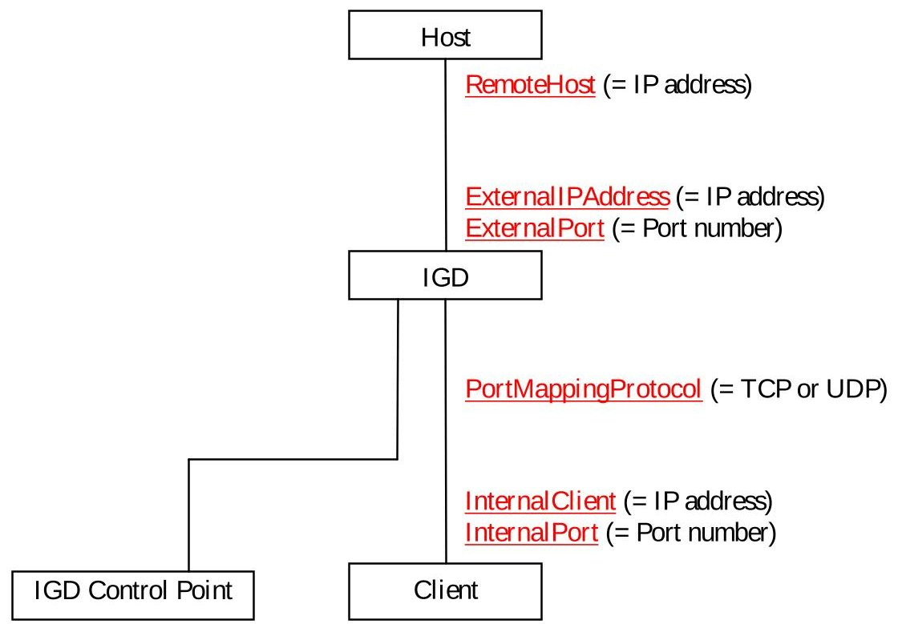
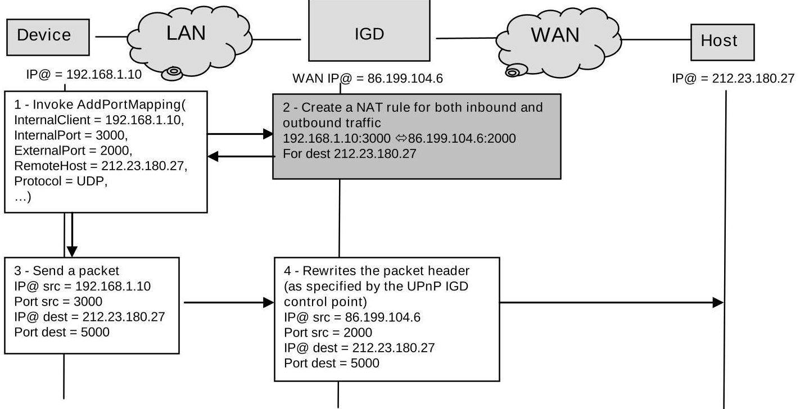
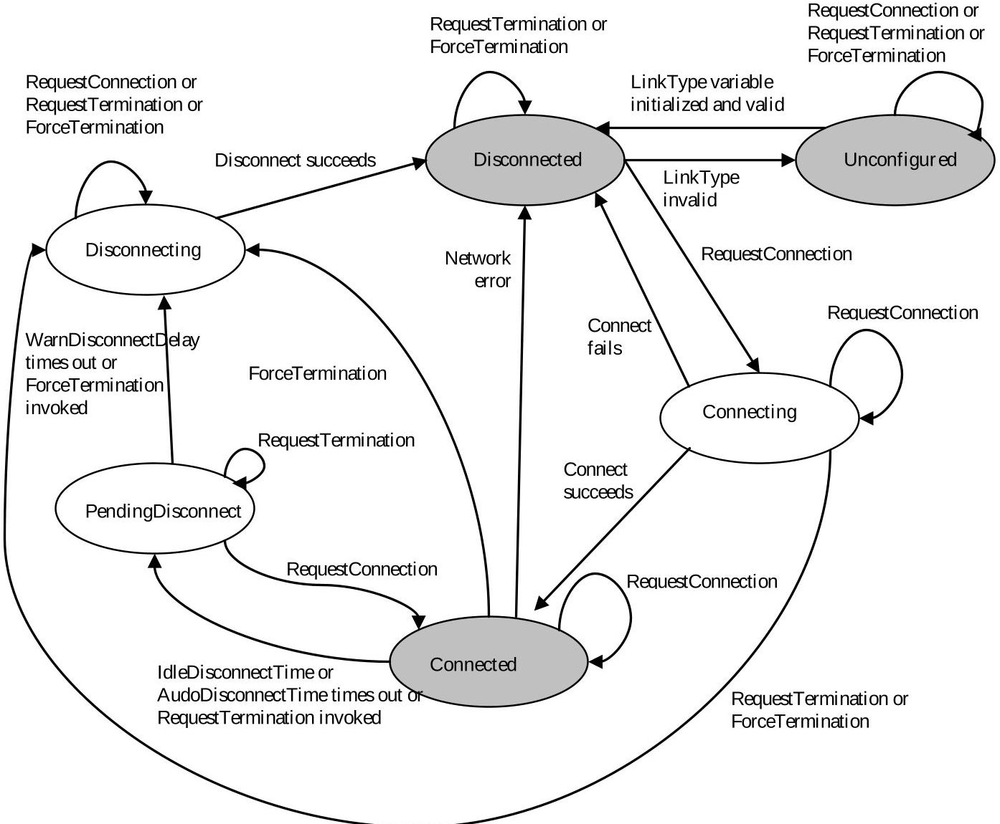
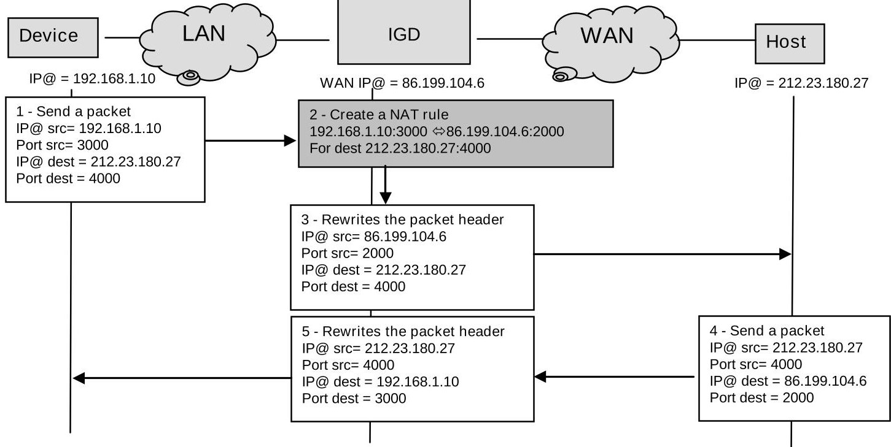
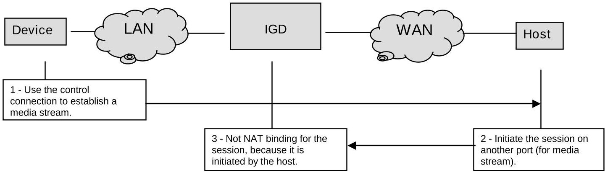

## WANIPConnection:2 Service

For UPnP Version 1.0

Status: Standardized DCP (SDCP)

Date: September 10, 2010

Service Template Version: 2.00

This Standardized DCP has been adopted as a Standardized DCP by the Steering Committee of the UPnP Forum, pursuant to Section 2.1(c)(ii) of the UPnP Forum Membership Agreement. UPnP Forum Members have rights and licenses defined by Section 3 of the UPnP Forum Membership Agreement to use and reproduce the Standardized DCP in UPnP Compliant Devices. All such use is subject to all of the provisions of the UPnP Forum Membership Agreement.

THE UPNP FORUM TAKES NO POSITION AS TO WHETHER ANY INTELLECTUAL PROPERTY RIGHTS EXIST IN THE STANDARDIZED DCPS. THE STANDARDIZED DCPS ARE PROVIDED "AS IS" AND "WITH ALL FAULTS". THE UPNP FORUM MAKES NO WARRANTY, EXPRESS, IMPLIED, STATUTORY, OR OTHERWISE WITH RESPECT TO THE STANDARDIZED DCPS, INCLUDING BUT NOT LIMITED TO ALL IMPLIED WARRANTY OF MERCHANTABILITY, NON-INFRINGEMENT AND FITNESS FOR A PARTICULAR PURPOSE, OF REASONABLE CARE OR WORKMANLIKE EFFORT, OR RESULTS OR OF LACK OF NEGLIGENCE.

## $ \textcircled{c} $ 2010 UPnP Forum. All Rights Reserved.

<table border="1"><tr><td>Authors1</td><td>Company</td></tr><tr><td>Barbara Stark</td><td>AT&amp;T</td></tr><tr><td>Matthew Schmitz</td><td>Cisco(V1)</td></tr><tr><td>Mark Baugher</td><td>Cisco</td></tr><tr><td>Ulhas Warrier,Prakash Iyer</td><td>Intel(V1)</td></tr><tr><td>Victor Lortz</td><td>Intel</td></tr><tr><td>Cathy Chan</td><td>Nokia</td></tr></table>

$ ^{1} $ Note: The UPnP Forum in no way guarantees the accuracy or completeness of this author list and in no way implies any rights for or support from those members listed. This list is not the specifications' contributor list that is kept on the UPnP Forum's website.

<table border="1"><tr><td>Authors1</td><td>Company</td></tr><tr><td>Mika Saaranen, Chair &amp; Co-editor</td><td>Nokia</td></tr><tr><td>Erwan Nédellec, co-editor</td><td>Orange Labs</td></tr><tr><td>Fabrice Fontaine</td><td>Orange Labs</td></tr><tr><td>Dongshin Jung</td><td>Samsung</td></tr></table>

## Contents

Contents...3

List of Tables...6

List of Figures...8

1 Overview and Scope...9

1.1 Introduction...9

1.2 Changes since WANIPConnection:1...9

1.3 Notation...11

    1.3.1 Data Types...12

    1.3.2 Derived data types...12

1.4 Vendor-defined Extensions...13

1.5 References...13

    1.5.1 Normative References...13

    1.5.2 Informative references...14

2 Service Modeling Definitions (Normative)...15

2.1 Service Type...15

2.2 Terms and Abbreviations...15

    2.2.1 Abbreviations...15

    2.2.2 Terms...17

2.3 WANIPConnection Service Architecture...18

    2.3.1 State Variables...19

    2.3.2 State Variable Overview...19

    2.3.3 ConnectionType...20

    2.3.4 PossibleConnectionTypes...21

    2.3.5 ConnectionStatus...21

    2.3.6 Uptime...22

    2.3.7 LastConnectionError...22

    2.3.8 AutoDisconnectTime...22

    2.3.9 IdleDisconnectTime...23

    2.3.10 WarnDisconnectDelay...23

    2.3.11 RSIPAvailable...23

    2.3.12 NATEEnabled...23

    2.3.13 ExternalIPAddress...23

    2.3.14 PortMappingNumberOfEntries...23

    2.3.15 PortMappingEnabled...23

    2.3.16 PortMappingLeaseDuration...24

    2.3.17 RemoteHost...24

    2.3.18 ExternalPort...24

    2.3.19 InternalPort...25

    2.3.20 PortMappingProtocol...25

    2.3.21 InternalClient...25

2.3.22 PortMappingDescription ...25

2.3.23 SystemUpdateID ...25

2.3.24 A_ARG_TYPE_Manage ...26

2.3.25 A_ARG_TYPE_PortListing ...26

2.4 Eventing and Moderation ...27

2.4.1 Eventing of PossibleConnectionTypes ...28

2.4.2 Eventing of ConnectionStatus ...28

2.4.3 Eventing of ExternalIPAddress ...28

2.4.4 Eventing of PortMappingNumberOfEntries ...29

2.4.5 Eventing of SystemUpdateID ...29

2.4.6 Relationships among State Variables ...29

2.5 Actions ...29

2.5.1 SetConnectionType() ...32

2.5.2 GetConnectionTypeInfo() ...33

2.5.3 RequestConnection() ...34

2.5.4 RequestTermination() ...35

2.5.5 ForceTermination() ...37

2.5.6 SetAutoDisconnectTime() ...38

2.5.7 SetIdleDisconnectTime() ...39

2.5.8 SetWarnDisconnectDelay() ...40

2.5.9 GetStatusInfo() ...41

2.5.10 GetAutoDisconnectTime() ...42

2.5.11 GetIdleDisconnectTime() ...43

2.5.12 GetWarnDisconnectDelay() ...44

2.5.13 GetNATRSIPStatus() ...45

2.5.14 GetGenericPortMappingEntry() ...46

2.5.15 GetSpecificPortMappingEntry() ...47

2.5.16 AddPortMapping() ...49

2.5.17 AddAnyPortMapping() ...53

2.5.18 DeletePortMapping() ...56

2.5.19 DeletePortMappingRange() ...57

2.5.20 GetExternalIPAddress() ...59

2.5.21 GetListOfPortMappings() ...60

2.5.22 Relationships Between Actions ...62

2.5.23 Error Code Summary ...62

2.6 Service Behavioral Model ...64

2.6.1 Connection Initiation ...64

2.6.2 Connection Termination ...65

3 Theory of Operation (Informative) ...67

3.1.1 Connection Scenarios ...67

3.1.2 Non-UPnP compliant clients ...68

3.1.3 VPN connections ...68

3.2 NAT & NAT traversal ...69

3.2.1 NAT & NAPT...69

3.2.2 NAT traversal...70

3.3 UPnPIGD & NAT Traversal...71

4 XML Service Description...72

# List of Tables

Table 2-1: Abbreviations...15

Table 2-2: State Variables...19

Table 2-3: allowedValueList for the ConnectionType state variable...20

Table 2-4: allowedValueList for the ConnectionStatus state variable...21

Table 2-5: allowedValueList for the LastConnectionError state variable...22

Table 2-6: allowedValueRange for the PortMappingLeaseDuration state variable...24

Table 2-7: allowedValueRange for the InternalPort state variable...25

Table 2-8: allowedValueList for the PortMappingProtocol state variable...25

Table 2-9: Eventing and Moderation...27

Table 2-10: Actions...29

Table 2-11: Common parameters...30

Table 2-12: Arguments for SetConnectionType()...32

Table 2-13: Error Codes for SetConnectionType()...32

Table 2-14: Arguments for GetConnectionTypeInfo()...33

Table 2-15: Error Codes for GetConnectionTypeInfo()...34

Table 2-16: Error Codes for RequestConnection()...35

Table 2-17: Error Codes for RequestTermination()...36

Table 2-18: Error Codes for ForceTermination()...37

Table 2-19: Arguments for SetAutoDisconnectTime()...38

Table 2-20: Error Codes for SetAutoDisconnectTime()...38

Table 2-21: Arguments for SetIdleDisconnectTime()...39

Table 2-22: Error Codes for SetIdleDisconnectTime()...40

Table 2-23: Arguments for SetWarnDisconnectDelay()...40

Table 2-24: Error Codes for SetWarnDisconnectDelay()...41

Table 2-25: Arguments for GetStatusInfo()...41

Table 2-26: Error Codes for GetStatusInfo()...42

Table 2-27: Arguments for GetAutoDisconnectTime()...42

Table 2-28: Error Codes for GetAutoDisconnectTime()...43

Table 2-29: Arguments for GetIdleDisconnectTime()...43

Table 2-30: Error Codes for GetIdleDisconnectTime()...44

Table 2-31: Arguments for GetWarnDisconnectDelay()...44

Table 2-32: Error Codes for GetWarnDisconnectDelay()...45

Table 2-33: Arguments for GetNATRSIPStatus()...45

Table 2-34: Error Codes for GetNATRSIPStatus()...46

Table 2-35: Arguments for GetGenericPortMappingEntry()...46

Table 2-36: Error Codes for GetGenericPortMappingEntry() ...47

Table 2-37: Arguments for GetSpecificPortMappingEntry() ...48

Table 2-38: Error Codes for GetSpecificPortMappingEntry() ...49

Table 2-39: Arguments for AddPortMapping() ...50

Table 2-40: Error Codes for AddPortMapping() ...52

Table 2-41: Arguments for AddAnyPortMapping() ...53

Table 2-42: Error Codes for AddAnyPortMapping() ...56

Table 2-43: Arguments for DeletePortMapping() ...56

Table 2-44: Error Codes for DeletePortMapping() ...57

Table 2-45: Arguments for DeletePortMappingRange() ...58

Table 2-46: Error Codes for DeletePortMappingRange() ...59

Table 2-47: Arguments for GetExternalIPAddress() ...59

Table 2-48: Error Codes for GetExternalIPAddress() ...60

Table 2-49: Arguments for GetListOfPortMappings() ...60

Table 2-50: Error Codes for GetListOfPortMappings() ...61

Table 2-51: Error Code Summary ...62

Table 3-1: Connection Procedures ...67

## List of Figures

Figure 2-1: UPnPIGD terminology for NAT rules...17

Figure 2-2: Example of relationship between AddPortMapping() action and port triggering ...49

Figure 2-3: Summary of AddPortMapping() results...51

Figure 2-4: Summary of AddAnyPortMapping() results...55

Figure 2-5: State diagram for IP connection...65

Figure 3-1: NAT is an IP address translator ...70

Figure 3-2: NAT issue with bundled session applications...70

## 1 Overview and Scope

This service definition is compliant with the UPnP Device Architecture version 1.0. It defines a service type referred to herein as WANIPConnection service.

## 1.1 Introduction

This service-type enables a UPnP control point to configure and control IP connections on the WAN interface of a UPnP compliant InternetGatewayDevice $ ^{1} $ . Any type of WAN interface (e.g., DSL or cable) that can support an IP connection can use this service.

The service is REQUIRED if an IP connection is used for WAN access, and is specified in urn:schemas-upnp-org:device:WANConnectionDevice, one or more instances of which are specified under the device: urn:schemas-upnp-org:device:WANDevice

An instance of WANDevice is specified under the root device urn:schemas-upnp-org:device:InternetGatewayDevice

All IP Internet connections are set up from a WAN interface of the InternetGatewayDevice or bridged through the gateway to Internet Service Providers (ISPs). WANDevice is a container for all UPnP services associated with a physical WAN device. It is assumed that clients are connected to InternetGatewayDevice via a LAN (IP-based network).

An instance of a WANIPConnection service is activated (refer to the state variable table) for each actual Internet connection instance on a WANConnectionDevice. WANIPConnection service provides IP-level connectivity with an ISP for networked clients on the LAN.

In accordance with UPnP Device Architecture version 1.0, the maximum number of WANIPConnection service instances is static and specified in the InternetGatewayDevice description document.

A WANConnectionDevice MAY include a WAN{POTS/DSL/Cable/Ethernet}LinkConfig service that encapsulates Internet access properties pertaining to the physical link of a particular WAN access type. These properties are common to all instances of WANIPConnection in a WANConnectionDevice.

A WANDevice provides a WANCommonInterfaceConfig service that encapsulates Internet access properties common across all WANConnectionDevice instances.

## 1.2 Changes since WANIPConnection:1

This chapter lists the changes made over version 1 of this service. This service is fully compliant with WANIPConnection:1 service, except in cases where access control has been added.

Generic requirements and other changes:

- The NAT behaviour SHOULD follow IETF RFCs [RFC 5382] and [RFC 4787],

- When a control point creates a port forwarding rule for inbound traffic, this rule MUST also be applied when NAT port triggering occurs for outbound traffic,

- UPnPIGD MUST expose UPnP services only over the LAN interface. IGD MUST reject UPnP requests from the WAN interfaces,

- Upon startup, UPnPIGD DCP MUST broadcast an ssdp:byebye before sending the initial ssdp:alive onto the local network. Sending an ssdp:byebye as part of the normal start up process for a UPnP device ensures that UPnP control points with information about the previous device

instance will safely discard state information about the previous device instance before communicating with the new device instance.

- From version 2, error codes 724 SamePortValuesRequired, 725 OnlyPermanentLeasesSupported, 726 RemoteHostOnlySupportsWildcard and 727 ExternalPortOnlySupportsWildcard are deprecated from IGD, but control points are REQUIRED to support those error codes due to legacy support. For details, see 2.5.16.

- Clarifications to specification 1.0.

## New state variables:

- SystemUpdateID is used to track changes which could affect NAT port mappings,

- A_ARG_TYPE_Manage is a parameter used in new actions which allows a control point to request access level elevation,

- A_ARG_TYPE_PortListing is a data structure used to return a list of port mappings.

## New actions:

- DeletePortMappingRange() allows removal of a range of port mappings,

- GetListOfPortMappings() allows retrieval of a list of existing port mappings,

## Changes in existing actions and procedures:

- AddAnyPortMapping() allows the control point to request a specific external port, and if the port is not free the gateway assigns a free port.

- PortMappingLeaseDuration can be either a value between 1 and 604800 seconds or the zero value (for infinite lease time). Note that an infinite lease time can be only set by out-of-band mechanisms like WWW-administration, remote management or local management,

- If a control point uses the value 0 to indicate an infinite lease time mapping, it is REQUIRED that gateway uses the maximum value instead (e.g. 604800 seconds),

- IGD2 introduces access control features. [IGD2] RECOMMENDS access control requirements and authorization levels to be applied by default. However, devices MAY choose a different security policy,

- This version of the service uses access restriction for certain actions and parameters. In the 2-box model, where the control point is in the same device that desires to receive communication through the NAT, [IGD2] RECOMMENDS that access control is not needed. But in the 3-box model, where the control point is configuring NAT port mappings for a third device, [IGD2] RECOMMENDS that authentication and authorization is used.

- To summarize, [IGD2] RECOMMENDS that unauthenticated and unauthorized control points are only allowed to control port mappings which have InternalClient value equals to the control point's IP address. However, devices MAY choose a different security policy,

- [IGD2] RECOMMENDS that unauthenticated and unauthorized control points are only allowed to invoke actions with NewExternalPort and NewInternalPort values greater than or equal to 1024. However, devices MAY choose a different security policy,

- NAT port mapping rules can be created by other mechanisms besides UPnPIGD. Therefore, it is possible that port mappings done by independent mechanisms MAY overlap or conflict. It is left to vendors to determine a suitable algorithm to resolve conflicting mappings. A new error code has been created (729 ConflictWithOtherMechanisms) in order to allow an IGD to deny a request due to conflict with other mechanisms,

- IGD 2 MUST support both wildcard and specific IP address values for RemoteHost (only the wildcard value was REQUIRED in release 1.0),

- IGD 2 MUST support specific port values for ExternalPort,

- The error code 731 ReadOnly (indicating that it is not possible to modify the value because it is read only) has been created for the SetConnectionType() action,

- The error code 728 NoPortMapsAvailable (There are not enough free ports available to complete the port mapping) has been created for the AddPortMapping() and AddAnyPortMapping() actions,

- The error code 730 PortMappingNotFound (There are not port mappings in the specified range) has been created for the DeletePortMappingRange() and GetListOfPortMappings() actions,

- The error code 732 WildCardNotPermittedInIntPort (The internal port cannot be wild-carded) has been created for the AddPortMapping() and AddAnyPortMapping() actions,

- The error code 733 InconsistentParameters (NewStartPort and NewEndPort values are not consistent) has been created for the DeletePortMappingRange() and GetListOfPortMappings() actions.

## 1.3 Notation

- In this document, features are described as Required, Recommended, or Optional as follows:

The key words "MUST," "MUST NOT," "REQUIRED," "SHALL," "SHALL NOT," "SHOULD," "SHOULD NOT," "RECOMMENDED," "MAY," and "OPTIONAL" in this specification are to be interpreted as described in [RFC 2119].

In addition, the following keywords are used in this specification:

PROHIBITED - The definition or behavior is an absolute prohibition of this specification. Opposite of REQUIRED.

CONDITIONALLY REQUIRED - The definition or behavior depends on a condition. If the specified condition is met, then the definition or behavior is REQUIRED, otherwise it is PROHIBITED.

CONDITIONALLY OPTIONAL - The definition or behavior depends on a condition. If the specified condition is met, then the definition or behavior is OPTIONAL, otherwise it is PROHIBITED.

These keywords are thus capitalized when used to unambiguously specify requirements over protocol and application features and behavior that affect the interoperability and security of implementations. When these words are not capitalized, they are meant in their natural-language sense.

- Strings that are to be taken literally are enclosed in "double quotes".

- Words that are emphasized are printed in italic.

- Keywords that are defined by the UPnP Working Committee are printed using the forum character style.

- Keywords that are defined by the UPnP Device Architecture are printed using the arch character style.

- A double colon delimiter, "::", signifies a hierarchical parent-child (parent::child) relationship between the two objects separated by the double colon. This delimiter is used in multiple contexts, for example: Service::Action(), Action()::Argument, parentProperty::childProperty.

## 1.3.1 Data Types

This specification uses data type definitions from two different sources. The UPnP Device Architecture defined data types are used to define state variable and action argument data types [DEVICE1.0]. The XML Schema namespace is used to define property data types [XML SCHEMA-2].

For UPnP Device Architecture defined Boolean data types, it is strongly RECOMMENDED to use the value "0" for false, and the value "1" for true. The values "true”，“yes”，“false”，or "no" MAY also be used but are NOT RECOMMENDED. The values "yes" and "no" are deprecated and MUST NOT be sent out by devices but MUST be accepted on input.

For XML Schema defined Boolean data types, it is strongly RECOMMENDED to use the value "0" for false, and the value "1" for true. The values "true", "yes", "false", or "no" MAY also be used but are NOT RECOMMENDED. The values "yes" and "no" are deprecated and MUST NOT be sent out by devices but MUST be accepted on input.

## 1.3.2 Derived data types

This section defines a derived data type that is represented as a string data type with special syntax. This specification uses string data type definitions that originate from two different sources. The UPnP Device Architecture defined string data type is used to define state variable and action argument string data types. The XML Schema namespace is used to define property xsd:string data types. The following definition applies to both string data types.

## 1.3.2.1 Comma Separated Value (CSV) Lists

The UPnPIGD services use state variables, action arguments and properties that represent lists- or onedimensional arrays- of values. The UPnP Device Architecture, Version 1.0 [DEVICE1.0], does not provide for either an array type or a list type, so a list type is defined here. Lists MAY either be homogeneous (all values are the same type) or heterogeneous (values of different types are allowed). Lists MAY also consist of repeated occurrences of homogeneous or heterogeneous subsequences, all of which have the same syntax and semantics (same number of values, same value types and in the same order). The data type of a homogeneous list is string or xsd:string and denoted by CSV (x), where x is the type of the individual values. The data type of a heterogeneous list is also string or xsd:string and denoted by CSV (x, y, z), where x, y and z are the types of the individual values. If the number of values in the heterogeneous list is too large to show each type individually, that variable type is represented as CSV (heterogeneous), and the variable description includes additional information as to the expected sequence of values appearing in the list and their corresponding types. The data type of a repeated subsequence list is string or xsd:string and denoted by CSV {x, y, z}), where x, y and z are the types of the individual values in the subsequence and the subsequence MAY be repeated zero or more times.

- A list is represented as a string type (for state variables and action arguments) or xsd:string type (for properties).

- Commas separate values within a list.

- Integer values are represented in CSVs with the same syntax as the integer data type specified in [DEVICE1.0] (that is: optional leading sign, optional leading zeroes, numeric ASCII)

- Boolean values are represented in state variable and action argument CSVs as either "0" for false or "1" for true. These values are a subset of the defined Boolean data type values specified in [DEVICE1.0]: 0, false, no, 1, true, yes.

- Boolean values are represented in property CSVs as either "0" for false or "1" for true. These values are a subset of the defined Boolean data type values specified in [XML SCHEMA-2]: 0, false, 1, true.

- Escaping conventions for the comma and backslash characters are defined in Section 1.2.2, "Strings Embedded in Other Strings".

- White space before, after, or interior to any numeric data type is not allowed.

- White space before, after, or interior to any other data type is part of the value.

<table border="1"><tr><td>Type of Refinement String</td><td>Value</td><td>Comments</td></tr><tr><td>CSV(string) or CSV(xsd:string)</td><td>“+artist,-date”</td><td>List of 2 property sort criteria.</td></tr><tr><td>CSV(int) or CSV(xsd:integer)</td><td>“1,-5,006,0,+7”</td><td>List of 5 integers.</td></tr><tr><td>CSV(boolean) or CSV(xsd:Boolean)</td><td>“0,1,1,0”</td><td>List of 4 booleans</td></tr><tr><td>CSV(string) or CSV(xsd:string)</td><td>“Smith\ Fred,Jones\ Davey”</td><td>List of 2 names，“Smith，Fred”和“Jones，Davey”</td></tr><tr><td>CSV(i4,string,ui2) or CSV(xsd:int,xsd:string,xsd:unsignedShort)</td><td>“-29837，string with leading blanks,0”</td><td>Note that the second value is“string with leading blanks”</td></tr><tr><td>CSV(i4) or CSV(xsd:int)</td><td>“3，4”</td><td>Illegal CSV. White space is not allowed as part of an integer value.</td></tr><tr><td>CSV(string) or CSV(xsd:string)</td><td>“，,”</td><td>List of 3 empty string values</td></tr><tr><td>CSV(heterogeneous)</td><td>“Alice,Marketing,5,Sue,R&amp;D,21,Dave,Finance,7”</td><td>List of unspecified number of people and associated attributes. Each person is described by 3 elements:a name string,a department string and years-of-service ui2 or a name xsd:string,a department xsd:string and years-of-service xsd:unsignedShort</td></tr></table>

## 1.4 Vendor-defined Extensions

Whenever vendors create additional vendor-defined state variables, actions or properties, their assigned names and XML representation MUST follow the naming conventions and XML rules as specified in [DEVICE1.0], Section 2.5, "Description: Non-standard vendor extensions".

## 1.5 References

## 1.5.1 Normative References

[DEVICE1.0] - UPnP Device Architecture, version 1.0, UPnP Forum, June 8, 2000 Available at: http://upnp.org/specs/arch/UPnP-arch-DeviceArchitecture-v1.0.pdf.

[DEVICE1.1] - UPnP Device Architecture, version 1.1, UPnP Forum, October 15, 2008 Available at: http://upnp.org/specs/arch/UPnP-arch-DeviceArchitecture-v1.1.pdf.

[IGD2] - UPnP InternetGatewayDevice:2, version 1.00, UPnP Forum, December 10, 2010 Available at http://upnp.org/specs/gw/UPnP-gw-InternetGatewayDevice-v2-Device.pdf

[ISO 8601] - Data elements and interchange formats - Information interchange -- Representation of dates and times, International Standards Organization, December 21, 2000. Available at: ISO 8601:2000.

[RFC 1035] - IETF RFC 1035, Domain names - implementation and specification, P. Mockapetris November 1987. Available at: http://tools.ietf.org/html/rfc1035.

[RFC 2119] - IETF RFC 2119, Key words for use in RFCs to Indicate Requirement Levels, S. Bradner, March 1997. Available at: http://tools.ietf.org/html/rfc2119.

[RFC 3986] - IETF RFC 3986, Uniform Resource Identifier (URI): Generic Syntax, T. Berners-Lee, R. Fielding, L. Masinter, January 2006. Available at: http://tools.ietf.org/html/rfc3986.

[RFC 3339] - IETF RFC 3339, Date and Time on the Internet: Timestamps, G. Klyne, Clearswift Corporation, C. Newman, Sun Microsystems, July 2002. Available at: http://tools.ietf.org/html/rfc3339.

[XML] - Extensible Markup Language (XML) 1.0 (Third Edition), François Yergeau, Tim Bray, Jean Paoli, C. M. Sperberg-McQueen, Eve Maler, eds., W3C Recommendation, February 4, 2004. Available at: http://www.w3.org/TR/2004/REC-xml-20040204.

[XML SCHEMA-2] - XML Schema Part 2: Data Types, Second Edition, Paul V. Biron, Ashok Malhotra, W3C Recommendation, 28 October 2004. Available at: http://www.w3.org/TR/2004/REC-xmlschema-2-20041028.

## 1.5.2 Informative references

[RFC 3102] - IETF RFC 3102, Realm Specific IP: Framework, M.Borella, J. Lo, D. Grabelsky, G. Montenegro, October 2001. Available at: http://tools.ietf.org/html/rfc3102.

[RFC 3103] - IETF RFC 3103, Realm Specific IP: Protocol Specification, M. Borella, D. Grabelsky, J. Lo, K. Taniguchi, October 2001. Available at: http://tools.ietf.org/html/rfc3103.

[RFC 5382] - IETF RFC 5382, NAT Behavioral Requirements for TCP, S. Guha, K. and Biswas and B. Ford and S. Sivakumar and P. Srisuresh, October 2008. Available at: http://tools.ietf.org/html/rfc5382.

[RFC 4787] - IETF RFC 4787, Network Address Translation (NAT) Behavioral Requirements for Unicast UDP, F. Audet and C. Jennings, January 2007. Available at: http://tools.ietf.org/html/rfc4787.

## 2 Service Modeling Definitions (Normative)

## 2.1 Service Type

The following service type identifies a service that is compliant with this specification:

urn: schemas-upnp-org: service: WANIPConnection: 2

WANIPConnection service is used herein to refer to this service type.

## 2.2 Terms and Abbreviations

## 2.2.1 Abbreviations

<div align="center">

Table 2-1: Abbreviations

</div>

<table border="1"><tr><td>Abbreviation</td><td>Description</td></tr><tr><td>CSV</td><td>Comma Separated Value</td></tr><tr><td>DCP</td><td>Device Control Protocol</td></tr><tr><td>DHCP</td><td>Dynamic Host Configuration Protocol</td></tr><tr><td>DNS</td><td>Domain Name Service</td></tr><tr><td>DSL</td><td>Digital Subscriber Line</td></tr><tr><td>FTP</td><td>File Transfer Protocol</td></tr><tr><td>HTTP</td><td>HyperText Transfer Protocol</td></tr><tr><td>IETF</td><td>Internet Engineering Task Force</td></tr><tr><td>IGD</td><td>Internet Gateway Device</td></tr><tr><td>IP</td><td>Internet Protocol</td></tr><tr><td>ISP</td><td>Internet Service Provider</td></tr><tr><td>LAN</td><td>Local Area Network</td></tr><tr><td>MAC</td><td>Media Access Control</td></tr><tr><td>NAPT</td><td>Network Address Port Translation</td></tr><tr><td>NAT</td><td>Network Address Translation</td></tr><tr><td>POTS</td><td>Plain Old Telephone Service</td></tr><tr><td>PPP</td><td>Point-to-Point Protocol</td></tr><tr><td>RSIP</td><td>Realm Specific Internet Protocol</td></tr><tr><td>RTSP</td><td>Real Time Streaming Protocol</td></tr><tr><td>SIP</td><td>Session Initiation Protocol</td></tr><tr><td>SNMP</td><td>Simple Network Management Protocol</td></tr><tr><td>SOAP</td><td>Simple Object Access Protocol</td></tr><tr><td>SSDP</td><td>Simple Service Discovery Protocol</td></tr></table>

<table border="1"><tr><td>Abbreviation</td><td>Description</td></tr><tr><td>TCP</td><td>Transmission Control Protocol</td></tr><tr><td>UDP</td><td>User Datagram Protocol</td></tr><tr><td>UI</td><td>User Interface</td></tr><tr><td>UPnP</td><td>Universal Plug and Play</td></tr><tr><td>URN</td><td>Universal Resource Name</td></tr><tr><td>UUID</td><td>Universally Unique IDentifier</td></tr><tr><td>VC</td><td>Virtual Channel</td></tr><tr><td>VCI</td><td>Virtual Channel Identifier</td></tr><tr><td>VPI</td><td>Virtual Path Identifier</td></tr><tr><td>VPN</td><td>Virtual Private Network</td></tr><tr><td>WAN</td><td>Wide Area Network</td></tr><tr><td>XML</td><td>eXtensible Markup Language</td></tr></table>

## 2.2.2 Terms



<div align="center">

Figure 2-1: UPnP IGD terminology for NAT rules

</div>

Client is a host located in the local network connecting to the Internet e.g. to the remote host.

IGD Control Point is a UPnP control point using UPnPIGD to control an Internet Gateway device (IGD). Both Client and IGD control point MAY or MAY NOT be located in the same physical device:

- 2-Box scenario means that the client and the IGD control point are located in a single physical device,

- 3-Box scenario means that the IGD control point, the client, and the Internet Gateway Device are all in separate physical devices having different IP address.

RemoteHost is the WAN IP address (destination) of connections initiated by a client in the local network.

External IPAddress is the WAN IP address of the Client as seen by the remote host.

ExternalPort is a source TCP or UDP port number of the Client as seen by the remote host.

InternalClient is the local IP address of the client.

InternalPort is the local TCP or UDP port number of the client.

PortMappingProtocol is either TCP or UDP.

Port forwarding refers to a port mapping rule which allows a remote host to reach a port on a client with private IP address (inside a LAN) via a NAT enabled router (ex: IGD).

Port triggering is a way to automate port forwarding in which outbound traffic on predetermined ports ('triggering ports') causes inbound traffic to specific incoming ports to be dynamically forwarded to the initiating host, while the outbound ports are in use.

## 2.3 WANIPConnection Service Architecture

## This service has three main features.

The first set of functionalities focuses on managing connections when the connection is not always on. This service is impacted only if the instance of WANIPConnection is in IP_Routed mode. An IP connection can be started with RequestConnection() action, and RequestTermination() or ForceTermination() can be used to disconnect an active connection. In addition to these actions, it is possible to set the duration for the connection or to set the idle time after which the connection MAY be terminated automatically.

The second feature includes a number of actions that allow retrieval of status information from the gateway including: getting connection type, disconnect times, external IP address, NAT and RSIP status. These can be used to determine the state of the gateway and its settings.

The NAT Traversal or port mapping functionality allows creation of mappings for both TCP and UDP protocols between an external IGD port (called ExternalPort) and an internal client address associated with one of its ports (respectively called InternalClient and InternalPort). It is also possible to narrow the mapping by limiting the mapping to a specific remote host $ ^{1} $ . This feature is used to allow external hosts to reach hosts located behind NATs.

Getting information about existing port mapping can be done with the following actions:

- GetGenericPortMappingEntry() is used to retrieve port mapping entries based on a table index. The table consists of all port mapping entries. The size of the table and its indexes are updated as the number of port mapping entries changes,

- GetSpecificPortMappingEntry() allows retrieval of a port mapping entry based on the ExternalPort, the PortMappingProtocol, and the RemoteHost,

- GetListOfPortMappings() returns a list of port mapping entries based on a range of ExternalPort and the PortMappingProtocol values.

Creation and deletion of port mapping entries is done with the following actions:

- AddPortMapping() allows creation of a single port mapping by specifying all parameters in one call, this action returns an error if the mapping is already reserved. Please note that since release 2.0 of the specification, it is recommended to use AddAnyPortMapping() instead of AddPortMapping(),

- AddAnyPortMapping() allows requests for a preferred port mapping; if it is not free, the gateway will make an alternative reservation,

- DeletePortMapping() allows deletion of a single port mapping entry,

- DeletePortMappingRange() allows removal of a range of port mapping entries.

NAT port mapping rules can be created by other mechanisms besides UPnPIGD. Therefore, it is possible that port mappings done by independent mechanisms MAY overlap or conflict. It is left to vendors to determine suitable algorithm on how to resolve conflicting mappings. A new error code has been created (729 PortMappingNotAllowed) in order to allow an IGD to deny a request due to conflict with other mechanisms.

The WANIPConnection service defines security policy classifying actions at two levels:

- Actions that require specific authentication. The access control requirements are specifically referenced within each action's description,

Access restrictions to actions and parameters based on the control point's IP address. The restrictions are handled locally within this service. In port mappings, there are three UPnP entities involved: The IGD control point which edits port mappings, the client which needs the port mapping, and the gateway device that executes the port mapping. When the control point and the client are located in the same physical device, this is called the 2-box model. If the control point is located in another device, then this is called the 3-box model. [IGD2] RECOMMENDS that no authentication nor authorization is needed in 2-box model in most actions. [IGD2] RECOMMENDS that control point configuring the gateway is authenticated and authorized in 3-box model. However, devices MAY choose a different security policy.

For security reasons, UPnPIGD MUST expose UPnP services only over the LAN interface. IGD MUST reject UPnP requests from the WAN interfaces.

## 2.3.1 State Variables

The state variables in this service can be divided into the following types:

- Basic connection settings and connections status,

- Disconnection time settings,

- Specific variables for NAT traversal / port mapping creation and deletion.

Note: For first-time reader, it MAY be more insightful to read the theory of operations first and then the action definitions before reading the state variable definitions.

## 2.3.2 State Variable Overview

<div align="center">

Table 2-2: State Variables

</div>

<table border="1"><tr><td>Variable Name</td><td>R/O1</td><td>Data Type</td><td>Reference</td></tr><tr><td>ConnectionType</td><td>R</td><td>string</td><td>See Section 2.3.3</td></tr><tr><td>PossibleConnectionTypes</td><td>R</td><td>string(CSV)</td><td>See Section 2.3.4</td></tr><tr><td>ConnectionStatus</td><td>R</td><td>string</td><td>See Section 2.3.5</td></tr><tr><td>Uptime</td><td>R</td><td>ui4</td><td>See Section 2.3.6</td></tr><tr><td>LastConnectionError</td><td>R</td><td>string</td><td>See Section 2.3.7</td></tr><tr><td>AutoDisconnectTime</td><td>O</td><td>ui4</td><td>See Section 2.3.8</td></tr><tr><td>IdleDisconnectTime</td><td>O</td><td>ui4</td><td>See Section 2.3.9</td></tr><tr><td>WarnDisconnectDelay</td><td>O</td><td>ui4</td><td>See Section 2.3.10</td></tr><tr><td>RSIPAvailable</td><td>R</td><td>boolean</td><td>See Section 2.3.11</td></tr><tr><td>NATEEnabled</td><td>R</td><td>boolean</td><td>See Section 2.3.12</td></tr><tr><td>ExternalIPAddress</td><td>R</td><td>string</td><td>See Section 2.3.13</td></tr><tr><td>PortMappingNumberOfEntries</td><td>R</td><td>ui2</td><td>See Section 2.3.14</td></tr><tr><td>PortMappingEnabled</td><td>R</td><td>boolean</td><td>See Section 2.3.15</td></tr><tr><td>PortMappingLeaseDuration</td><td>R</td><td>ui4</td><td>See Section 2.3.16</td></tr><tr><td>RemoteHost</td><td>R</td><td>string</td><td>See Section 2.3.17</td></tr></table>

<table border="1"><tr><td>Variable Name</td><td>R/O1</td><td>Data Type</td><td>Reference</td></tr><tr><td>ExternalPort</td><td>R</td><td>ui2</td><td>See Section 2.3.18</td></tr><tr><td>InternalPort</td><td>R</td><td>ui2</td><td>See Section 2.3.19</td></tr><tr><td>PortMappingProtocol</td><td>R</td><td>string</td><td>See Section 2.3.20</td></tr><tr><td>InternalClient</td><td>R</td><td>string</td><td>See Section 2.3.21</td></tr><tr><td>PortMappingDescription</td><td>R</td><td>string</td><td>See Section 2.3.22</td></tr><tr><td>SystemUpdateID</td><td>R</td><td>ui4</td><td>See Section 2.3.23</td></tr><tr><td>A_ARG_TYPE_Manage</td><td>R</td><td>boolean</td><td>See Section 2.3.24</td></tr><tr><td>A_ARG_TYPE_PortListing</td><td>R</td><td>string(XML fragment)</td><td>See Section 2.3.25</td></tr><tr><td>Non standard state variables implemented by an UPnP vendor go here</td><td>X</td><td>TBD</td><td>TBD</td></tr></table>

$ ^{1} $ $ \underline{R} $ = REQUIRED, $ \underline{O} $ = OPTIONAL, $ \underline{C R} $ = CONDITIONALLY REQUIRED, $ \underline{C O} $ = CONDITIONALLY OPTIONAL, $ \underline{X} $ = Non-standard, add -D when deprecated (e.g., $ \underline{R-D} $ , $ \underline{O-D} $ ).

## 2.3.3 ConnectionType

This state variable is a string that contains information on the connection types used in the gateway.

<div align="center">

Table 2-3: allowedValueList for the ConnectionType state variable

</div>

<table border="1"><tr><td>Value</td><td>R/O1</td></tr><tr><td>Unconfigured</td><td>R</td></tr><tr><td>IP_Routed(DEFAULT)</td><td>R</td></tr><tr><td>IP_Bridged</td><td>R</td></tr><tr><td>Vendor-defined</td><td>X</td></tr></table>

## 2.3.3.1 Unconfigured

Valid connection types cannot be identified. This MAY be due to the fact that the LinkType variable (if specified in the WAN* LinkConfig service) is uninitialized.

THIS VALUE IS DEPENDENT ON THE DEPLOYMENT AND TESTING SHOULD BE DEFERED TO THE VENDOR.

## 2.3.3.2 IP Routed

The Internet Gateway is an IP router between the LAN and the WAN connection.

THIS VALUE IS ONLY APPLICABLE FOR AN IGD DEVICE SUPPORTING NAT. SHOULD NOT BE TESTED IN OTHER DEVICE CONFIGURATIONS.

## 2.3.3.3 IP Bridged

The Internet Gateway is an Ethernet bridge between the LAN and the WAN connection. A router at the other end of the WAN connection from the IGD routes IP packets.

THIS VALUE IS ONLY APPLICABLE FOR AN IGD DEVICE CONFIGURED AS AN ETHERNET BRIDGE. SHOULD NOT BE TESTED IN OTHER DEVICE CONFIGURATIONS.

## 2.3.4 PossibleConnectionTypes

This variable represents a CSV list indicating the types of connections possible in the context of a specific modem and link type. Possible values are a subset or proper subset of values listed in Table 2-3.

NOTE: Refer to the WANConnectionDevice specification for valid combinations of LinkType and PossibleConnectionTypes for different modems that can support IP based connections.

## 2.3.5 ConnectionStatus

This state variable is a string that contains information on the status of the connection.

<div align="center">

Table 2-4: allowedValueList for the ConnectionStatus state variable

</div>

<table border="1"><tr><td>Value</td><td>R/O</td></tr><tr><td>Unconfigured</td><td>R</td></tr><tr><td>Connecting</td><td>O</td></tr><tr><td>Connected</td><td>R</td></tr><tr><td>PendingDisconnect</td><td>O</td></tr><tr><td>Disconnecting</td><td>O</td></tr><tr><td>Disconnected</td><td>R</td></tr><tr><td>Vendor-defined</td><td>X</td></tr></table>

NOTE: Whether or not a control point gets notified of the intermediary states of a connection transition MAY depend on the gateway implementation.

## 2.3.5.1 Unconfigured

This value indicates that other variables in the service table are uninitialized or in an invalid state. Examples of such variables include PossibleConnectionTypes and ConnectionType.

## 2.3.5.2 Connecting

The WANConnectionDevice is in the process of initiating a connection for the first time after the connection became disconnected.

## 2.3.5.3 Connected

At least one client has successfully initiated an Internet connection using this instance.

## 2.3.5.4 PendingDisconnect

The connection is active (packets are allowed to flow through), but will transition to Disconnecting state after a certain period (indicated by WarnDisconnectDelay).

## 2.3.5.5 Disconnecting

The WANConnectionDevice is in the process of terminating a connection. On successful termination, ConnectionStatus transitions to Disconnected.

## 2.3.5.6 Disconnected

No ISP connection is active (or being activated) from this connection instance. No packets are transiting the gateway.

## 2.3.6 Uptime

The variable Uptime represents time in seconds that this connections has stayed up. The type of this variable is ui4.

## 2.3.7 LastConnectionError

This variable is a string that provides information about the cause of failure for the last connection setup attempt. The restricted list of enumeration values are listed in Table 2-5.

<div align="center">

Table 2-5: allowedValueList for the LastConnectionError state variable

</div>

<table border="1"><tr><td>Value</td><td>R/O</td></tr><tr><td>ERROR_NONE</td><td>R</td></tr><tr><td>ERROR_COMMAND_ABORTED</td><td>O</td></tr><tr><td>ERROR_NOT_ENABLED_FOR_INTERNET</td><td>O</td></tr><tr><td>ERROR_ISP_DISCONNECT.</td><td>O</td></tr><tr><td>ERROR_USER_DISCONNECT</td><td>O</td></tr><tr><td>ERROR_IDLE_DISCONNECT</td><td>O</td></tr><tr><td>ERROR_FORCED_DISCONNECT</td><td>O</td></tr><tr><td>ERROR_NO_CARRIER</td><td>O</td></tr><tr><td>ERROR_IP_CONFIGURATION</td><td>O</td></tr><tr><td>ERROR_UNKNOWN</td><td>O</td></tr><tr><td>Vendor-defined</td><td>X</td></tr></table>

## 2.3.8 AutoDisconnectTime

The AutoDisconnectTime variable represents time in seconds (since the establishment of the connection measured from the time ConnectionStatus transitions to Connected), after which connection termination is automatically initiated by the gateway. This occurs irrespective of whether the connection is being used or not. A value of zero for AutoDisconnectTime indicates that the connection is not to be turned off automatically. However, this MAY be overridden by:

- An implementation specific WAN/Gateway device policy,

- EnabledForInternet variable (see WANCommonInterfaceConfig* ) being set to “ 0 ” (false) by a control point,

- Connection termination initiated by ISP.

If WarnDisconnectDelay is non-zero, the connection state is changed to PendingDisconnect. It stays in this state for WarnDisconnectDelay seconds (if no connection requests are made) before switching to Disconnected. The data type of this variable is ui4.

## 2.3.9 IdleDisconnectTime

IdleDisconnectTime represents the idle time of a connection in seconds (since the establishment of the connection), after which connection termination is initiated by the gateway. A value of zero for this variable allows infinite idle time - connection will not be terminated due to idle time.

NOTE: Layer 2 heartbeat packets are included as part of an idle state i.e., they do not reset the idle timer. The date type of this variable is ui4.

If WarnDisconnectDelay is non-zero, the connection state is changed to PendingDisconnect. It stays in this state for WarnDisconnectDelay seconds (if no connection requests are made) before switching to Disconnected.

## 2.3.10 WarnDisconnectDelay

This variable represents time in seconds the ConnectionStatus remains in the PendingDisconnect state before transitioning to Disconnecting state to drop the connection. For example, if this variable was set to 5 seconds, and one of the clients terminates an active connection, the gateway will wait (with ConnectionStatus as PendingDisconnect) for 5 seconds before actual termination of the connection. A value of zero for this variable indicates that no warning will be given to clients before terminating the connection. The data type of this variable is ui4.

## 2.3.11 RSIPAavailable

This variable indicates if Realm-specific IP (RSIP) is available as a feature on the Internet Gateway Device. The type of this variable is boolean. RSIP has been defined by IETF ([RFC 3102], [RFC 3103]) to allow host-NATing using a standard set of message exchanges. It also allows end-to-end applications that otherwise break if NAT is introduced (e.g. IPsec-based VPNs). A gateway that does not support RSIP MUST set this variable to 0.

## 2.3.12 NATEenabled

This boolean type variable indicates if Network Address Translation (NAT) is enabled for this connection.

## 2.3.13 ExternalIPAddress

ExternalIPAddress is a string containing the external IP address used by NAT for the connection. The format of this string is standard IP address representation and MUST be formatted as:

- a set of four decimal digit groups separated by "." as defined in [RFC 3986],

- or an empty string.

When the external IP address could not be retrieved by the gateway (for example, because the interface is down or because there was a failure in the last connection setup attempt), then the External IPAddress MUST be equal to the empty string.

## 2.3.14 PortMappingNumberOfEntries

This variable indicates the number of NAT port mapping entries (number of elements in the array) configured on this connection.

## 2.3.15 PortMappingEnabled

This variable allows security conscious users to disable and enable dynamic NAT port mappings on the IGD. The type of this variable is boolean.

## 2.3.16 PortMappingLeaseDuration

<div align="center">

Table 2-6: allowedValueRange for the PortMappingLeaseDuration state variable

</div>

<table border="1"><tr><td></td><td>Value</td><td>R/O</td></tr><tr><td>minimum</td><td>0</td><td>R</td></tr><tr><td>maximum</td><td>604800</td><td>R</td></tr><tr><td>default</td><td>Vendor-defined(RECOMMENDED value is 3600)</td><td>R</td></tr></table>

This variable determines the lifetime in seconds of a port-mapping lease. Non-zero values indicate the duration after which a port mapping will be removed, unless a control point refreshes the mapping.

In IGD release 1.0, a value of 0 was used to create a static port mapping. In version 2.0, it is no longer possible to create static port mappings via UPnP actions. Instead, an out-of-band mechanism is REQUIRED to do so (cf. WWW-administration, remote management or local management). In order to be backward compatible with legacy control points, the value of 0 MUST be interpreted as the maximum value (e.g. 604800 seconds, which corresponds to one week).

NOTE: Port mappings are NOT REQUIRED to be persistent across device resets or reboots. It is up to the control points to recreate their port mappings when needed.

## 2.3.17 RemoteHost

This variable represents the source of inbound IP packets. This variable can contain a host name or a standard IPv4 address representation. This state variable MUST be formatted as:

- a domain name of a network host like it is defined in [RFC 1035],

- or as a set of four decimal digit groups separated by "." as defined in [RFC 3986],

- or an empty string.

This will be a wildcard in most cases (an empty string). In version 2.0, NAT vendors are REQUIRED to support non-wildcarded IP addresses in addition to wildcards. A non-wildcard value will allow for "narrow" port mappings, which MAY be desirable in some usage scenarios. When RemoteHost is a wildcard, all traffic sent to the ExternalPort on the WAN interface of the gateway is forwarded to the InternalClient on the InternalPort (this corresponds to the endpoint independent filtering behaviour defined in the [RFC 4787]). When RemoteHost is specified as a specific external IP address as opposed to a wildcard, the NAT will only forward inbound packets from this RemoteHost to the InternalClient. All other packets will be dropped (this corresponds to the address dependent filtering behaviour defined in [RFC 4787]).

## 2.3.18 ExternalPort

This variable is of type ui2 and represents the external port that the NAT gateway would "listen" on for connection requests to a corresponding InternalPort on an InternalClient. Inbound packets to this external port on the WAN interface of the gateway SHOULD be forwarded to InternalClient on the InternalPort on which the message was received. If this value is specified as a wildcard (i.e. 0), connection request on all external ports (that are not otherwise mapped) will be forwarded to InternalClient. In the wildcard case, the value(s) of InternalPort on InternalClient are ignored by the IGD for those connections that are forwarded to InternalClient. Obviously only one such entry can exist in the NAT at any time and conflicts are handled with a "first write wins" behavior. In version 2.0, NAT vendors are REQUIRED to support non-wildcarded ports.

## 2.3.19 InternalPort

This variable is of type ui2 and represents the port on InternalClient that the gateway SHOULD forward connection requests to. A value of 0 is not allowed. NAT implementations that do not permit different values for ExternalPort and InternalPort will return an error.

<div align="center">

Table 2-7: allowedValueRange for the InternalPort state variable

</div>

<table border="1"><tr><td></td><td>Value</td><td>R/O</td></tr><tr><td>minimum</td><td>1</td><td>R</td></tr><tr><td>maximum</td><td>65535</td><td>R</td></tr></table>

## 2.3.20 PortMappingProtocol

This string variable represents the protocol of the port mapping. Possible values are TCP or UDP.

<div align="center">

Table 2-8: allowedValueList for the PortMappingProtocol state variable

</div>

<table border="1"><tr><td>Value</td><td>R/O</td></tr><tr><td>TCP</td><td>R</td></tr><tr><td>UDP</td><td>R</td></tr><tr><td>Vendor-defined</td><td>X</td></tr></table>

## 2.3.21 InternalClient

This variable is a string containing the IP address or DNS host name of an InternalClient (on the residential LAN). This variable can contain a host name or a standard IPv4 address representation. This state variable MUST be formatted as:

- a domain name of a network host like it is defined in [RFC 1035],

- or as a set of four decimal digit groups separated by "." as defined in [RFC 3986].

Note that if the gateway does not support DHCP, it does not have to support DNS host names. Consequently, support for an IP address is REQUIRED, and support for DNS host names is RECOMMENDED. This value cannot be a wildcard (i.e. empty string). It MUST be possible to set the InternalClient to the broadcast IP address 255.255.255.255 for UDP mappings. This is to enable multiple NAT clients to use the same well-known port simultaneously.

## 2.3.22 PortMappingDescription

This is a string representation of a port mapping. The format of the description string is not specified and is application dependent. If specified, the description string can be displayed to a user via the UI of a control point, enabling easier management of port mappings. The description string for a port mapping (or a set of related port mappings) is NOT REQUIRED to be unique across multiple instantiations of an application on multiple nodes in the residential LAN.

## 2.3.23 SystemUpdateID

The type of this variable is ui4, and it is used to notify of changes done in NAT or firewall rules.

Examples:

- the user changed the firewall level settings of his IGD, and the NAT port mappings rules are no more valid,

- the user disabled the UPnPIGD NAT traversal facilities through the WWW-administration of the IGD,

- the user updated a NAT rule thanks to the WWW-administration of his IGD, and that NAT rule was previously created by a UPnPIGD control point.

Whenever a change is done, the value of this variable is incremented by 1 and evented. A change can be an addition, a removal, an update, or the fact that a rule is disabled or enabled. So, control points are encouraged to check if their port mappings are still valid when notified.

This variable is evented when something which affects the port mappings validity occurs. Even if the event affects several port mappings rules, the variable is evented once (and not for each impacted port mappings rules).

Moreover, a control point needs to detect if the IGD has rebooted in order to check if its NAT port mappings rules are still valid. In UPnP Device Architecture 1.0 (cf. [DEVICE1.0]), there are no mechanisms to detect when a device has rebooted. In UPnP Device Architecture 1.1 (cf. [DEVICE1.1]), it is possible to detect rebooting thanks to BOOTID. However, UPnP Device Architecture 1.1 is NOT REQUIRED for implementing the WANIPConnection service.

Therefore, in order to allow control points to distinguish between the reboot of the IGD and the refreshment of the advertisement, the UPnPIGD MUST broadcast an ssdp:byebye before sending the initial ssdp:alive onto the local network upon startup. Sending an ssdp:byebye as part of the normal start up process for a UPnP device ensures that UPnP control points with information about the previous device instance will safely discard state information about the previous device instance before communicating with the new device instance.

## 2.3.24 A ARG TYPE Manage

This argument type is used to describe management intent when issuing certain actions with elevated level of access. The type of this argument is boolean.

## 2.3.25 A ARG TYPE PortListing

This argument type contains the list of port mapping entries.

## 2.3.25.1 XML Schema Definition

This is a string containing an XML fragment. The XML fragment in this argument MUST validate against the XML schema for PortMappingList in the XML namespace "urn:schemas-upnp-

org:gw:WANIPConnection" which is located at: "http://www.upnp.org/schemas/gw/WANIPConnection- v2.xsd".

## 2.3.25.1.1 Description of fields in the PortMappingList structure

The fields in the XML fragment are:

PortMappingList is a REQUIRED structure defined as an XML element. There SHALL be only one element of this kind.

PortMappingEntry is a REQUIRED structure defined as an XML element. There can be zero to 65535 elements of this kind.

NewRemoteHost is a REQUIRED structure defined as an XML attribute. Its type corresponds to the RemoteHost state variable (type string).

NewExternalPort is a REQUIRED structure defined as an XML attribute. Its type corresponds to the ExternalHost state variable (type ui2).

NewProtocol is a REQUIRED structure defined as XML attribute. Its type corresponds to the PortMappingProtocol state variable (type string).

NewInternalPort is a REQUIRED structure defined as XML attribute. Its type corresponds to the InternalPort state variable (type ui2).

NewInternalClient is a REQUIRED structure defined as XML attribute. Its type corresponds to the InternalClient state variable (type string).

NewEnabled is a REQUIRED structure defined as XML attribute. Its type corresponds to the PortMappingEnabled state variable (type boolean).

NewDescription is a REQUIRED structure defined as XML attribute. Its type corresponds to the PortMappingDescription state variable (type string).

NewLeaseTime is a REQUIRED structure defined as XML attribute. Its type corresponds to the PortMappingLeaseDuration state variable (type ui4).

## 2.3.25.2 Sample XML document

```xml

<?xml version="1.0" encoding="UTF-8" ?>

```

```xml

<?xml version="1.0" encoding="UTF-8"?>

<p: Port Mappi ngLi st xm l ns: p="urn: schemas- upnp- or g: gw. WANI PConnec tion"

xm l ns: xsi =" http://www.w3.org/2001/XMLSchema-i nst ance"

xsi : schemaLocati on="urn: schemas- upnp- or g: gw. WANI PConnec tion

htt p: //www. upnp. or g/ schemas/ gw/ WANI PConnec tion-v2. xsd" >

<p: Port Mappi ngEntry>

<p: NewRemot eHost >202. 233. 2. 1</p: NewRemot eHost >

<p: NewExt enal Port >2345</p: NewExt enal Port >

<p: NewProt ocol >TCP</p: NewProt ocol >

<p: New nt enal Port >2345</p: New nt enal Port >

<p: New nt enal Cli ent >192. 168. 1. 137</p: New nt enal Cli ent >

<p: NewEnabl ed>1</p: NewEnabl ed>

<p: NewDescri ption>dooom</p: NewDescri ption>

<p: NewLeaseTi me>345</p: NewLeaseTi me>

</p: Port Mappi ngEntry>

<p: Port Mappi ngEntry>

<p: NewRemot eHost >134. 231. 2. 11</p: NewRemot eHost >

<p: NewExt enal Port >12345</p: NewExt enal Port >

<p: NewProt ocol >TCP</p: NewProt ocol >

<p: New nt enal Port >12345</p: New nt enal Port >

<p: New nt enal Cli ent >192. 168. 1. 137</p: New nt enal Cli ent >

<p: NewEnabl ed>1</p: NewEnabl ed>

<p: NewDescri ption>dooom</p: NewDescri ption>

<p: NewLeaseTi me>345</p: NewLeaseTi me>

</p: Port Mappi ngEntry>

</p: Port Mappi ngList>

```

</ p: Port Mappi ngLi st >

Note that this XML fragment is returned as part of SOAP response, and so needs to be XML escaped. Moreover, note that the XML declaration, <?xml version="1.0" encoding="UTF-8"?>, is OPTIONAL.

## 2.4 Eventing and Moderation

<div align="center">

Table 2-9: Eventing and Moderation

</div>

<table border="1"><tr><td>Variable Name</td><td>Evented</td><td>Moderated</td><td>Criteria</td></tr><tr><td>ConnectionType</td><td>NO</td><td>NO</td><td>N/A</td></tr><tr><td>PossibleConnectionTypes</td><td>YES</td><td>NO</td><td>N/A</td></tr><tr><td>ConnectionStatus</td><td>YES</td><td>NO</td><td>N/A</td></tr></table>

<table border="1"><tr><td>Variable Name</td><td>Evented</td><td>Moderated</td><td>Criteria</td></tr><tr><td>Uptime</td><td>NO</td><td>NO</td><td>N/A</td></tr><tr><td>LastConnectionError</td><td>NO</td><td>NO</td><td>N/A</td></tr><tr><td>AutoDisconnectTime</td><td>NO</td><td>NO</td><td>N/A</td></tr><tr><td>IdleDisconnectTime</td><td>NO</td><td>NO</td><td>N/A</td></tr><tr><td>WarnDisconnectDelay</td><td>NO</td><td>NO</td><td>N/A</td></tr><tr><td>RSIPAvailable</td><td>NO</td><td>NO</td><td>N/A</td></tr><tr><td>NATEEnabled</td><td>NO</td><td>NO</td><td>N/A</td></tr><tr><td>ExternalIPAddress</td><td>YES</td><td>NO</td><td>N/A</td></tr><tr><td>PortMappingNumberOfEntries</td><td>YES</td><td>NO</td><td>N/A</td></tr><tr><td>PortMappingEnabled</td><td>NO</td><td>NO</td><td>N/A</td></tr><tr><td>PortMappingLeaseDuration</td><td>NO</td><td>NO</td><td>N/A</td></tr><tr><td>RemoteHost</td><td>NO</td><td>NO</td><td>N/A</td></tr><tr><td>ExternalPort</td><td>NO</td><td>NO</td><td>N/A</td></tr><tr><td>InternalPort</td><td>NO</td><td>NO</td><td>N/A</td></tr><tr><td>PortMappingProtocol</td><td>NO</td><td>NO</td><td>N/A</td></tr><tr><td>InternalClient</td><td>NO</td><td>NO</td><td>N/A</td></tr><tr><td>PortMappingDescription</td><td>NO</td><td>NO</td><td>N/A</td></tr><tr><td>SystemUpdateID</td><td>YES</td><td>NO</td><td>N/A</td></tr><tr><td>A_ARG_TYPE_Manage</td><td>NO</td><td>NO</td><td>N/A</td></tr><tr><td>A_ARG_TYPE_PortListing</td><td>NO</td><td>NO</td><td>N/A</td></tr><tr><td>Non-standard state variables implemented by an UPnP vendor go here.</td><td>TBD</td><td>TBD</td><td>TBD</td></tr></table>

$ ^{1} \underline{R}=\mathrm {R E Q U I R E D}, \underline{O}=\mathrm {O P T I O N A L}, \underline{X}=\mathrm {N o n - s t a n d a r d}. $

## 2.4.1 Eventing of PossibleConnectionTypes

This event is created whenever the list of PossibleConnectionTypes has changed.

## 2.4.2 Eventing of ConnectionStatus

This variable is evented whenever ConnectionStatus has changed.

## 2.4.3 Eventing of ExternalIPAddress

This variable is evented whenever the external IP address of the gateway has changed.

## 2.4.4 Eventing of PortMappingNumberOfEntries

This variable is evented when the number of port mapping entries changes. SystemUpdateD and PortMappingNumberOfEntries MUST be evented at the same time when mapping rules are added or removed.

## 2.4.5 Eventing of SystemUpdateID

This variable is evented when NAT or firewall rules have been changed. The eventing of this variable MUST be done in the same time when PortMappingNumberofEntries is evented.

## 2.4.6 Relationships among State Variables

If ConnectionStatus is set to Unconfigured, all other variables are set to their default values.

If ConnectionStatus is set to Disconnected, Uptime is set to its default value.

If NATEenabled is set to 0, other port mapping related set actions are essentially disabled. Get actions MAY still succeed. Moreover, SystemUpdateD is incremented by 1 and evented.

For port mappings, the PortMappingLeaseDuration variable counts down from the value set by the AddPortMapping() or AddAnyPortmapping() action. The value counts down independent of the state of PortMappingEnabled for that specific port mapping. If a GetGenericPortMappingEntry() or GetSpecificPortMappingEntry() action is invoked, the remaining time on a port-mapping lease is returned to the control point. For example if a port mapping is added with a lease duration of 1500 seconds and GetSpecificPortMappingEntry() is invoked on that port mapping 500 seconds later,

PortMappingLeaseDuration will return 1000 as its value (+/- a few seconds accounting for clock drift). When PortMappingLeaseDuration counts to zero, the entry will be deleted by the IGD, independent of the state of PortMappingEnabled for that specific port mapping. The IGD will correspondingly modify local NAT (and firewall settings if appropriate) to stop forwarding packets as was specified in the deleted port mapping. This will also cause PortMappingNumberOfEntries to be decremented by 1 and evented. SystemUpdateD is incremented by 1 and evented every time a change is made to port mappings. Port mappings will not be automatically reinitiated by the IGD - it is the responsibility of a control point to refresh the port mapping a few "threshold" seconds before the port mapping is set to expire (i.e. PortMappingLeaseDuration equals zero) to prevent service disruption. The value of "threshold" seconds is implementation dependent.

## 2.5 Actions

Table 2-10: Actions

<table border="1"><tr><td>Name</td><td>DeviceR/O1</td><td>ControlPoint R/O2</td></tr><tr><td>SetConnectionType()</td><td>R</td><td>O</td></tr><tr><td>GetConnectionTypeInfo()</td><td>R</td><td>O</td></tr><tr><td>RequestConnection()</td><td>R</td><td>O</td></tr><tr><td>RequestTermination()</td><td>O</td><td>O</td></tr><tr><td>ForceTermination()</td><td>R</td><td>O</td></tr><tr><td>SetAutoDisconnectTime()</td><td>O</td><td>O</td></tr><tr><td>SetIdleDisconnectTime()</td><td>O</td><td>O</td></tr><tr><td>SetWarnDisconnectDelay()</td><td>O</td><td>O</td></tr></table>

$ \textcircled{c} $ 2010 UPnP Forum. All rights reserved.

<table border="1"><tr><td>Name</td><td>DeviceR/O1</td><td>ControlPoint R/O2</td></tr><tr><td>GetStatusInfo()</td><td>R</td><td>R</td></tr><tr><td>GetAutoDisconnectTime()</td><td>O</td><td>O</td></tr><tr><td>GetIdleDisconnectTime()</td><td>O</td><td>O</td></tr><tr><td>GetWarnDisconnectDelay()</td><td>O</td><td>O</td></tr><tr><td>GetNATRSIPStatus()</td><td>R</td><td>R</td></tr><tr><td>GetGenericPortMappingEntry()</td><td>R</td><td>R</td></tr><tr><td>GetSpecificPortMappingEntry()</td><td>R</td><td>R</td></tr><tr><td>AddPortMapping()</td><td>R</td><td>R</td></tr><tr><td>AddAnyPortMapping()</td><td>R</td><td>R</td></tr><tr><td>DeletePortMapping()</td><td>R</td><td>R</td></tr><tr><td>DeletePortMappingRange()</td><td>R</td><td>O</td></tr><tr><td>GetExternalIPAddress()</td><td>R</td><td>R</td></tr><tr><td>GetListOfPortMappings()</td><td>R</td><td>O</td></tr><tr><td colspan="2">Non-standard actions implemented by an UPnP vendor go here.</td><td>X</td><td>X</td></tr></table>

1 For a device this column indicates whether the action MUST be implemented or not, where $ \underline{R}= $ REQUIRED, $ \underline{O}= $ OPTIONAL, $ \underline{CR}= $ CONDITIONALLY REQUIRED, $ \underline{CO}= $ CONDITIONALLY OPTIONAL, $ \underline{X}= $ Non-standard, add -D when deprecated (e.g., $ \underline{R-D}, $ $ \underline{O-D} $ ).

$ ^{2} $ For a control pont this column indicates whether a control point MUST be capable of invoking this action, where $ \underline{R}= $ REQUIRED, $ \underline{O}= $ OPTIONAL, $ \underline{CR}= $ CONDITIONALLY REQUIRED, $ \underline{CO}= $ CONDITIONALLY OPTIONAL, $ \underline{X}= $ Non-standard, add -D when deprecated (e.g., $ \underline{R-D}, $ $ \underline{O-D} $ ).

<div align="center">

Table 2-11: Common parameters

</div>

<table border="1"><tr><td>Variable Name</td><td>Related state variable</td><td>Reference</td></tr><tr><td>NewRemoteHost</td><td>RemoteHost</td><td>This argument refers to the remote host which sends packets to the IGD. If a wildcard is defined then packets MAY be sent by any host, but if a specific IP address is defined, then only packets sent by this IP address are forwarded.
This argument is of type string in format of “x.x.x.x”. The wildcard value corresponds to an empty string. This MAY also be DNS name in dotted notation. See RemoteHost state variable definition for details.</td></tr><tr><td>NewExternalPort</td><td>ExternalPort</td><td>This argument defines the external port value of a port mapping. This port number is visible to external hosts during NAT operation.
This argument is of type ui2.</td></tr></table>

<table border="1"><tr><td>Variable Name</td><td>Related state variable</td><td>Reference</td></tr><tr><td>NewProtocol</td><td>PortMappingProtocol</td><td>This argument defines whether this port mapping is used by TCP or UDP connection.
This argument is type of string and allowed values are“TCP”和“UDP”.</td></tr><tr><td>NewInternalPort</td><td>InternalPort</td><td>This argument defines the port number of the internal client where IGD forwards the incoming traffic.
This argument is of type ui2.</td></tr><tr><td>NewInternalClient</td><td>InternalClient</td><td>This argument defines the IP address of the internal host where IGD forwards incoming traffic.
This argument is of type string in format of“x.x.x.x”. This MAY also be DNS name in dotted notation. See InternalClient state variable definition for details.</td></tr><tr><td>NewEnabled</td><td>PortMappingEnabled</td><td>This argument defines if this specific port mapping is enabled or disabled.
This argument is type of boolean.</td></tr><tr><td>NewPortMappingDescription</td><td>PortMappingDescription</td><td>This argument provides a description of a port mapping entry. The type is string and formatting is left to applications.</td></tr><tr><td>NewLeaseDuration</td><td>PortMappingLeaseDuration</td><td>This argument defines the duration of the port mapping. The value of this argument MUST be greater than0. A NewLeaseDuration with value0 means static port mapping, but static port mappings can only be created through an out-of-band mechanism. If this parameter is set to0, default value of604800 MUST be used. The RECOMMENDED value for NewLeaseDuration is3600 seconds.</td></tr><tr><td>NewStartPort</td><td>ExternalPort</td><td>This argument is type of ui2,and it is used to describe the beginning of a port mapping range. Its allowed value range is the same as for ExternalPort state variable,but it MUST be less than or equal to NewEndPort.</td></tr><tr><td>NewEndPort</td><td>ExternalPort</td><td>This argument is type of ui2,and it is used to describe the end of a port mapping range. Its allowed value range is the same as for ExternalPort state variable,but it MUST be greater than or equal to NewStartPort.</td></tr><tr><td>NewManage</td><td>A_ARG_TYPE_Manage</td><td>This argument is type of boolean,and if a control point wants to get or to remove only its own port mappings it SHOULD be set to“0”(false). If the intent is to manage port mappings for other clients,then NewManage SHOULD be set to“1”(true). This flag does not supersede access control based on control points IP address.</td></tr></table>

## 2.5.1 SetConnectionType()

This action sets up a specific connection type. Clients on the LAN MAY initiate or share connection only after this action completes and ConnectionType is set to a value other than Unconfigured. ConnectionType can be a read-only variable in cases where some form of auto configuration is employed.

## 2.5.1.1 Arguments

<div align="center">

Table 2-12: Arguments for SetConnectionType()

</div>

<table border="1"><tr><td>Argument</td><td>Direction</td><td>relatedStateVariable</td></tr><tr><td>NewConnectionType</td><td>IN</td><td>ConnectionType</td></tr></table>

## 2.5.1.2 NewConnectionType

This argument defines what type of connection is to be established. See definition in chapter 2.3.3.

## 2.5.1.3 Service Requirements

Before processing the action request, the device MUST apply the chosen security policy, and authenticate and authorize the control point as required by the security policy. If the control point does not have the necessary permission to perform the action with the requested parameters, the device MUST return the 606 Action not authorized error code (defined in [DEVICE1.0]).

[IGD2] RECOMMENDS access control requirements and authentication levels to be applied by default for this action. However, devices MAY choose a different security policy.

If the control point uses a NewConnectionType value which is not in the allowedValueList of the ConnectionType state variable, the gateway SHALL return the 601 Argument Value Out of Range error code (defined in [DEVICE1.0]).

2. 5.1.4 Control Point Requirements When Calling The Action Before invoking this action, a control point SHOULD verify that it has sufficient permission.

## 2.5.1.5 Dependency on Device State

If ConnectionStatus is neither Disconnected nor Unconfigured, this action cannot be completed.

## 2.5.1.6 Effect on Device State

This action sets the connection to a specific type. No connections can be established if ConnectionType is set to Unconfigured.

## 2.5.1.7 Errors

<div align="center">

Table 2-13: Error Codes for SetConnectionType()

</div>

<table border="1"><tr><td>ErrorCode</td><td>errorDescription</td><td>Description</td></tr><tr><td>400-499</td><td>TBD</td><td>See UPnP Device Architecture section on Control.</td></tr><tr><td>500-599</td><td>TBD</td><td>See UPnP Device Architecture section on Control.</td></tr><tr><td>600-699</td><td>TBD</td><td>See UPnP Device Architecture section on Control.</td></tr></table>

<table border="1"><tr><td>ErrorCode</td><td>errorDescription</td><td>Description</td></tr><tr><td>606</td><td>Action not authorized</td><td>The action requested REQUIRES authorization and the sender was not authorized.</td></tr><tr><td>703</td><td>InactiveConnection StateRequired</td><td>Current value of ConnectionStatus SHOULD be either Disconnected or Unconfigured to permit this action.</td></tr><tr><td>731</td><td>ReadOnly</td><td>Not possible to modify the value because it is read only.</td></tr></table>

## 2.5.2 GetConnectionTypeInfo()

This action retrieves the values of the current connection type and allowable connection types.

## 2.5.2.1 Arguments

<div align="center">

Table 2-14: Arguments for GetConnectionTypeInfo()

</div>

<table border="1"><tr><td>Argument</td><td>Direction</td><td>relatedStateVariable</td></tr><tr><td>NewConnectionType</td><td>OUT</td><td>ConnectionType</td></tr><tr><td>NewPossibleConnectionTypes</td><td>OUT</td><td>PossibleConnectionTypes</td></tr></table>

## 2.5.2.2 NewConnectionType

This argument is defined in chapter 2.3.3.

## 2.5.2.3 NewPossibleConnectionTypes

This argument is defined in chapter 2.3.4.

## 2.5.2.4 Service Requirements

Before processing the action request, the device MUST apply the chosen security policy, and authenticate and authorize the control point as required by the security policy. If the control point does not have the necessary permission to perform the action with the requested parameters, the device MUST return the 606 Action not authorized error code (defined in [DEVICE1.0]).

[IGD2] RECOMMENDS access control requirements and authentication levels to be applied by default for this action. However, devices MAY choose a different security policy.

## 2.5.2.5 Control Point Requirements When Calling The Action

Before invoking this action, a control point SHOULD verify that it has sufficient permission.

## 2.5.2.6 Dependency on Device State

## 2.5.2.7 Effect on Device State

None.

## 2.5.2.8 Errors

<div align="center">

Table 2-15: Error Codes for GetConnectionTypeInfo()

</div>

<table border="1"><tr><td>ErrorCode</td><td>errorDescription</td><td>Description</td></tr><tr><td>400-499</td><td>TBD</td><td>See UPnP Device Architecture section on Control.</td></tr><tr><td>500-599</td><td>TBD</td><td>See UPnP Device Architecture section on Control.</td></tr><tr><td>600-699</td><td>TBD</td><td>See UPnP Device Architecture section on Control.</td></tr><tr><td>606</td><td>Action not authorized</td><td>The action requested REQUIRES authorization and the sender was not authorized.</td></tr></table>

## 2.5.3 RequestConnection()

A client sends this action to initiate a connection on an instance of a connection service that has a configuration already defined. RequestConnection() causes the ConnectionStatus to immediately change to Connecting (if implemented) unless the action is not permitted in the current state of the IGD or the specific service instance. This change of state will be evented. RequestConnection() SHOULD synchronously return at this time in accordance with UPnP architecture requirements that mandate that an action can take no more than 30 seconds to respond synchronously. However, the actual connection setup MAY take several seconds more to complete. If the connection setup is successful, ConnectionStatus will change to Connected and will be evented. If the connection setup is not successful, ConnectionStatus will eventually revert back to Disconnected and will be evented. LastConnectionError will be set appropriately in either case. While this MAY be obvious, it is worth noting that a control point MUST NOT source packets to the Internet until ConnectionStatus is updated to Connected, or the IGD MAY drop packets until it transitions to the Connected state.

The process of requesting a connection is described in chapter 2.6.1.

## 2.5.3.1 Arguments

None.

## 2.5.3.2 Service Requirements

The IGD SHOULD implement a timeout mechanism to ensure that it does not remain in the Connecting state forever. The timeout value is implementation dependent.

When ConnectionStatus is in PendingDisconnect state, if any client sends RequestConnection() command, the gateway MAY choose to discontinue the termination process by changing ConnectionStatus to Connected. If connection is not restored, the gateway will return error code indicating that the connection was in the process of being torn down.

Before processing the action request, the device MUST apply the chosen security policy, and authenticate and authorize the control point as required by the security policy. If the control point does not have the necessary permission to perform the action with the requested parameters, the device MUST return the 606 Action not authorized error code (defined in [DEVICE1.0]).

[IGD2] RECOMMENDS access control requirements and authentication levels to be applied by default for this action. However, devices MAY choose a different security policy.

## 2.5.3.3 Control Point Requirements When Calling The Action

Control points SHOULD manage a timeout for initiated connections to recover from catastrophic failures on the IGD. The timeout value is implementation dependent.

The IGD MAY take several seconds (or even a few minutes) to transition from the Connecting state to the Connected state. Control points SHOULD moderate the polling frequency of the ConnectionStatus variable on the IGD so as to not create data storms on the network.

Before invoking this action, a control point SHOULD verify that it has sufficient permission.

## 2.5.3.4 Dependency on Device State

The gateway MUST be configured before attempting connection. The state variable ConnectionStatus MUST be equal to either Disconnected, PendingDisconnect or Connected value, and the state variable ConnectionType MUST be equal to IP_Routed.

The EnabledForInternet flag in WANCommonInterfaceConfig MUST be set to “ 1 ” (true).

## 2.5.3.5 Effect on Device State

If successful, <u>ConnectionStatus</u> is changed to <u>Connected</u>.

## 2.5.3.6 Errors

<div align="center">

Table 2-16: Error Codes for RequestConnection()

</div>

<table border="1"><tr><td>ErrorCode</td><td>errorDescription</td><td>Description</td></tr><tr><td>400-499</td><td>TBD</td><td>See UPnP Device Architecture section on Control.</td></tr><tr><td>500-599</td><td>TBD</td><td>See UPnP Device Architecture section on Control.</td></tr><tr><td>600-699</td><td>TBD</td><td>See UPnP Device Architecture section on Control.</td></tr><tr><td>606</td><td>Action not authorized</td><td>The action requested REQUIRES authorization and the sender was not authorized.</td></tr><tr><td>704</td><td>ConnectionSetupFailed</td><td>There was a failure in setting up the IP or PPP connection with the service provider.</td></tr><tr><td>705</td><td>ConnectionSetupInProgress</td><td>The connection is already in the process of being setup(Current ConnectionStatus is Connecting).</td></tr><tr><td>706</td><td>ConnectionNotConfigured</td><td>Current ConnectionStatus is Unconfigured.</td></tr><tr><td>707</td><td>DisconnectInProgress</td><td>The connection is in the process of being torn down(Current ConnectionStatus is Disconnecting).</td></tr><tr><td>708</td><td>InvalidLayer2Address</td><td>Corresponding Link Config service has an invalid VPI/VCI or phone number.</td></tr><tr><td>709</td><td>InternetAccessDisabled</td><td>The EnabledForInternet flag is set to“0”(false).</td></tr><tr><td>710</td><td>InvalidConnectionType</td><td>This action is not permitted for the specified ConnectionType(Current ConnectionType is Unconfigured or IP_Bridged).</td></tr></table>

## 2.5.4 RequestTermination()

A client MAY send this command to any connection instance in Connected or Connecting state to change ConnectionStatus to Disconnected (through the Disconnecting state, if implemented). Connection state changes to PendingDisconnect (if implemented) depend on the value of WarnDisconnectDelay variable. Connection termination will depend on whether other clients intend to continue to use the connection by invoking the RequestConnection() action. The process of terminating a connection is described in chapter 2.6.2.

## 2.5.4.1 Arguments

None.

## 2.5.4.2 Service Requirements

Before processing the action request, the device MUST apply the chosen security policy, and authenticate and authorize the control point as required by the security policy. If the control point does not have the necessary permission to perform the action with the requested parameters, the device MUST return the 606 Action not authorized error code (defined in [DEVICE1.0]).

[IGD2] RECOMMENDS access control requirements and authentication levels to be applied by default for this action. However, devices MAY choose a different security policy.

## 2.5.4.3 Control Point Requirements When Calling The Action

Before invoking this action, a control point SHOULD verify that it has sufficient permission.

## 2.5.4.4 Dependency on Device State

ConnectionType MUST be equal to IP Routed to allow this action to work.

ConnectionStatus MUST be equal to Connected or Connecting to allow this action to work.

If the connection state is Connecting when a client issues a RequestTermination(), the state transitions to Disconnected directly - it does not go to PendingDisconnect even if WarnDisconnectDelay is nonzero.

## 2.5.4.5 Effect on Device State

If successful, ConnectionStatus is changed to Disconnected.

## 2.5.4.6 Errors

<div align="center">

Table 2-17: Error Codes for RequestTermination()

</div>

<table border="1"><tr><td>ErrorCode</td><td>errorDescription</td><td>Description</td></tr><tr><td>400-499</td><td>TBD</td><td>See UPnP Device Architecture section on Control.</td></tr><tr><td>500-599</td><td>TBD</td><td>See UPnP Device Architecture section on Control.</td></tr><tr><td>600-699</td><td>TBD</td><td>See UPnP Device Architecture section on Control.</td></tr><tr><td>606</td><td>Action not authorized</td><td>The action requested REQUIRES authorization and the sender was not authorized.</td></tr><tr><td>706</td><td>ConnectionNotConfigured</td><td>Current ConnectionStatus is Unconfigured.</td></tr><tr><td>707</td><td>DisconnectInProgress</td><td>The connection is in the process of being torn down(Current ConnectionStatus is Disconnecting or PendingDisconnect).</td></tr><tr><td>710</td><td>InvalidConnectionType</td><td>This command is valid only when ConnectionType is IP_Routed.</td></tr><tr><td>711</td><td>ConnectionAlreadyTerminated</td><td>An attempt was made to terminate a connection that is no longer active(Current ConnectionStatus is Disconnected).</td></tr></table>

## 2.5.5 ForceTermination()

A client MAY send this command to any connection instance in Connected, Connecting or PendingDisconnect state to change ConnectionStatus to Disconnected (goes via Disconnecting state if implemented). Connection state immediately transitions to Disconnecting (or to Disconnected if Disconnecting is not implemented) irrespective of the setting of WarnDisconnectDelay variable. The process of terminating a connection is described in chapter 2.6.2.

## 2.5.5.1 Arguments

None.

## 2.5.5.2 Service Requirements

Before processing the action request, the device MUST apply the chosen security policy, and authenticate and authorize the control point as required by the security policy. If the control point does not have the necessary permission to perform the action with the requested parameters, the device MUST return the 606 Action not authorized error code (defined in [DEVICE1.0]).

[IGD2] RECOMMENDS access control requirements and authentication levels to be applied by default for this action. However, devices MAY choose a different security policy.

## 2.5.5.3 Control Point Requirements When Calling The Action

Before invoking this action, a control point SHOULD verify that is has sufficient permission.

## 2.5.5.4 Dependency on Device State

ConnectionType MUST be equal to IP_Routed to allow this action to work.

ConnectionStatus MUST be equal to Connected, Connecting or PendingDisconnect to allow this action to work.

## 2.5.5.5 Effect on Device State

If successful, ConnectionStatus is changed to Disconnected.

## 2.5.5.6 Errors

<div align="center">

Table 2-18: Error Codes for ForceTermination()

</div>

<table border="1"><tr><td>ErrorCode</td><td>errorDescription</td><td>Description</td></tr><tr><td>400-499</td><td>TBD</td><td>See UPnP Device Architecture section on Control.</td></tr><tr><td>500-599</td><td>TBD</td><td>See UPnP Device Architecture section on Control.</td></tr><tr><td>600-699</td><td>TBD</td><td>See UPnP Device Architecture section on Control.</td></tr><tr><td>606</td><td>Action not authorized</td><td>The action requested REQUIRES authorization and the sender was not authorized.</td></tr><tr><td>706</td><td>ConnectionNotConfigured</td><td>Current ConnectionStatus is Unconfigured.</td></tr><tr><td>707</td><td>DisconnectInProgress</td><td>The connection is in the process of being torn down(Current ConnectionStatus is Disconnecting).</td></tr></table>

<table border="1"><tr><td>ErrorCode</td><td>errorDescription</td><td>Description</td></tr><tr><td>710</td><td>InvalidConnectionType</td><td>This command is valid only when ConnectionType is IP_Routed</td></tr><tr><td>711</td><td>ConnectionAlreadyTerminated</td><td>An attempt was made to terminate a connection that is no longer active(Current ConnectionStatus is Disconnected)</td></tr></table>

## 2.5.6 SetAutoDisconnectTime()

This action sets the time (in seconds) after which an active connection is automatically disconnected. The actual disconnect will occur after WarnDisconnectDelay time elapses (if implemented). The process of terminating a connection is described in chapter 2.6.2.

## 2.5.6.1 Arguments

<div align="center">

Table 2-19: Arguments for SetAutoDisconnectTime()

</div>

<table border="1"><tr><td>Argument</td><td>Direction</td><td>relatedStateVariable</td></tr><tr><td>NewAutoDisconnectTime</td><td>IN</td><td>AutoDisconnectTime</td></tr></table>

## 2.5.6.2 NewAutoDisconnectTime

This argument sets the autodisconnect time for the connection. See definition in chapter 2.3.8.

## 2.5.6.3 Service Requirements

Before processing the action request, the device MUST apply the chosen security policy, and authenticate and authorize the control point as required by the security policy. If the control point does not have the necessary permission to perform the action with the requested parameters, the device MUST return the 606 Action not authorized error code (defined in [DEVICE1.0]).

[IGD2] RECOMMENDS access control requirements and authentication levels to be applied by default for this action. However, devices MAY choose a different security policy.

## 2.5.6.4 Control Point Requirements When Calling The Action

Before invoking this action, a control point SHOULD verify that is has sufficient permission.

## 2.5.6.5 Dependency on Device State

None.

## 2.5.6.6 Effect on Device State

After expiration of specified time, ConnectionStatus is changed to Disconnected (via PendingDisconnect and Disconnecting state if it is implemented). The intermediate connection states before the connection is terminated will depend on WarnDisconnectDelay.

## 2.5.6.7 Errors

<div align="center">

Table 2-20: Error Codes for SetAutoDisconnectTime()

</div>

<table border="1"><tr><td>ErrorCode</td><td>errorDescription</td><td>Description</td></tr><tr><td>400-499</td><td>TBD</td><td>See UPnP Device Architecture section on Control.</td></tr></table>

<table border="1"><tr><td>ErrorCode</td><td>errorDescription</td><td>Description</td></tr><tr><td>500-599</td><td>TBD</td><td>See UPnP Device Architecture section on Control.</td></tr><tr><td>600-699</td><td>TBD</td><td>See UPnP Device Architecture section on Control.</td></tr><tr><td>606</td><td>Action not authorized</td><td>The action requested REQUIRES authorization and the sender was not authorized.</td></tr></table>

## 2.5.7 SetIdleDisconnectTime()

This action specifies the idle time (in seconds) after which a connection MAY be disconnected. The actual disconnect will occur after WarnDisconnectDelay time elapses. The process of terminating a connection is described in chapter 2.6.2.

## 2.5.7.1 Arguments

<div align="center">

Table 2-21: Arguments for SetIdleDisconnectTime()

</div>

<table border="1"><tr><td>Argument</td><td>Direction</td><td>relatedStateVariable</td></tr><tr><td>NewIdleDisconnectTime</td><td>IN</td><td>IdleDisconnectTime</td></tr></table>

## 2.5.7.2 NewIdleDisconnectTime

This argument set the time of the connection idle before the connection is terminated. See definition in chapter 2.3.9.

## 2.5.7.3 Service Requirements

Before processing the action request, the device MUST apply the chosen security policy, and authenticate and authorize the control point as required by the security policy. If the control point does not have the necessary permission to perform the action with the requested parameters, the device MUST return the 606 Action not authorized error code (defined in [DEVICE1.0]).

[IGD2] RECOMMENDS access control requirements and authentication levels to be applied by default for this action. However, devices MAY choose a different security policy.

## 2.5.7.4 Control Point Requirements When Calling The Action

Before invoking this action, a control point SHOULD verify that is has sufficient permission.

## 2.5.7.5 Dependency on Device State

None.

## 2.5.7.6 Effect on Device State

After expiration of specified time, ConnectionStatus is changed to Disconnected (via PendingDisconnect and Disconnecting state if it is implemented). The intermediate connection states before the connection is terminated will depend on WarnDisconnectDelay.

## 2.5.7.7 Errors

<div align="center">

Table 2-22: Error Codes for SetIdleDisconnectTime()

</div>

<table border="1"><tr><td>ErrorCode</td><td>errorDescription</td><td>Description</td></tr><tr><td>400-499</td><td>TBD</td><td>See UPnP Device Architecture section on Control.</td></tr><tr><td>500-599</td><td>TBD</td><td>See UPnP Device Architecture section on Control.</td></tr><tr><td>600-699</td><td>TBD</td><td>See UPnP Device Architecture section on Control.</td></tr><tr><td>606</td><td>Action not authorized</td><td>The action requested REQUIRES authorization and the sender was not authorized.</td></tr></table>

## 2.5.8 SetWarnDisconnectDelay()

This action specifies the number of seconds of warning to each (potentially) active user of a connection before a connection is terminated.

## 2.5.8.1 Arguments

<div align="center">

Table 2-23: Arguments for SetWarnDisconnectDelay()

</div>

<table border="1"><tr><td>Argument</td><td>Direction</td><td>relatedStateVariable</td></tr><tr><td>NewWarnDisconnectDelay</td><td>IN</td><td>WarnDisconnectDelay</td></tr></table>

## 2.5.8.2 NewWarnDisconnectDelay

This argument sets the time when IGD is expected to warn before a connection is terminated. See definition in chapter 2.3.10.

## 2.5.8.3 Service Requirements

Before processing the action request, the device MUST apply the chosen security policy, and authenticate and authorize the control point as required by the security policy. If the control point does not have the necessary permission to perform the action with the requested parameters, the device MUST return the 606 Action not authorized error code (defined in [DEVICE1.0]).

[IGD2] RECOMMENDS access control requirements and authentication levels to be applied by default for this action. However, devices MAY choose a different security policy.

## 2.5.8.4 Control Point Requirements When Calling The Action

Before invoking this action, a control point SHOULD verify that is has sufficient permission.

## 2.5.8.5 Dependency on Device State

None.

## 2.5.8.6 Effect on Device State

After the time specified in seconds expires, the connection is terminated. ConnectionStatus is changed to Disconnected (via Disconnecting state if it is implemented).

## 2.5.8.7 Errors

<div align="center">

Table 2-24: Error Codes for SetWarnDisconnectDelay()

</div>

<table border="1"><tr><td>ErrorCode</td><td>errorDescription</td><td>Description</td></tr><tr><td>400-499</td><td>TBD</td><td>See UPnP Device Architecture section on Control.</td></tr><tr><td>500-599</td><td>TBD</td><td>See UPnP Device Architecture section on Control.</td></tr><tr><td>600-699</td><td>TBD</td><td>See UPnP Device Architecture section on Control.</td></tr><tr><td>606</td><td>Action not authorized</td><td>The action requested REQUIRES authorization and the sender was not authorized.</td></tr></table>

## 2.5.9 GetStatusInfo()

This action retrieves the values of state variables pertaining to connection status.

## 2.5.9.1 Arguments

<div align="center">

Table 2-25: Arguments for GetStatusInfo()

</div>

<table border="1"><tr><td>Argument</td><td>Direction</td><td>relatedStateVariable</td></tr><tr><td>NewConnectionStatus</td><td>OUT</td><td>ConnectionStatus</td></tr><tr><td>NewLastConnectionError</td><td>OUT</td><td>LastConnectionError</td></tr><tr><td>NewUptime</td><td>OUT</td><td>Uptime</td></tr></table>

## 2.5.9.2 NewConnectionStatus

This argument shows the current state of the connection. See definition in chapter 2.3.5.

## 2.5.9.3 NewLastConnectionError

See explanation of this argument from chapter 2.3.7.

## 2.5.9.4 NewUptime

## 2.5.9.5 Service Requirements

See explanation of this argument from 2.3.6.

Before processing the action request, the device MUST apply the chosen security policy, and authenticate and authorize the control point as required by the security policy. If the control point does not have the necessary permission to perform the action with the requested parameters, the device MUST return the 606 Action not authorized error code (defined in [DEVICE1.0]).

[IGD2] RECOMMENDS access control requirements and authentication levels to be applied by default for this action. However, devices MAY choose a different security policy.

## 2.5.9.6 Control Point Requirements When Calling The Action

Before invoking this action, a control point SHOULD verify that is has sufficient permission.

## 2.5.9.7 Dependency on Device State None.

## 2.5.9.8 Effect on Device State

## 2.5.9.9 Errors

<div align="center">

Table 2-26: Error Codes for GetStatusInfo()

</div>

<table border="1"><tr><td>ErrorCode</td><td>errorDescription</td><td>Description</td></tr><tr><td>400-499</td><td>TBD</td><td>See UPnP Device Architecture section on Control.</td></tr><tr><td>500-599</td><td>TBD</td><td>See UPnP Device Architecture section on Control.</td></tr><tr><td>600-699</td><td>TBD</td><td>See UPnP Device Architecture section on Control.</td></tr><tr><td>606</td><td>Action not authorized</td><td>The action requested REQUIRES authorization and the sender was not authorized.</td></tr></table>

## 2.5.10 GetAutoDisconnectTime()

This action retrieves the value of AutoDisconnectTime set by SetAutoDisconnectTime(). This value indicates the duration after the connection is terminated.

## 2.5.10.1 Arguments

<div align="center">

Table 2-27: Arguments for GetAutoDisconnectTime()

</div>

<table border="1"><tr><td>Argument</td><td>Direction</td><td>relatedStateVariable</td></tr><tr><td>NewAutoDisconnectTime</td><td>OUT</td><td>AutoDisconnectTime</td></tr></table>

## 2.5.10.2 NewAutoDisconnectTime

This argument defines duration in seconds after connection is closed automatically. See definition in chapter 2.3.8.

## 2.5.10.3 Service Requirements

Before processing the action request, the device MUST apply the chosen security policy, and authenticate and authorize the control point as required by the security policy. If the control point does not have the necessary permission to perform the action with the requested parameters, the device MUST return the 606 Action not authorized error code (defined in [DEVICE1.0]).

[IGD2] RECOMMENDS access control requirements and authentication levels to be applied by default for this action. However, devices MAY choose a different security policy.

## 2.5.10.4 Control Point Requirements When Calling The Action

Before invoking this action, a control point SHOULD verify that is has sufficient permission.

## 2.5.10.5 Dependency on Device State

2. 5.10.6 Effect on Device State None.

## 2.5.10.7 Errors

<div align="center">

Table 2-28: Error Codes for GetAutoDisconnectTime()

</div>

<table border="1"><tr><td>ErrorCode</td><td>errorDescription</td><td>Description</td></tr><tr><td>400-499</td><td>TBD</td><td>See UPnP Device Architecture section on Control.</td></tr><tr><td>500-599</td><td>TBD</td><td>See UPnP Device Architecture section on Control.</td></tr><tr><td>600-699</td><td>TBD</td><td>See UPnP Device Architecture section on Control.</td></tr><tr><td>606</td><td>Action not authorized</td><td>The action requested REQUIRES authorization and the sender was not authorized.</td></tr></table>

## 2.5.11 GetIdleDisconnectTime()

This action retrieves the value of IdleDisconnectTime. This value indicates how long a connection can stay in idle state before the connection termination.

## 2.5.11.1 Arguments

<div align="center">

Table 2-29: Arguments for GetIdleDisconnectTime()

</div>

<table border="1"><tr><td>Argument</td><td>Direction</td><td>relatedStateVariable</td></tr><tr><td>NewIdleDisconnectTime</td><td>OUT</td><td>IdleDisconnectTime</td></tr></table>

## 2.5.11.2 NewIdleDisconnectTime

This argument returns value of IdleDisconnectTime state variable defined in chapter 2.3.9.

## 2.5.11.3 Service Requirements

Before processing the action request, the device MUST apply the chosen security policy, and authenticate and authorize the control point as required by the security policy. If the control point does not have the necessary permission to perform the action with the requested parameters, the device MUST return the 606 Action not authorized error code (defined in [DEVICE1.0]).

[IGD2] RECOMMENDS access control requirements and authentication levels to be applied by default for this action. However, devices MAY choose a different security policy.

## 2.5.11.4 Control Point Requirements When Calling The Action

Before invoking this action, a control point SHOULD verify that is has sufficient permission.

2. 5.11.5 Dependency on Device State None.

2. 5.11.6 Effect on Device State None.

## 2.5.11.7 Errors

<div align="center">

Table 2-30: Error Codes for GetIdleDisconnectTime()

</div>

<table border="1"><tr><td>ErrorCode</td><td>errorDescription</td><td>Description</td></tr><tr><td>400-499</td><td>TBD</td><td>See UPnP Device Architecture section on Control.</td></tr><tr><td>500-599</td><td>TBD</td><td>See UPnP Device Architecture section on Control.</td></tr><tr><td>600-699</td><td>TBD</td><td>See UPnP Device Architecture section on Control.</td></tr><tr><td>606</td><td>Action not authorized</td><td>The action requested REQUIRES authorization and the sender was not authorized.</td></tr></table>

## 2.5.12 GetWarnDisconnectDelay()

This action retrieves the values of WarnDisconnectDelay. This value indicates how long before a disconnection, the user is warned.

## 2.5.12.1 Arguments

<div align="center">

Table 2-31: Arguments for GetWarnDisconnectDelay()

</div>

<table border="1"><tr><td>Argument</td><td>Direction</td><td>relatedStateVariable</td></tr><tr><td>NewWarnDisconnectDelay</td><td>OUT</td><td>WarnDisconnectDelay</td></tr></table>

## 2.5.12.2 NewWarnDisconnectDelay

This argument returns the value of WarnDisconnectDelay state variable defined in chapter 2.3.10.

## 2.5.12.3 Service Requirements

Before processing the action request, the device MUST apply the chosen security policy, and authenticate and authorize the control point as required by the security policy. If the control point does not have the necessary permission to perform the action with the requested parameters, the device MUST return the 606 Action not authorized error code (defined in [DEVICE1.0]).

[IGD2] RECOMMENDS access control requirements and authentication levels to be applied by default for this action. However, devices MAY choose a different security policy.

## 2.5.12.4 Control Point Requirements When Calling The Action

Before invoking this action, a control point SHOULD verify that is has sufficient permission.

## 2.5.12.5 Dependency on Device State

None.

## 2.5.12.6 Effect on Device State

None.

## 2.5.12.7 Errors

<div align="center">

Table 2-32: Error Codes for GetWarnDisconnectDelay()

</div>

<table border="1"><tr><td>ErrorCode</td><td>errorDescription</td><td>Description</td></tr><tr><td>400-499</td><td>TBD</td><td>See UPnP Device Architecture section on Control.</td></tr><tr><td>500-599</td><td>TBD</td><td>See UPnP Device Architecture section on Control.</td></tr><tr><td>600-699</td><td>TBD</td><td>See UPnP Device Architecture section on Control.</td></tr><tr><td>606</td><td>Action not authorized</td><td>The action requested REQUIRES authorization and the sender was not authorized.</td></tr></table>

## 2.5.13 GetNATRSIPStatus()

This action retrieves the current state of NAT and RSIP on the gateway for this connection.

## 2.5.13.1 Arguments

<div align="center">

Table 2-33: Arguments for GetNATRSIPStatus()

</div>

<table border="1"><tr><td>Argument</td><td>Direction</td><td>relatedStateVariable</td></tr><tr><td>NewRSIPAvailable</td><td>OUT</td><td>RSIPAvailable</td></tr><tr><td>NewNATEEnabled</td><td>OUT</td><td>NATEEnabled</td></tr></table>

## 2.5.13.2 NewRSIPAvailable

This argument is type of boolean and describes if Realm Specific IP service has been enabled. See definition in chapter 2.3.11.

## 2.5.13.3 NewNATEenabled

This argument is type of boolean and describes if NAT has been enabled. See definition in chapter 2.3.12.

## 2.5.13.4 Service Requirements

Before processing the action request, the device MUST apply the chosen security policy, and authenticate and authorize the control point as required by the security policy. If the control point does not have the necessary permission to perform the action with the requested parameters, the device MUST return the 606 Action not authorized error code (defined in [DEVICE1.0]).

[IGD2] RECOMMENDS access control requirements and authentication levels to be applied by default for this action. However, devices MAY choose a different security policy.

## 2.5.13.5 Control Point Requirements When Calling The Action

Before invoking this action, a control point SHOULD verify that is has sufficient permission.

## 2.5.13.6 Dependency on Device State

## 2.5.13.7 Effect on Device State

## 2.5.13.8 Errors

<div align="center">

Table 2-34: Error Codes for GetNATRSIPStatus()

</div>

<table border="1"><tr><td>ErrorCode</td><td>errorDescription</td><td>Description</td></tr><tr><td>400-499</td><td>TBD</td><td>See UPnP Device Architecture section on Control.</td></tr><tr><td>500-599</td><td>TBD</td><td>See UPnP Device Architecture section on Control.</td></tr><tr><td>600-699</td><td>TBD</td><td>See UPnP Device Architecture section on Control.</td></tr><tr><td>606</td><td>Action not authorized</td><td>The action requested REQUIRES authorization and the sender was not authorized.</td></tr></table>

## 2.5.14 GetGenericPortMappingEntry()

This action retrieves NAT port mappings one entry at a time. Control points can call this action with an incrementing array index until no more entries are found on the gateway. If PortMappingNumberOfEntries is updated during a call, the process MAY have to start over. Entries in the array are contiguous. As entries are deleted, the array is compacted, and the evented variable PortMappingNumberOfEntries is decremented. Port mappings are logically stored as an array on the IGD and retrieved using an array index ranging from 0 to PortMappingNumberOfEntries-1.

Returned port mappings rules correspond to those created by UPnPIGD control point, but also to those created by other mechanisms (ex: WWW-administration, remote management, local management...) MUST be returned. In the meantime, NAT rules created through port triggering are not returned.

The returned port mappings also depends on the authentication of the control point (cf. chapter 2.5.14.3).

## 2.5.14.1 Arguments

<div align="center">

Table 2-35: Arguments for GetGenericPortMappingEntry()

</div>

<table border="1"><tr><td>Argument</td><td>Direction</td><td>relatedStateVariable</td></tr><tr><td>NewPortMappingIndex</td><td>IN</td><td>PortMappingNumberOfEntries</td></tr><tr><td>NewRemoteHost</td><td>OUT</td><td>RemoteHost</td></tr><tr><td>NewExternalPort</td><td>OUT</td><td>ExternalPort</td></tr><tr><td>NewProtocol</td><td>OUT</td><td>PortMappingProtocol</td></tr><tr><td>NewInternalPort</td><td>OUT</td><td>InternalPort</td></tr><tr><td>NewInternalClient</td><td>OUT</td><td>InternalClient</td></tr><tr><td>NewEnabled</td><td>OUT</td><td>PortMappingEnabled</td></tr><tr><td>NewPortMappingDescription</td><td>OUT</td><td>PortMappingDescription</td></tr><tr><td>NewLeaseDuration</td><td>OUT</td><td>PortMappingLeaseDuration</td></tr></table>

See description of arguments from Table 2-11.

## 2.5.14.2 NewPortMappingIndex

This argument is the type of ui2 and its allowed value range is from 0 to PortMappingNumberOfEntries-1. This parameter is an index to the table of all existing port mappings.

## 2.5.14.3 Service Requirements

This action returns an entry from the table of all port mapping entries based on NewPortMappingIndex argument.

Before processing the action request, the device MUST apply the chosen security policy, and authenticate and authorize the control point as required by the security policy. If the control point does not have the necessary permission to perform the action with the requested parameters, the device MUST NOT return the port mapping entry and MUST return the 606 Action not authorized error code (defined in [DEVICE1.0]).

[IGD2] RECOMMENDS access control requirements and authentication levels to be applied by default for this action. However, devices MAY choose a different security policy.

In particular, [IGD2] RECOMMENDS that unauthenticated and unauthorized control points are only allowed to retrieve port mapping entries which have:

- InternalPort and ExternalPort values greater than or equal to 1024,

- InternalClient value equals to the control point's IP address.

## 2.5.14.4 Control Point Requirements When Calling The Action

Before invoking this action, a control point SHOULD verify that it has sufficient permission.

## 2.5.14.5 Dependency on Device State

## 2.5.14.6 Effect on Device State None.

## 2.5.14.7 Errors

<div align="center">

Table 2-36: Error Codes for GetGenericPortMappingEntry()

</div>

<table border="1"><tr><td>ErrorCode</td><td>errorDescription</td><td>Description</td></tr><tr><td>400-499</td><td>TBD</td><td>See UPnP Device Architecture section on Control.</td></tr><tr><td>500-599</td><td>TBD</td><td>See UPnP Device Architecture section on Control.</td></tr><tr><td>600-699</td><td>TBD</td><td>See UPnP Device Architecture section on Control.</td></tr><tr><td>606</td><td>Action not authorized</td><td>The action requested REQUIRES authorization and the sender was not authorized.
This error can be returned e.g. if a control point is not authorized for the operation because of its IP address or because it tries to use well-known ports.</td></tr><tr><td>713</td><td>SpecifiedArrayIndexInvalid</td><td>The specified array index is out of bounds.</td></tr></table>

## 2.5.15 GetSpecificPortMappingEntry()

This action reports the port mapping specified by the unique tuple of RemoteHost, ExternalPort and PortMappingProtocol.

The returned port mappings also depends on the authentication of the control point (cf. chapter 2.5.15.2).

## 2.5.15.1 Arguments

<div align="center">

Table 2-37: Arguments for GetSpecificPortMappingEntry()

</div>

<table border="1"><tr><td>Argument</td><td>Direction</td><td>relatedStateVariable</td></tr><tr><td>NewRemoteHost</td><td>IN</td><td>RemoteHost</td></tr><tr><td>NewExternalPort</td><td>IN</td><td>ExternalPort</td></tr><tr><td>NewProtocol</td><td>IN</td><td>PortMappingProtocol</td></tr><tr><td>NewInternalPort</td><td>OUT</td><td>InternalPort</td></tr><tr><td>NewInternalClient</td><td>OUT</td><td>InternalClient</td></tr><tr><td>NewEnabled</td><td>OUT</td><td>PortMappingEnabled</td></tr><tr><td>NewPortMappingDescription</td><td>OUT</td><td>PortMappingDescription</td></tr><tr><td>NewLeaseDuration</td><td>OUT</td><td>PortMappingLeaseDuration</td></tr></table>

See explanation of these arguments from Table 2-11: Common parameters.

## 2.5.15.2 Service Requirements

This action MUST return the complete list of port mappings regardless of the creator. Returned port mappings rules correspond to those created by UPnPIGD control point, but also to those created by other mechanisms (ex: WWW-administration, remote management, local management...）MUST be returned. In the meantime, NAT rules created through port triggerring are not returned.

If NewRemoteHost is equal to empty string value, GetSpecificPortMappingEntry() action MUST return only port mappings with a RemoteHost equal to empty string value.

Before processing the action request, the device MUST apply the chosen security policy, and authenticate and authorize the control point as required by the security policy. If the control point does not have the necessary permission to perform the action with the requested parameters, the device MUST NOT return the port mapping entry and MUST return the 606 Action not authorized error code (defined in [DEVICE1.0]).

[IGD2] RECOMMENDS access control requirements and authentication levels to be applied by default for this action. However, devices MAY choose a different security policy.

In particular, [IGD2] RECOMMENDS that unauthenticated and unauthorized control points are only allowed to retrieve port mapping entries which have:

- InternalPort value greater than or equals to 1024,

- InternalClient value equals to the control point's IP address.

Moreover, [IGD2] RECOMMENDS that unauthenticated and unauthorized control points are only allowed to invoke this action with NewExternalPort value greater than or equals to 1024. If the control point uses a NewProtocol value which is not in the allowedValueList of the PortMappingProtocol state variable, the gateway MUST return the 601 Argument Value Out of Range error code (defined in [DEVICE1.0]).

## 2.5.15.3 Control Point Requirements When Calling The Action

Before invoking this action, a control point SHOULD verify that it has sufficient permission.

2. 5.15.4 Dependency on Device State None.

2. 5.15.5 Effect on Device State None.

<div align="center">

2. 5.15.6 Errors

</div>

<div align="center">

Table 2-38: Error Codes for GetSpecificPortMappingEntry()

</div>

<table border="1"><tr><td>ErrorCode</td><td>errorDescription</td><td>Description</td></tr><tr><td>400-499</td><td>TBD</td><td>See UPnP Device Architecture section on Control.</td></tr><tr><td>500-599</td><td>TBD</td><td>See UPnP Device Architecture section on Control.</td></tr><tr><td>600-699</td><td>TBD</td><td>See UPnP Device Architecture section on Control.</td></tr><tr><td>606</td><td>Action not authorized</td><td>The action requested REQUIRES authorization and the sender was not authorized.
This error can be returned e.g. if a control point is not authorized for the operation because of its IP address or because it tries to use well-known ports.</td></tr><tr><td>714</td><td>NoSuchEntryInArray</td><td>The specified value does not exist in the array.</td></tr></table>

## 2.5.16 AddPortMapping()

This action creates a new port mapping or overwrites an existing mapping with the same internal client. If the ExternalPort and PortMappingProtocol pair is already mapped to another internal client, an error is returned.

When a control point creates a port forwarding rule with AddPortMapping() action for inbound traffic, this rule MUST also be applied when NAT port triggering occurs for outbound traffic (cf. example in Figure 2-2).



<div align="center">

Figure 2-2: Example of relationship between AddPortMapping() action and port triggering

</div>

NOTE: Not all NAT implementations will support:

- Wildcard value (i.e. 0) for ExternalPort,

- InternalPort values that are different from ExternalPort.

Since the release 2.0 of the specification, it is encouraged to use the AddAnyPortMapping() action instead of AddPortMapping().

From this version, error code 724 MUST NOT be used, as the gateway is REQUIRED not to restrict port mappings to ExternalPort and InternalPort values being the same.

From this version, error code 725 MUST NOT be used as the gateway is REQUIRED to support both wildcard and specific lease duration values for PortMappingLeaseDuration.

From this version, error code 726 MUST NOT be used as the gateway is REQUIRED to support both wildcard and specific IP address values for RemoteHost.

From this version, error code 727 MUST NOT be used as the gateway is REQUIRED to support both wildcard and specific port values for ExternalPort.

## 2.5.16.1 Arguments

<div align="center">

Table 2-39: Arguments for AddPortMapping()

</div>

<table border="1"><tr><td>Argument</td><td>Direction</td><td>relatedStateVariable</td></tr><tr><td>NewRemoteHost</td><td>IN</td><td>RemoteHost</td></tr><tr><td>NewExternalPort</td><td>IN</td><td>ExternalPort</td></tr><tr><td>NewProtocol</td><td>IN</td><td>PortMappingProtocol</td></tr><tr><td>NewInternalPort</td><td>IN</td><td>InternalPort</td></tr><tr><td>NewInternalClient</td><td>IN</td><td>InternalClient</td></tr><tr><td>NewEnabled</td><td>IN</td><td>PortMappingEnabled</td></tr><tr><td>NewPortMappingDescription</td><td>IN</td><td>PortMappingDescription</td></tr><tr><td>NewLeaseDuration</td><td>IN</td><td>PortMappingLeaseDuration</td></tr></table>

See description of these arguments from Table 2-11: Common parameters

## 2.5.16.2 Service Requirements

This action has restrictions on its arguments as follows:

- NewPortMappingLeaseDuration value can be between 1 second and 604800 seconds, however value "0" can exist for port mappings made out of band,

- Infinite mappings cannot be made in WANIPConnection:2 and value "0" MUST be interpreted as 604800 seconds,

- It is RECOMMENDED that a lease time of 3600 seconds would be used as a default value.

Before processing the action request, the device MUST apply the chosen security policy, and authenticate and authorize the control point as required by the security policy. If the control point does not have the necessary permission to perform the action with the requested parameters, the device MUST NOT add the port mapping entry and MUST return the 606 Action not authorized error code (defined in [DEVICE1.0]).

[IGD2] RECOMMENDS access control requirements and authentication levels to be applied by default for this action. However, devices MAY choose a different security policy.

In particular, [IGD2] RECOMMENDS that unauthenticated and unauthorized control points are only allowed to invoke this action with:

- NewExternalPort and NewInternalPort values greater than or equal to 1024,

- NewInternalClient value equals to the control point's IP address.

If the control point uses a NewProtocol value which is not in the allowedValueList of the PortMappingProtocol state variable, the gateway MUST return the 601 Argument Value Out of Range error code (defined in [DEVICE1.0]).

In cases where the ExternalPort, PortMappingProtocol and InternalClient are the same, but RemoteHost is different, the vendor can choose to support both mappings simultaneously, or reject the second mapping with an appropriate error.

<table border="1"><tr><td>Protocol</td><td>ExternalPort</td><td>RemoteHost</td><td>InternalClient</td><td>Result</td></tr><tr><td>≠</td><td>≠</td><td>≠</td><td>≠</td><td>Success</td></tr><tr><td>≠</td><td>≠</td><td>≠</td><td>=</td><td>Success</td></tr><tr><td>≠</td><td>≠</td><td>=</td><td>≠</td><td>Success</td></tr><tr><td>≠</td><td>≠</td><td>=</td><td>=</td><td>Success</td></tr><tr><td>≠</td><td>=</td><td>≠</td><td>≠</td><td>Success</td></tr><tr><td>≠</td><td>=</td><td>≠</td><td>=</td><td>Success</td></tr><tr><td>≠</td><td>=</td><td>=</td><td>≠</td><td>Success</td></tr><tr><td>=</td><td>≠</td><td>≠</td><td>≠</td><td>Success</td></tr><tr><td>=</td><td>≠</td><td>=</td><td>≠</td><td>Success</td></tr><tr><td>=</td><td>≠</td><td>=</td><td>=</td><td>Success</td></tr><tr><td>=</td><td>=</td><td>≠</td><td>≠</td><td>Failure</td></tr><tr><td>=</td><td>=</td><td>≠</td><td>=</td><td>Failure or success (vendor specific)</td></tr><tr><td>=</td><td>=</td><td>=</td><td>≠</td><td>Failure</td></tr><tr><td>=</td><td>=</td><td>=</td><td>=</td><td>Success (overwrite)</td></tr></table>

<div align="center">

Figure 2-3: Summary of AddPortMapping() results

</div>

2. 5.16.3 Control Point Requirements When Calling The Action When issuing AddPortMapping() action, control points are REQUIRED to use following parameter values:

- NewPortMappingLeaseDuration value MUST be between 1 second and 604800 seconds,

- It is RECOMMENDED that NewPortMappingLeaseDuration value would be no more than 3600 seconds.

Before invoking this action, a control point SHOULD verify that it has sufficient permission.

It is REQUIRED that control points support error codes 724, 725, 726 and 727 due to legacy support. WANIPConnection:2 services MUST NOT use those error codes.

## 2.5.16.4 Dependency on Device State

In order to have a successful port mapping request, the desired port mapping MUST be free.

## 2.5.16.5 Effect on Device State

The effect is that a NAT portforwarding rule is set.

## 2.5.16.6 Errors

<div align="center">

Table 2-40: Error Codes for AddPortMapping()

</div>

<table border="1"><tr><td>ErrorCode</td><td>errorDescription</td><td>Description</td></tr><tr><td>400-499</td><td>TBD</td><td>See UPnP Device Architecture section on Control.</td></tr><tr><td>500-599</td><td>TBD</td><td>See UPnP Device Architecture section on Control.</td></tr><tr><td>600-699</td><td>TBD</td><td>See UPnP Device Architecture section on Control.</td></tr><tr><td>606</td><td>Action not authorized</td><td>The action requested REQUIRES authorization and the sender was not authorized.
This error can be returned e.g. if a control point is not authorized for the operation because of its IP address or because it tries to use well-known ports.</td></tr><tr><td>715</td><td>WildCardNotPermittedInSrcIP</td><td>The source IP address cannot be wild-carded (InternalClient equals to an empty string).</td></tr><tr><td>716</td><td>WildCardNotPermittedInExtPort</td><td>The external port cannot be wild-carded.</td></tr><tr><td>718</td><td>ConflictInMappingEntry</td><td>The port mapping entry specified conflicts with a mapping assigned previously to another client.</td></tr><tr><td>724</td><td>SamePortValuesRequired</td><td>Internal and External port values MUST be the same. This error code MUST NOT be used by WANIPConnection:2 services, but Control points are REQUIRED to support this error code.</td></tr><tr><td>725</td><td>OnlyPermanentLeasesSupported</td><td>The NAT implementation only supports permanent lease times on port mappings. This error code MUST NOT be used by WANIPConnection:2 services, but Control points are REQUIRED to support this error code.</td></tr><tr><td>726</td><td>RemoteHostOnlySupportsWildcard</td><td>RemoteHost MUST be a wildcard and cannot be a specific IP address or DNS name. This error code MUST NOT be used by WANIPConnection:2 services, but Control points are REQUIRED to support this error code.</td></tr></table>

<table border="1"><tr><td>ErrorCode</td><td>errorDescription</td><td>Description</td></tr><tr><td>727</td><td>ExternalPortOnlySupportsWildcard</td><td>ExternalPortMUST be a wildcard and cannot be a specific port value. This error code MUST NOT be used byWANIPConnection:2services, but Control points are REQUIRED to support this error code.</td></tr><tr><td>728</td><td>NoPortMapsAvailable</td><td>There are not enough free ports available to complete port mapping.</td></tr><tr><td>729</td><td>ConflictWithOtherMechanisms</td><td>Attempted port mapping is not allowed due to conflict with other mechanisms.</td></tr><tr><td>732</td><td>WildCardNotPermittedInIntPort</td><td>The internal port cannot be wild-carded.</td></tr></table>

## 2.5.17 AddAnyPortMapping()

Like AddPortMapping() action, AddAnyPortMapping() action also creates a port mapping specified with the same arguments. The behaviour differs only on the case where the specified port is not free, because in that case the gateway reserves any free NewExternalPort and NewProtocol pair and returns the NewReservedPort. It is up to the vendors to define an algorithm which finds a free port.

It is encouraged to use this new action instead of the former one AddPortMapping() action, because it is more efficient, and it will be compatible with future potential solutions based on port range NAT solution also called "fractional address" within the IETF. The goal of "fractional address" NAT solution is to cope with the IPv4 public address exhaustion, by providing the same IPv4 public address to several IGDs, where each IGD is allocated with a different port range.

NOTE: Not all NAT implementations will support:

- Wildcard value (i.e. 0) for ExternalPort,

- InternalPort values that are different from ExternalPort.

Regarding the last point, this behaviour is not encouraged because the goal of AddAnyPortMapping() is to provide a free port if the desired port is not free, so the InternalPort is potentially different from the ExternalPort. Nevertheless, in order to be backward compatible with AddPortMapping() action, this behaviour is supported. If parameters NewInternalClient, NewExternalPort and NewProtocol are the same as an existing port mapping and control point is authorized for the operation, the port mapping is updated instead of creating new one.

When a control point creates a port forwarding rule with AddAnyPortMapping() for inbound traffic, this rule MUST also be applied when NAT port triggering occurs for outbound traffic (cf. example in Figure 2-2).

## 2.5.17.1 Arguments

<div align="center">

Table 2-41: Arguments for AddAnyPortMapping()

</div>

<table border="1"><tr><td>Argument</td><td>Direction</td><td>relatedStateVariable</td></tr><tr><td>NewRemoteHost</td><td>IN</td><td>RemoteHost</td></tr><tr><td>NewExternalPort</td><td>IN</td><td>ExternalPort</td></tr><tr><td>NewProtocol</td><td>IN</td><td>PortMappingProtocol</td></tr><tr><td>NewInternalPort</td><td>IN</td><td>InternalPort</td></tr><tr><td>NewInternalClient</td><td>IN</td><td>InternalClient</td></tr><tr><td>NewEnabled</td><td>IN</td><td>PortMappingEnabled</td></tr></table>

<table border="1"><tr><td>Argument</td><td>Direction</td><td>relatedStateVariable</td></tr><tr><td>NewPortMappingDescription</td><td>IN</td><td>PortMappingDescription</td></tr><tr><td>NewLeaseDuration</td><td>IN</td><td>PortMappingLeaseDuration</td></tr><tr><td>NewReservedPort</td><td>OUT</td><td>ExternalPort</td></tr></table>

See explanation of arguments from Table 2-11 except NewReservedPort.

## 2.5.17.2 NewReservedPort

This argument's type is ui2 and is used to describe the number of the port reserved.

## 2.5.17.3 Service Requirements

This action has restrictions on its arguments as follows:

- NewPortMappingLeaseDuration value can be between 1 second and 604800 seconds, however value "0" can exist for port mappings made out of band,

- Static mappings cannot be made in WANIPConnection:2. Value "0" MUST be interpreted as 604800 seconds,

- It is RECOMMENDED that a lease time of 3600 seconds be used as a default value,

- If NewExternalPort is specified as a wildcard (i.e. 0) and if the gateway supports that feature, the action will return 0 in the NewReservedPort parameter.

Before processing the action request, the device MUST apply the chosen security policy, and authenticate and authorize the control point as required by the security policy. If the control point does not have the necessary permission to perform the action with the requested parameters, the device MUST NOT add the port mapping entry and MUST return the 606 Action not authorized error code (defined in [DEVICE1.0]).

[IGD2] RECOMMENDS access control requirements and authentication levels to be applied by default for this action. However, devices MAY choose a different security policy.

In particular, [IGD2] RECOMMENDS that unauthenticated and unauthorized control points are only allowed to invoke this action with:

- NewExternalPort and NewInternalPort values greater than or equal to 1024,

- NewInternalClient value equals to the control point's IP address.

Moreover, [IGD2] RECOMMENDS that unauthenticated and unauthorized control points are only allowed to create port mapping entries which have ExternalPort value greater than or equals to 1024. If the control point uses a NewProtocol value which is not in the allowedValueList of the PortMappingProtocol state variable, the gateway MUST return the 601 Argument Value Out of Range error code (defined in [DEVICE1.0]).

In cases where the ExternalPort, PortMappingProtocol and InternalClient are the same, but RemoteHost is different, the vendor can choose to support both mappings simultaneously, or to create a new one (with an alternative ExternalPort) for the second mapping.

<table border="1"><tr><td>Protocol</td><td>ExternalPort</td><td>RemoteHost</td><td>InternalClient</td><td>Result</td></tr><tr><td>≠</td><td>≠</td><td>≠</td><td>≠</td><td>Success(ReservedPort=ExternalPort)</td></tr><tr><td>≠</td><td>≠</td><td>≠</td><td>=</td><td>Success(ReservedPort=ExternalPort)</td></tr><tr><td>≠</td><td>≠</td><td>=</td><td>≠</td><td>Success(ReservedPort=ExternalPort)</td></tr></table>

<table border="1"><tr><td>≠</td><td>≠</td><td>=</td><td>=</td><td>Success(ReservedPort=ExternalPort)</td></tr><tr><td>≠</td><td>=</td><td>≠</td><td>≠</td><td>Success(ReservedPort=ExternalPort)</td></tr><tr><td>≠</td><td>=</td><td>≠</td><td>=</td><td>Success(ReservedPort=ExternalPort)</td></tr><tr><td>≠</td><td>=</td><td>=</td><td>≠</td><td>Success(ReservedPort=ExternalPort)</td></tr><tr><td>≠</td><td>=</td><td>=</td><td>=</td><td>Success(ReservedPort=ExternalPort)</td></tr><tr><td>=</td><td>≠</td><td>≠</td><td>≠</td><td>Success(ReservedPort=ExternalPort)</td></tr><tr><td>=</td><td>≠</td><td>=</td><td>≠</td><td>Success(ReservedPort=ExternalPort)</td></tr><tr><td>=</td><td>≠</td><td>=</td><td>=</td><td>Success(ReservedPort=ExternalPort)</td></tr><tr><td>=</td><td>=</td><td>≠</td><td>≠</td><td>Success(ReservedPort≠ExternalPort)</td></tr><tr><td>=</td><td>=</td><td>≠</td><td>=</td><td>Success(ReservedPort≠ExternalPort)</td></tr><tr><td>=</td><td>=</td><td>=</td><td>=</td><td>Success(overwrite)</td></tr></table>

<div align="center">

Figure 2-4: Summary of AddAnyPortMapping() results

</div>

2. 5.17.4 Control Point Requirements When Calling The Action When issuing AddAnyPortMapping() action, control points are REQUIRED to use the following parameter values:

- NewLeaseDuration value MUST be between 1 second and 604800 seconds,

- It is RECOMMENDED that NewLeaseDuration value be no more than 3600 seconds. Before invoking this action, a control point SHOULD verify that it has sufficient permission.

## 2.5.17.5 Dependency on Device State

In order to have a successful port mapping request, there MUST be free port mappings available.

## 2.5.17.6 Effect on Device State

The effect is that a NAT portforwarding rule is set.

## 2.5.17.7 Errors

<div align="center">

Table 2-42: Error Codes for AddAnyPortMapping()

</div>

<table border="1"><tr><td>ErrorCode</td><td>errorDescription</td><td>Description</td></tr><tr><td>400-499</td><td>TBD</td><td>See UPnP Device Architecture section on Control.</td></tr><tr><td>500-599</td><td>TBD</td><td>See UPnP Device Architecture section on Control.</td></tr><tr><td>600-699</td><td>TBD</td><td>See UPnP Device Architecture section on Control.</td></tr><tr><td>606</td><td>Action not authorized</td><td>The action requested REQUIRES authorization and the sender was not authorizedThis error can be returned e.g. if a control point is not authorized for the operation because of its IP address or because it tries to use well-known ports.</td></tr><tr><td>715</td><td>WildCardNotPermittedInSrcIP</td><td>The source IP address cannot be wild-carded(InternalClient equals to an empty string).</td></tr><tr><td>716</td><td>WildCardNotPermittedInExtPort</td><td>The external port cannot be wild-carded.</td></tr><tr><td>728</td><td>NoPortMapsAvailable</td><td>There are not enough free ports available to complete port mapping.</td></tr><tr><td>729</td><td>ConflictWithOtherMechanisms</td><td>Attempted port mapping is not allowed due to conflict with other mechanisms.</td></tr><tr><td>732</td><td>WildCardNotPermittedInIntPort</td><td>The internal port cannot be wild-carded.</td></tr></table>

## 2.5.18 DeletePortMapping()

This action deletes a previously instantiated port mapping. As each entry is deleted, the array is compacted, the evented variable PortMappingNumberOfEntries is decremented and the evented variable SystemUpdateD is incremented.

## 2.5.18.1 Arguments

<div align="center">

Table 2-43: Arguments for DeletePortMapping()

</div>

<table border="1"><tr><td>Argument</td><td>Direction</td><td>relatedStateVariable</td></tr><tr><td>NewRemoteHost</td><td>IN</td><td>RemoteHost</td></tr><tr><td>NewExternalPort</td><td>IN</td><td>ExternalPort</td></tr><tr><td>NewProtocol</td><td>IN</td><td>PortMappingProtocol</td></tr></table>

See description from Table 2-11.

## 2.5.18.2 Service Requirements

Before processing the action request, the device MUST apply the chosen security policy, and authenticate and authorize the control point as required by the security policy. If the control point does not have the necessary permission to perform the action with the requested parameters, the device MUST NOT delete the port mapping entry and MUST return the 606 Action not authorized error code (defined in [DEVICE1.0]).

[IGD2] RECOMMENDS access control requirements and authentication levels to be applied by default for this action. However, devices MAY choose a different security policy.

In particular, [IGD2] RECOMMENDS that unauthenticated and unauthorized control points are only allowed to delete port mapping entries which have:

- InternalPort value greater than or equals to 1024,

- InternalClient value equals to the control point's IP address.

Moreover, [IGD2] RECOMMENDS that unauthenticated and unauthorized control points are only allowed to invoke this action with NewExternalPort value greater than or equals to 1024. If the control point uses a NewProtocol value which is not in the allowedValueList of the PortMappingProtocol state variable, the gateway MUST return the 601 Argument Value Out of Range error code (defined in [DEVICE1.0]).

## 2.5.18.3 Control Point Requirements When Calling The Action

Before invoking this action, a control point SHOULD verify that it has sufficient permission.

## 2.5.18.4 Dependency on Device State

There needs to be existing port mapping entry in order to this action to succeed.

## 2.5.18.5 Effect on Device State

Inbound connections are no longer permitted on the port mapping being deleted.

## 2.5.18.6 Errors

<div align="center">

Table 2-44: Error Codes for DeletePortMapping()

</div>

<table border="1"><tr><td>ErrorCode</td><td>errorDescription</td><td>Description</td></tr><tr><td>400-499</td><td>TBD</td><td>See UPnP Device Architecture section on Control.</td></tr><tr><td>500-599</td><td>TBD</td><td>See UPnP Device Architecture section on Control.</td></tr><tr><td>600-699</td><td>TBD</td><td>See UPnP Device Architecture section on Control.</td></tr><tr><td>606</td><td>Action not authorized</td><td>The action requested REQUIRES authorization and the sender was not authorized.
This error can be returned e.g. if a control point is not authorized for the operation because of its IP address or because it tries to use well-known ports.</td></tr><tr><td>714</td><td>NoSuchEntryInArray</td><td>The specified value does not exist in the array.</td></tr></table>

## 2.5.19 DeletePortMappingRange()

This action deletes port mapping entries defined by a range. As the range is deleted, the array is compacted, the evented variable PortMappingNumberOfEntries is decremented, and the evented variable SystemUpdateD is incremented. When issued, this action will remove all port mapping entries between NewStartPort and NewEndPort.

The NewManage argument is used to describe the intent of this action:

- If NewManage is set to "0" (false), then the gateway SHALL only remove port mappings having the InternalClient value matching IP address of the control point,

- If NewManage is set to "1" (true), the gateway SHALL remove all port mappings between NewStartPort and NewEndPort values.

The deleted port mappings also depends on the authentication of the control point (cf. chapter 2.5.19.2).

## 2.5.19.1 Arguments

<div align="center">

Table 2-45: Arguments for DeletePortMappingRange()

</div>

<table border="1"><tr><td>Argument</td><td>Direction</td><td>relatedStateVariable</td></tr><tr><td>NewStartPort</td><td>IN</td><td>ExternalPort</td></tr><tr><td>NewEndPort</td><td>IN</td><td>ExternalPort</td></tr><tr><td>NewProtocol</td><td>IN</td><td>PortMappingProtocol</td></tr><tr><td>NewManage</td><td>IN</td><td>A_ARG_TYPE_Manage</td></tr></table>

See description of arguments from Table 2-11.

## 2.5.19.2 Service Requirements

Before processing the action request, the device MUST apply the chosen security policy, and authenticate and authorize the control point as required by the security policy. If the control point does not have the necessary permission to perform the action with the requested parameters, the device MUST return the 606 Action not authorized error code (defined in [DEVICE1.0]). However, if the control point does not have the necessary permission to delete a port mapping entry in the specified range, the device SHOULD skip it and check next port mapping entries in the range. Finally, if no port mapping entries are found in the specified range, the device MUST return the 730 PortMappingNotFound error code.

[IGD2] RECOMMENDS access control requirements and authentication levels to be applied by default for this action. However, devices MAY choose a different security policy.

In particular, [IGD2] RECOMMENDS that unauthenticated and unauthorized control points are only allowed to delete port mapping entries which have:

- InternalPort value greater than or equals to 1024,

- InternalClient value equals to the control point's IP address.

Moreover, [IGD2] RECOMMENDS that unauthenticated and unauthorized control points are only allowed to invoke this action with NewStartPort and NewEndPort values greater than or equal to 1024. If the control point is not authenticated, the NewManage argument SHOULD be ignored.

If the control point uses a NewProtocol value which is not in the allowedValueList of the PortMappingProtocol state variable, the gateway MUST return the 601 Argument Value Out of Range error code (defined in [DEVICE1.0]).

It is advised that when using this action, application developers SHOULD take caution not to inadvertently destroy port mappings made by other control points from the same IP address.

This action MUST be done as atomic operation where all deletable port mappings are deleted according the given criteria.

## 2.5.19.3 Control Point Requirements When Calling The Action

Before invoking this action, a control point SHOULD verify that it has sufficient permission.

## 2.5.19.4 Dependency on Device State

There needs to be existing at least one port mapping entry in the range in order to this action succeeds.

## 2.5.19.5 Effect on Device State

Inbound connections are no longer permitted on the port mapping being deleted.

## 2.5.19.6 Errors

<div align="center">

Table 2-46: Error Codes for DeletePortMappingRange()

</div>

<table border="1"><tr><td>ErrorCode</td><td>errorDescription</td><td>Description</td></tr><tr><td>400-499</td><td>TBD</td><td>See UPnP Device Architecture section on Control.</td></tr><tr><td>500-599</td><td>TBD</td><td>See UPnP Device Architecture section on Control.</td></tr><tr><td>600-699</td><td>TBD</td><td>See UPnP Device Architecture section on Control.</td></tr><tr><td>606</td><td>Action not authorized</td><td>The action requested REQUIRES authorization and the sender was not authorized.
This error can be returned e.g. if a control point is not authorized for the operation because of its IP address or because it tries to use well-known ports.</td></tr><tr><td>730</td><td>PortMappingNotFound</td><td>This error message is returned if no port mapping is found in the specified range.</td></tr><tr><td>733</td><td>InconsistentParameters</td><td>NewStartPort and NewEndPort values are not consistent.</td></tr></table>

## 2.5.20 GetExternalIPAddress()

This action retrieves the value of the external IP address on this connection instance.

## 2.5.20.1 Arguments

<div align="center">

Table 2-47: Arguments for GetExternalIPAddress()

</div>

<table border="1"><tr><td>Argument</td><td>Direction</td><td>relatedStateVariable</td></tr><tr><td>NewExternalIPAddress</td><td>OUT</td><td>ExternalIPAddress</td></tr></table>

## 2.5.20.2 Argument Descriptions

See description in Table 2-11.

## 2.5.20.3 Service Requirements

Before processing the action request, the device MUST apply the chosen security policy, and authenticate and authorize the control point as required by the security policy. If the control point does not have the necessary permission to perform the action with the requested parameters, the device MUST return the 606 Action not authorized error code (defined in [DEVICE1.0]).

[IGD2] RECOMMENDS access control requirements and authentication levels to be applied by default for this action. However, devices MAY choose a different security policy.

2. 5.20.4 Control Point Requirements When Calling The Action Before invoking this action, a control point SHOULD verify that is has sufficient permission.

## 2.5.20.5 Dependency on Device State None.

2. 5.20.6 Effect on Device State None.

## 2.5.20.7 Errors

<div align="center">

Table 2-48: Error Codes for GetExternalIPAddress()

</div>

<table border="1"><tr><td>ErrorCode</td><td>errorDescription</td><td>Description</td></tr><tr><td>400-499</td><td>TBD</td><td>See UPnP Device Architecture section on Control.</td></tr><tr><td>500-599</td><td>TBD</td><td>See UPnP Device Architecture section on Control.</td></tr><tr><td>600-699</td><td>TBD</td><td>See UPnP Device Architecture section on Control.</td></tr><tr><td>606</td><td>Action not authorized</td><td>The action requested REQUIRES authorization and the sender was not authorized.</td></tr></table>

## 2.5.21 GetListOfPortMappings()

This action returns a list of port mappings matching the arguments. The operation of this action has two modes depending on NewManage value:

- If the NewManage argument is set to "0" (false), then this action returns a list of port mappings that have InternalClient value matching to the IP address of the control point between NewStartPort and NewEndPort,

- If the NewManage argument is set to "1" (true), then the gateway MUST return all port mappings between NewStartPort and NewEndPort.

With the argument NewNumberOfPorts, a control point MAY limit the size of the list returned in order to limit the length of the list returned. If NewNumberOfPorts is equal to 0, then the gateway MUST return all port mappings between NewStartPort and NewEndPort.

The returned port mappings also depends on the authentication of the control point (cf. chapter 2.5.21.3).

## 2.5.21.1 Arguments

<div align="center">

Table 2-49: Arguments for GetListOfPortMappings()

</div>

<table border="1"><tr><td>Argument</td><td>Direction</td><td>relatedStateVariable</td></tr><tr><td>NewStartPort</td><td>IN</td><td>ExternalPort</td></tr><tr><td>NewEndPort</td><td>IN</td><td>ExternalPort</td></tr><tr><td>NewProtocol</td><td>IN</td><td>PortMappingProtocol</td></tr><tr><td>NewManage</td><td>IN</td><td>A_ARG_TYPE_Manage</td></tr><tr><td>NewNumberOfPorts</td><td>IN</td><td>PortMappingNumberOfEntries</td></tr><tr><td>NewPortListing</td><td>OUT</td><td>A_ARG_TYPE_PortListing</td></tr></table>

See descriptions for NewStartPort and NewEndPort in Table 2-11.

## 2.5.21.2 NewPortListing

This argument returns a list of port mappings matching the input arguments. This is a XML fragment defined in A_ARG_TYPE_PortListing state variable description.

## 2.5.21.3 Service Requirements

Before processing the action request, the device MUST apply the chosen security policy, and authenticate and authorize the control point as required by the security policy. If the control point does not have the necessary permission to perform the action with the requested parameters, the device MUST return the 606 Action not authorized error code (defined in [DEVICE1.0]). However, if the control point does not have the necessary permission to retrieve a specific port mapping entry in the specied range, the device SHOULD skip it and check next port mapping entries in the range. Finally, if no port mapping entries are found in the specified range, the device MUST return the 730 PortMappingNotFound error code.

[IGD2]RECOMMENDS access control requirements and authentication levels to be applied by default for this action. However, devices MAY choose a different security policy.

In particular, [IGD2] RECOMMENDS that unauthenticated and unauthorized control points are only allowed to invoke this action with NewStartPort and NewEndPort values greater than or equal to 1024. Moreover, [IGD2] RECOMMENDS that unauthenticated and unauthorized control points are only allowed to retrieve port mapping entries which have:

- InternalPort value greater than or equals to 1024,

- InternalClient value equals to the control point's IP address.

If the control point is not authenticated, the NewManage argument SHOULD be ignored.

If the control point uses a NewProtocol value which is not in the allowedValueList of the PortMappingProtocol state variable, the gateway MUST return the 601 Argument Value Out of Range error code (defined in [DEVICE1.0]).

## 2.5.21.4 Control Point Requirements When Calling The Action

Before invoking this action, a control point SHOULD verify that it has sufficient permission.

## 2.5.21.5 Dependency on Device State

None.

## 2.5.21.6 Effect on Device State

None.

## 2.5.21.7 Errors

<div align="center">

Table 2-50: Error Codes for GetListOfPortMappings()

</div>

<table border="1"><tr><td>ErrorCode</td><td>errorDescription</td><td>Description</td></tr><tr><td>400-499</td><td>TBD</td><td>See UPnP Device Architecture section on Control.</td></tr><tr><td>500-599</td><td>TBD</td><td>See UPnP Device Architecture section on Control.</td></tr><tr><td>600-699</td><td>TBD</td><td>See UPnP Device Architecture section on Control.</td></tr></table>

<table border="1"><tr><td>ErrorCode</td><td>errorDescription</td><td>Description</td></tr><tr><td>606</td><td>Action not authorized</td><td>The action requested REQUIRES authorization and the sender was not authorized.
This error can be returned e.g. if a control point is not authorized for the operation because of its IP address or because it tries to use well-known ports.</td></tr><tr><td>730</td><td>PortMappingNotFound</td><td>This error message is returned if no port mapping is found in the specified range.</td></tr><tr><td>733</td><td>InconsistentParameters</td><td>NewStartPort and NewEndPort values are not consistent.</td></tr></table>

## 2.5.22 Relationships Between Actions

Actions initiated by a client MAY have different results depending on whether the state of the gateway was changed as a result of another client's actions.

For example, the action RequestConnection() might not be successful in changing the ConnectionStatus to Connected if the gateway receives RequestTermination() on the same connection (while it is in the process of connecting) from another client.

## 2.5.23 Error Code Summary

The following table lists error codes common to actions for this service type. If an action results in multiple errors, the most specific error SHOULD be returned.

<div align="center">

Table 2-51: Error Code Summary

</div>

<table border="1"><tr><td>ErrorCode</td><td>errorDescription</td><td>Description</td></tr><tr><td>400-499</td><td>TBD</td><td>See UPnP Device Architecture section on Control.</td></tr><tr><td>500-599</td><td>TBD</td><td>See UPnP Device Architecture section on Control.</td></tr><tr><td>600-699</td><td>TBD</td><td>See UPnP Device Architecture section on Control.</td></tr><tr><td>606</td><td>Action not authorized</td><td>The action requested REQUIRES authorization and the sender was not authorized.
This error can be returned e.g. if a control point is not authorized for the operation because of its IP address or because it tries to use well-known ports.</td></tr><tr><td>700</td><td></td><td>Reserved for future extensions.</td></tr><tr><td>703</td><td>InactiveConnectionStateRequired</td><td>Current value of ConnectionStatus SHOULD be either Disconnected or Unconfigured to permit this action.</td></tr><tr><td>704</td><td>ConnectionSetupFailed</td><td>There was a failure in setting up the IP or PPP connection with the service provider.</td></tr><tr><td>705</td><td>ConnectionSetupInProgress</td><td>The connection is already in the process of being setup.</td></tr><tr><td>706</td><td>ConnectionNotConfigured</td><td>Current ConnectionStatus is Unconfigured.</td></tr><tr><td>707</td><td>DisconnectInProgress</td><td>The connection is in the process of being torn down.</td></tr></table>

<table border="1"><tr><td>ErrorCode</td><td>errorDescription</td><td>Description</td></tr><tr><td>708</td><td>InvalidLayer2Address</td><td>Corresponding Link Config service has an invalid VPI/VCI or phone number.</td></tr><tr><td>709</td><td>InternetAccessDisabled</td><td>The EnabledForInternet flag is set to“0”(false).</td></tr><tr><td>710</td><td>InvalidConnectionType</td><td>This action is not permitted for the specified ConnectionType.</td></tr><tr><td>711</td><td>ConnectionAlreadyTerminated</td><td>An attempt was made to terminate a connection that is no longer active.</td></tr><tr><td>713</td><td>SpecifiedArrayIndexInvalid</td><td>The specified array index is out of bounds.</td></tr><tr><td>714</td><td>NoSuchEntryInArray</td><td>The specified value does not exist in the array.</td></tr><tr><td>715</td><td>WildCardNotPermittedInSrcIP</td><td>The source IP address cannot be wild-carded.</td></tr><tr><td>716</td><td>WildCardNotPermittedInExtPort</td><td>The external port cannot be wild-carded.</td></tr><tr><td>718</td><td>ConflictInMappingEntry</td><td>The port mapping entry specified conflicts with a mapping assigned previously to another client.</td></tr><tr><td>724</td><td>SamePortValuesRequired</td><td>Internal and External port values MUST be the same. This error code MUST NOT be used by WANIPConnection:2 services, but Control points are REQUIRED to support this error code.</td></tr><tr><td>725</td><td>OnlyPermanentLeasesSupported</td><td>The NAT implementation only supports permanent lease times on port mappings. This error code MUST NOT be used by WANIPConnection:2 services, but Control points are REQUIRED to support this error code.</td></tr><tr><td>726</td><td>RemoteHostOnlySupportsWildcard</td><td>RemoteHost MUST be a wildcard and cannot be a specific IP address or DNS name. This error code MUST NOT be used by WANIPConnection:2 services, but Control points are REQUIRED to support this error code.</td></tr><tr><td>727</td><td>ExternalPortOnlySupportsWildcard</td><td>ExternalPort MUST be a wildcard and cannot be a specific port value. This error code MUST NOT be used by WANIPConnection:2 services, but Control points are REQUIRED to support this error code.</td></tr><tr><td>728</td><td>NoPortMapsAvailable</td><td>There are not enough free ports available to complete port mapping.</td></tr><tr><td>729</td><td>ConflictWithOtherMechanisms</td><td>Attempted port mapping is not allowed due to conflict with other mechanisms.</td></tr><tr><td>730</td><td>PortMappingNotFound</td><td>This error message is returned if no port mapping is found in the specified range.</td></tr><tr><td>731</td><td>ReadOnly</td><td>Not possible to modify the value because it is read only.</td></tr><tr><td>732</td><td>WildCardNotPermittedInIntPort</td><td>The internal port cannot be wild-carded.</td></tr></table>

<table border="1"><tr><td>ErrorCode</td><td>errorDescription</td><td>Description</td></tr><tr><td>733</td><td>InconsistentParameters</td><td>NewStartPortandNewEndPortvalues are not consistent.</td></tr></table>

NOTE: 800-899 Error Codes are not permitted for standard actions. See UPnP Device Architecture section on Control for more details.

## 2.6 Service Behavioral Model

## 2.6.1 Connection Initiation

When a WANConnectionDevice is initialized, an instance of WANIPConnection service will be initialized. If an IP connection is automatically initiated i.e. 'always on' as soon as the underlying link is up, no action is needed from a UPnP control point to initiate the connection. However, the IP connection MAY become inactive (Disconnected) because of network or server issues.

A UPnP client sends the RequestConnection() action to a specific instance of the WANIPConnection service on a particular WANConnectionDevice to inform the gateway of its intent to use Internet access.

When a client sends a RequestConnection() command to a Disconnected connection, the WANConnectionDevice initiates the connection to ISP and MAY set ConnectionStatus to Connecting. Depending on whether the connection is successful, ConnectionStatus is changed to Connected or Disconnected.



## Figure 2-5: State diagram for IP connection

When a connection service gets a RequestConnection() command, if the ConnectionStatus is:

- Unconfigured, Connecting or Disconnecting: an error is returned,

- Disconnected: a connection is attempted (ConnectionStatus MAY transition to Connecting). If this is successful, ConnectionStatus changes to Connected,

- PendingDisconnect: it is changed to Connected.

When the ConnectionStatus is Connected: the client is allowed to use the connection if ConnectionType is IP_Routed, otherwise an error is returned.

Figure 2-5 illustrates the state transition diagram when all states are implemented by the gateway. REQUIRED states are in shaded ovals.

RequestConnection() MAY fail (causing an error code to be returned) under the following conditions:

1. Network failure,

2. ConnectionStatus is Unconfigured, Connecting or Disconnecting,

3. EnabledForInternet variable in WANCommonInterfaceConfig is set to “ 0 ” (false),

4. Invalid ConnectionType (either Unconfigured or IP_Bridged).

The connection set up MAY be aborted by a client (by issuing RequestTermination() or ForceTermination()).

## 2.6.2 Connection Termination

Connection termination can be explicit (by a client sending RequestTermination() or ForceTermination() action) or implicit (because of AutoDisconnectTime or IdleDisconnectTime coming into effect).

A UPnP client sends RequestTermination() or ForceTermination() action to a specific instance of the WANIPConnection service on a particular WANConnectionDevice to inform the gateway that this client no longer needs IP services.

A RequestTermination() command is acted upon only if the ConnectionType is IP_Routed and ConnectionStatus is Connecting or Connected, while a ForceTermination() command is acted upon only if the ConnectionType is IP_Routed and ConnectionStatus is Connected, Connecting or PendingDisconnect.

A connection termination MAY be initiated due to:

1. A RequestTermination() or ForceTermination() command from a client,

2. AutoDisconnectTime or IdleDisconnectTime coming into effect,

3. A deployment specific gateway policy,

4. EnabledForInternet variable (in WANCommonInterfaceConfig service) being set to “ 0 ” (false),

5. An ISP initiated connection termination or network failure.

At this point ConnectionStatus transitions (resulting in notification to clients registered for this event) immediately to one of the following:

- PendingDisconnect (if this state is implemented): This occurs if WarnDisconnectDelay is non-zero and the cause for termination is 1 or 2 (as mentioned above). The IP connection is still active in this state. This is useful for giving clients using a connection a chance to react when a connection termination is in progress. If the termination is due to a gateway policy (3 above), a specific implementation of the gateway MAY choose to warn the clients by transitioning to this state.

- If clients choose to ignore the notification, the connection will be terminated after the time (in seconds) specified as WarnDisconnectDelay. ConnectionStatus transitions to Disconnecting.

- If any client sends RequestConnection() command at this point, the gateway MAY choose to discontinue the termination process by changing ConnectionStatus to Connected. If connection is not restored, the gateway will return error code indicating that the connection was in the process of being torn down.

- Disconnecting - this can happen in the following cases-

- ForceTermination() command was called,

- RequestTermination() called, and if no other clients are using the connection, the gateway MAY choose to skip PendingDisconnect state,

- WarnDisconnectDelay is zero and the cause for termination is RequestTermination() or 2 (as mentioned above),

- Termination was triggered by EnabledForInternet variable being set to " 0 " (false),

- Termination was triggered by ISP,

- Termination occurred due to a gateway policy, and the specific implementation chose not to warn the clients by switching directly to this state - essentially overriding the value of WarnDisconnectDelay.

- Disconnected - if the above two OPTIONAL states are not implemented.

When transitioning to this state, the connection is terminated immediately.

If the connection state is Connecting when a client issues a RequestTermination(), the state transitions to Disconnecting directly - it does not go to PendingDisconnect even if WarnDisconnectDelay is nonzero.

As mentioned before, in the case of termination because of a gateway policy the action (whether clients are warned or not) depends upon the gateway implementation.

When a client receives a PendingDisconnect notification, it can do one of two things:

- Ignore it and let the disconnect proceed,

- Send a RequestConnection() command - the client can keep the connection from disconnecting - this is implementation dependent as pointed out earlier.

## 3 Theory of Operation (Informative)

WANIPConnection service is used to control IP connections and related functions. Its operation can be divided into three categories:

- Connection management,

- Status information of the gateway,

- NAT traversal control.

The connection management starts with initializing a WANDevice, which is initialized with one or more instances of WANConnectionDevice depending on the number of physical links the gateway is configured to support. For example, cable modem would typically implement one WANConnectionDevice instance, but multiple instances MAY exist for supporting VCs in the case of DSL.

Refer to the WANPPPConnection service definition for more details on connection setup procedures. A table summarizing connection procedures follows.

<div align="center">

Table 3-1: Connection Procedures

</div>

<table border="1"><tr><td>Value of ConnectionType</td><td>Control point capabilities</td><td>Step N°</td><td>Follow-up steps for a control point</td></tr><tr><td>IP Routed</td><td>IP Stack</td><td>1</td><td>Set the default gateway address to the Internet Gateway address</td></tr><tr><td></td><td></td><td>2</td><td>Send IP packets through the gateway</td></tr><tr><td>IP Bridged</td><td>IP Stack</td><td>1</td><td>Get the ISP IP address (through DHCP?) and set it as the default gateway address.</td></tr><tr><td></td><td></td><td>2</td><td>Send IP packets to ISP IP address</td></tr></table>

## 3.1.1 Connection Scenarios

As previously mentioned, the possible connection types for a WANIPConnection are IP_Routed and IP_Bridged. The connection scenarios for these two types of connections and the role of connection related actions are described in more detail below.

## 3.1.1.1 IP ROUTED

Unlike the WANPPPConnection, a WANIPConnection instance typically does not require a priori configuration. If the IP_Routed connection is the default connection on the IGD, a control point on the LAN that desires to use the connection is NOT REQUIRED to send the RequestConnection() action even if the connection is not Connected. If the connection is Disconnected, the IGD will initiate a WAN connection upon receiving any outbound packets from the control point (assuming the 'dial-on-demand' option is enabled on the IGD) or upon receiving a RequestConnection() action. This MAY cause the IGD to obtain an IP address via DHCP from the ISP. It results in a transition of ConnectionStatus to Connected. The IGD shares the routable WAN IP address with control points on the LAN using Network Address Translation (NAT). The control points on the LAN are assigned private IP addresses in response to their DHCP requests (control points MAY self-assign non-routable IP addresses in certain IGD configurations).

If the IGD supports multiple WAN connection instances, the RequestConnection() action is intended for a control point to specify a WANIPConnection instance (that in all likelihood is different from the default connection).

A control point MAY use RequestTermination() or ForceTermination() to disconnect the IGD from the WAN (this involves releasing any previously acquired IP resources from the ISP).

RequestTermination(): A control point can invoke this action, if available, to terminate an active connection. As an example, if three control points were sharing a WAN connection instance and if each were to call RequestTermination(), the IGD MAY release IP resources acquired from the ISP on the three instances of RequestTermination() to conserve IP resources. If WarnDisconnectDelay is implemented and is non-zero the IGD is REQUIRED to change the ConnectionStatus from Connected to PendingDisconnect and wait until WarnDisconnectDelay seconds elapse before transitioning to the Disconnected state.

ForceTermination(): The IGD will immediately release all WAN IP resources, disregarding the value of WarnDisconnectDelay variable.

An example of an implementation of this connection type is a routing IGD modeling a PC or embedded gateway with a cable modem as a WAN interface.

## 3.1.1.2 IP BRIDGED

In this scenario, all Ethernet packets from a control point on the LAN are bridged to the WAN by the IGD. If this were the default connection, all Ethernet traffic across all LAN interfaces will be bridged to the WAN side. The actions RequestConnection(), RequestTermination() and ForceTermination() are not relevant in this case since the IGD is not IP addressable by the control point over the LAN. Therefore, UPnPIGD would be inactive and not in use.

If the gateway is IP addressable, it is possible to use UPnPIGD for gateway configuration with appropriate actions. For instance, a control point MAY use the RequestConnection() action to select a specific WAN connection instance, followed typically by a DHCP renewal request. All Ethernet packets (including DHCP requests) from this control point get redirected (bridged) through the default WAN connection. This assumes that the IGD is capable of source (MAC) address based bridging. The control point that is actively using the connection MAY issue RequestTermination() or ForceTermination() actions through a secondary interface (if the control point is multi-homed) to end the use of this connection and change the ConnectionStatus to Disconnected. Alternatively, a control point that is not using the connection MAY issue RequestTermination() or ForceTermination() to disconnect IGD from the WAN.

An example of an implementation of this scenario would be a bridging IGD with an integrated cable modem on the WAN interface that, in turn, has an Ethernet link to CM Termination System (CMTS). If an IGD supports multiple WAN connection instances and has one active (IP) bridged connection, it cannot allow other WAN connections to be simultaneously active unless it supports source (MAC) address based bridging on that bridged connection, where the source MAC address identifies a control point. The RequestConnection() action returns an error if this were the case.

## 3.1.2 Non-UPnP compliant clients

The gateway SHOULD support non-UPnP compliant devices by making it possible for a client to start accessing the Internet (effectively Dial-on-Demand) without sending RequestConnection() command. The client in this scenario cannot specify which particular WANConnectionDevice or WANIPConnection it wants to use. The WANIPConnection to be used is identified using the DefaultConnectionService identified in Layer3Forwarding service. Also, the client will not be able to terminate the connection or use the other features of WANIPConnection service (like detecting connection speed or specifying a new port mapping).

## 3.1.3 VPN connections

VPN sessions MAY be established on an IP connection initiated at the gateway. There are two cases to consider:

- A VPN client is initiated by a client on the residential LAN. In this case, the VPN is transparent to the WANIPConnection instance and is not visible in the UPnP context.

- A VPN client is initiated on the gateway. In this case, the VPN session would use an WANIPConnection instance. A VPN service to model this scenario is not standardized in this Working Committee - it is possible however, as a vendor extension. One possible way to do this is to provide a VPN service in InternetGatewayDevice outside of WANDevice. The state table for this service would support configuration attributes that are essential for setting up a VPN connection. Thesewould include parameters such as:

- IP address(es) of VPN Gateway,

- Security Protocols to be used,

- Authentication and Privacy parameters specific to a security protocol,

- Session time-out delay.

In addition, it would also contain a ConnectionService variable that specifies a WANIPConnection service instance in a WANConnectionDevice. A comma-separated 2-tuple uniquely identifies the service:

uuid:device-UUID:WANConnectionDevice:v , urn:upnp-org:serviceId:serviceID.

The VPN service would support a RequestConnection() action that would in turn invoke the RequestConnection() of the corresponding WANIPConnection service like any other UPnP client.

- For IP Bridged connections, it is assumed that either all LAN ports (LANDevices) or none of the LAN ports are bridged to the connection. RequestConnection() is a NOP in this case.

- In the case of Always-On IP connections, an implementation MAY return an appropriate error code if ForceTermination() is not supported.

## 3.2 NAT & NAT traversal

## 3.2.1 NAT & NAPT

NAT (Network Address Translation) is a popular tool for alleviating the IPv4 address shortage. For example, NAT allows to enable multiple hosts on a private network to access the Internet using a single public IP address.

NAT involves re-writing the source and/or destination IP addresses, and usually also the TCP/UDP port numbers of IP packets as they pass through the NAT. Checksums (both IP and TCP/UDP) MUST also be rewritten to take into account the changes. A NAT which also rewrites the ports is called a NAPT (Network Address Port Translation). NAPT is the most widely used NAT mechanism in residential gateways.



<div align="center">

Figure 3-1: NAT is an IP address translator

</div>

## 3.2.2 NAT traversal

Even if this solution is largely used in the residential gateways which access the WAN, it does not solve all the problems. There are some remaining issues like:

- Expiration of the mapping timer: In order to manage its resources, a NAT destroys a NAT rule after a period of inactivity between the internal endpoint and the external endpoint,

- IP addresses carried in payloads: Protocols like SIP, H.323, SNMP do not respect the layered model, and they re-use the IP packet's address in their payload. NAT causes problems for these protocols, because the private IP addresses in the payload are no longer valid once a packet crosses the NAT,

- Issues with bundled session applications: Bundled session applications are applications which use a control connection to establish a media stream (cf. FTP (in passive mode), H.323, SIP and RTSP for example). In the example below, the device contacts a host on the WAN, and this remote host is responsible for establishing the session on another port. It does not work because there is no NAT binding for the requested session.



<div align="center">

Figure 3-2: NAT issue with bundled session applications

</div>

UPnPIGD provides a compelling NAT traversal mechanism to cope with those NAT issues by allowing an application (e.g. a control point) to control the mapping timer, to create NAT rules for upcoming session on another port and to get the external IP address of the residential gateway in order to use it directly in the payload.

## 3.3 UPnP IGD & NAT Traversal

The purpose of NAT traversal and port mappings is to support the programmatic creation of short-lived dynamic port mappings from any control point on the residential network for applications such as multiplayer games, Internet chat, and Peer-to-Peer messaging that use external ports for short session-based communication.

A port mapping is essentially an 8-tuple of the type:

<PortMappingEnabled, PortMappingLeaseDuration, RemoteHost, ExternalPort, InternalPort, PortMappingProtocol, InternalClient, PortMappingDescription>

The port mapping is used by clients to enable forwarding of inbound service requests, if NAT is used as the address translation mechanism between the residential (private) LAN and the Internet. Each 8-tuple configures NAT to listen for packets on the external interface of the WANConnectionDevice on behalf of a specific client and dynamically forward connection requests to that client.

If a firewall is co-resident on the gateway, it is assumed that the gateway will appropriately configure the firewall for the port mapping.

For example, a client on a residential LAN could run an HTTP server and configure the gateway to forward requests from specific hosts on the Internet (WAN) on specific WAN interfaces.

## 4 XML Service Description

```xml

<?xml version="1.0" ?>

```

<scpd xm ns="ur n: schemas-upnp-or g: servi ce-1-0">

```xml

<specVersion>

  <major>1</major>

  <minor>0</minor>

</specVersion>

<actionList>

  <action>

    <name>SetConnectionType</name>

    <argumentList>

      <argument>

        <name>NewConnectionType</name>

        <direction>in</direction>

        <relatEdStateVariable>

          ConnectionType

        </relatEdStateVariable>

      </argument>

    </argumentList>

  </action>

  <action>

    <name>GetConnectionTypeInfo</name>

    <argumentList>

      <argument>

        <name>NewConnectionType</name>

        <direction>out</direction>

        <relatEdStateVariable>

          ConnectionType

        </relatEdStateVariable>

      </argument>

      <argument>

        <name>NewPossibleConnectionTypes</name>

        <direction>out</direction>

        <relatEdStateVariable>

          PossibleConnectionTypes

        </relatEdStateVariable>

      </argument>

    </argumentList>

  </action>

  <action>

    <name>RequestConnection</name>

  </action>

  <action>

    <name>RequestTermination</name>

  </action>

  <action>

    <name>ForceTermination</name>

  </action>

```

```html

<action>

  <name>Set Aut oDi sconnect Ti me</name>

  <argument Li st>

    <argument>

      <name>NewAut oDi sconnect Ti me</name>

      <directi on>in</directi on>

      <rel at edSt at eVari abl e>

        Aut oDi sconnect Ti me

      </rel at edSt at eVari abl e>

    </argument>

  </argument Li st>

</action>

<action>

  <name>Set I dl eDi sconnect Ti me</name>

  <argument Li st>

    <argument>

      <name>NewI dl eDi sconnect Ti me</name>

      <directi on>in</directi on>

      <rel at edSt at eVari abl e>

        I dl eDi sconnect Ti me

      </rel at edSt at eVari abl e>

    </argument>

  </argument Li st>

</action>

<action>

  <name>Set Wär nDi sconnect Del ay</name>

  <argument Li st>

    <argument>

      <name>NewWär nDi sconnect Del ay</name>

      <directi on>in</directi on>

      <rel at edSt at eVari abl e>

        Wär nDi sconnect Del ay

      </rel at edSt at eVari abl e>

    </argument>

  </argument Li st>

</action>

<action>

  <name>Get St at usI nf o</name>

  <argument Li st>

    <argument>

      <name>NewConnec tionSt at us</name>

      <directi on>out</directi on>

      <rel at edSt at eVari abl e>

        Connec tionSt at us

      </rel at edSt at eVari abl e>

    </argument>

    <argument>

      <name>NewLast Connec tionEr r or</name>

      <directi on>out</directi on>

      <rel at edSt at eVari abl e>

        Last Connec tionEr r or

      </rel at edSt at eVari abl e>

    </argument>

  </argument>

```

```html

<argument>

  <name>NewUptime</name>

  <direction>out</direction>

  <rel at edSt at eVariable>

    Uptime

  </rel at edSt at eVariable>

</argument>

</argument Li st>

</action>

<action>

  <name>Get Aut oDi sconnect Ti me</name>

  <argument Li st>

    <argument>

      <name>NewAut oDi sconnect Ti me</name>

      <direction>out</direction>

      <rel at edSt at eVariable>

        Aut oDi sconnect Ti me

      </rel at edSt at eVariable>

    </argument>

  </argument Li st>

</action>

<action>

  <name>Get I dl eDi sconnect Ti me</name>

  <argument Li st>

    <argument>

      <name>NewI dl eDi sconnect Ti me</name>

      <direction>out</direction>

      <rel at edSt at eVariable>

        I dl eDi sconnect Ti me

      </rel at edSt at eVariable>

    </argument>

  </argument Li st>

</action>

<action>

  <name>Get Wär nDi sconnect Delay</name>

  <argument Li st>

    <argument>

      <name>NewWär nDi sconnect Delay</name>

      <direction>out</direction>

      <rel at edSt at eVariable>

        Wär nDi sconnect Delay

      </rel at edSt at eVariable>

    </argument>

  </argument Li st>

</action>

<action>

  <name>Get NATRSI PSt at us</name>

  <argument Li st>

    <argument>

      <name>NewRSI PAvai lable</name>

      <direction>out</direction>

      <rel at edSt at eVariable>

        RSI PAvai lable

      </rel at edSt at eVariable>

    </argument>

  </argument Li st>

```

## </argument>

<table border="1"><tr><td>&lt;argument&gt;</td><td>&lt;name&gt;NewNATEenabled&lt;/name&gt;</td><td>&lt;direction&gt;out&lt;/direction&gt;</td><td>&lt;relation&gt;at eVariable&lt;/relation&gt;</td><td>&lt;NATEenabled&lt;/name&gt;</td><td>&lt;/relation&gt;at eVariable&lt;/relation&gt;</td></tr><tr><td>&lt;argument&gt;</td><td>&lt;/argument&gt;</td><td>&lt;/argument&gt;</td><td>&lt;/argument&gt;</td><td>&lt;/argument&gt;</td><td>&lt;/argument&gt;</td></tr><tr><td>&lt;action&gt;</td><td>&lt;name&gt;Get Generic Port Mapping Entry&lt;/name&gt;</td><td>&lt;argumentList&gt;</td><td>&lt;argument&gt;</td><td>&lt;name&gt;NewPort Mapping Index&lt;/name&gt;</td><td>&lt;direction&gt;in&lt;/direction&gt;</td><td>&lt;relation&gt;at eVariable&lt;/relation&gt;</td></tr><tr><td>&lt;argument&gt;</td><td>&lt;/argument&gt;</td><td>&lt;argument&gt;</td><td>&lt;name&gt;NewRemote Host&lt;/name&gt;</td><td>&lt;direction&gt;out&lt;/direction&gt;</td><td>&lt;relation&gt;at eVariable&lt;/relation&gt;</td></tr><tr><td>&lt;argument&gt;</td><td>&lt;/argument&gt;</td><td>&lt;argument&gt;</td><td>&lt;name&gt;NewExternal Port&lt;/name&gt;</td><td>&lt;direction&gt;out&lt;/direction&gt;</td><td>&lt;relation&gt;at eVariable&lt;/relation&gt;</td></tr><tr><td>&lt;argument&gt;</td><td>&lt;/argument&gt;</td><td>&lt;argument&gt;</td><td>&lt;name&gt;NewProt ocol&lt;/name&gt;</td><td>&lt;direction&gt;out&lt;/direction&gt;</td><td>&lt;relation&gt;at eVariable&lt;/relation&gt;</td></tr><tr><td>&lt;argument&gt;</td><td>&lt;/argument&gt;</td><td>&lt;argument&gt;</td><td>&lt;name&gt;NewInternal Port&lt;/name&gt;</td><td>&lt;direction&gt;out&lt;/direction&gt;</td><td>&lt;relation&gt;at eVariable&lt;/relation&gt;</td></tr><tr><td>&lt;argument&gt;</td><td>&lt;/argument&gt;</td><td>&lt;argument&gt;</td><td>&lt;name&gt;NewInternal Client&lt;/name&gt;</td><td>&lt;direction&gt;out&lt;/direction&gt;</td><td>&lt;relation&gt;at eVariable&lt;/relation&gt;</td></tr></table>

<table border="1"><tr><td>&lt;rel at edSt at eVari abl e&gt;</td></tr><tr><td>&lt;Internal Client&gt;</td></tr><tr><td>&lt;/rel at edSt at eVari abl e&gt;</td></tr><tr><td>&lt;/argument&gt;</td></tr><tr><td>&lt;argument&gt;</td></tr><tr><td>&lt;name&gt;NewEnabl ed&lt;/name&gt;</td></tr><tr><td>&lt;direction&gt;out&lt;/direction&gt;</td></tr><tr><td>&lt;rel at edSt at eVari abl e&gt;</td></tr><tr><td>&lt;Port Mappi ngEnabl ed&lt;/port mappi ng enabl ed&gt;</td></tr><tr><td>&lt;/rel at edSt at eVari abl e&gt;</td></tr><tr><td>&lt;/argument&gt;</td></tr><tr><td>&lt;argument&gt;</td></tr><tr><td>&lt;name&gt;NewPort Mappi ngDescri ption&lt;/name&gt;</td></tr><tr><td>&lt;direction&gt;out&lt;/direction&gt;</td></tr><tr><td>&lt;rel at edSt at eVari abl e&gt;</td></tr><tr><td>&lt;Port Mappi ngDescri ption&lt;/port mappi ng descri ption&gt;</td></tr><tr><td>&lt;/rel at edSt at eVari abl e&gt;</td></tr><tr><td>&lt;/argument&gt;</td></tr><tr><td>&lt;argument&gt;</td></tr><tr><td>&lt;name&gt;NewLeaseDur ation&lt;/name&gt;</td></tr><tr><td>&lt;direction&gt;out&lt;/direction&gt;</td></tr><tr><td>&lt;rel at edSt at eVari abl e&gt;</td></tr><tr><td>&lt;Port Mappi ngLeaseDur ation&lt;/port mappi ng lease dur ation&gt;</td></tr><tr><td>&lt;/rel at edSt at eVari abl e&gt;</td></tr><tr><td>&lt;/argument&gt;</td></tr><tr><td>&lt;/argument List&gt;</td></tr><tr><td>&lt;/action&gt;</td></tr><tr><td>&lt;action&gt;</td></tr><tr><td>&lt;name&gt;Get Specific Port Mappi ngEntry&lt;/name&gt;</td></tr><tr><td>&lt;argument List&gt;</td></tr><tr><td>&lt;argument&gt;</td></tr><tr><td>&lt;name&gt;NewRemote Host&lt;/name&gt;</td></tr><tr><td>&lt;direction&gt;in&lt;/direction&gt;</td></tr><tr><td>&lt;rel at edSt at eVari abl e&gt;</td></tr><tr><td>&lt;Remote Host&lt;/remote host&gt;</td></tr><tr><td>&lt;/rel at edSt at eVari abl e&gt;</td></tr><tr><td>&lt;/argument&gt;</td></tr><tr><td>&lt;argument&gt;</td></tr><tr><td>&lt;name&gt;NewExternal Port&lt;/name&gt;</td></tr><tr><td>&lt;direction&gt;in&lt;/direction&gt;</td></tr><tr><td>&lt;rel at edSt at eVari abl e&gt;</td></tr><tr><td>&lt;External Port&lt;/external port&gt;</td></tr><tr><td>&lt;/rel at edSt at eVari abl e&gt;</td></tr><tr><td>&lt;/argument&gt;</td></tr><tr><td>&lt;argument&gt;</td></tr><tr><td>&lt;name&gt;NewProt ocol&lt;/name&gt;</td></tr><tr><td>&lt;direction&gt;in&lt;/direction&gt;</td></tr><tr><td>&lt;rel at edSt at eVari abl e&gt;</td></tr><tr><td>&lt;Port Mappi ngProt ocol&lt;/port mappi ng prot ocol&gt;</td></tr><tr><td>&lt;/rel at edSt at eVari abl e&gt;</td></tr><tr><td>&lt;/argument&gt;</td></tr></table>

<table border="1"><tr><td>&lt;argument&gt;</td><td>&lt;name&gt;NewProtocol&lt;/name&gt;</td><td>&lt;direction&gt;in&lt;/direction&gt;</td><td>&lt;relation&gt;atEdStateVariable&lt;/relation&gt;</td><td>&lt;PortMappingProtocol&lt;/port&gt;</td><td>&lt;/relation&gt;atEdStateVariable&lt;/relation&gt;</td></tr><tr><td>&lt;argument&gt;</td><td>&lt;name&gt;NewInternalPort&lt;/name&gt;</td><td>&lt;direction&gt;in&lt;/direction&gt;</td><td>&lt;relation&gt;atEdStateVariable&lt;/relation&gt;</td><td>&lt;InternalPort&lt;/internalPort&gt;</td><td>&lt;/relation&gt;atEdStateVariable&lt;/relation&gt;</td></tr><tr><td>&lt;argument&gt;</td><td>&lt;name&gt;NewInternalClient&lt;/name&gt;</td><td>&lt;direction&gt;in&lt;/direction&gt;</td><td>&lt;relation&gt;atEdStateVariable&lt;/relation&gt;</td><td>&lt;InternalClient&lt;/internalClient&gt;</td><td>&lt;/relation&gt;atEdStateVariable&lt;/relation&gt;</td></tr><tr><td>&lt;argument&gt;</td><td>&lt;name&gt;NewEnabled&lt;/name&gt;</td><td>&lt;direction&gt;in&lt;/direction&gt;</td><td>&lt;relation&gt;atEdStateVariable&lt;/relation&gt;</td><td>&lt;PortMappingEnabled&lt;/port&gt;</td><td>&lt;/relation&gt;atEdStateVariable&lt;/relation&gt;</td></tr><tr><td>&lt;argument&gt;</td><td>&lt;name&gt;NewPortMappingDescription&lt;/name&gt;</td><td>&lt;direction&gt;in&lt;/direction&gt;</td><td>&lt;relation&gt;atEdStateVariable&lt;/relation&gt;</td><td>&lt;PortMappingDescription&lt;/port&gt;</td><td>&lt;/relation&gt;atEdStateVariable&lt;/relation&gt;</td></tr><tr><td>&lt;argument&gt;</td><td>&lt;name&gt;NewLeaseDuration&lt;/name&gt;</td><td>&lt;direction&gt;in&lt;/direction&gt;</td><td>&lt;relation&gt;atEdStateVariable&lt;/relation&gt;</td><td>&lt;PortMappingLeaseDuration&lt;/port&gt;</td><td>&lt;/relation&gt;atEdStateVariable&lt;/relation&gt;</td></tr><tr><td>&lt;argument&gt;</td><td>&lt;name&gt;NewRemoteHost&lt;/name&gt;</td><td></td><td></td><td></td><td></td></tr></table>

<table border="1"><tr><td>&lt;direct ion&gt;in&lt;/direct ion&gt;</td><td>&lt;rel at edSt at eVari able&gt;</td></tr><tr><td>&lt;Remote Host&gt;</td><td>&lt;/rel at edSt at eVari able&gt;</td></tr><tr><td>&lt;/argument&gt;</td><td></td></tr><tr><td>&lt;argument&gt;</td><td>&lt;name&gt;NewExternalPort&lt;/name&gt;</td></tr><tr><td>&lt;direct ion&gt;in&lt;/direct ion&gt;</td><td>&lt;rel at edSt at eVari able&gt;</td></tr><tr><td>&lt;ExternalPort&gt;</td><td>&lt;/rel at edSt at eVari able&gt;</td></tr><tr><td>&lt;/argument&gt;</td><td></td></tr><tr><td>&lt;argument&gt;</td><td>&lt;name&gt;NewProtocol&lt;/name&gt;</td></tr><tr><td>&lt;direct ion&gt;in&lt;/direct ion&gt;</td><td>&lt;rel at edSt at eVari able&gt;</td></tr><tr><td>&lt;PortMappingProtocol&gt;</td><td>&lt;/rel at edSt at eVari able&gt;</td></tr><tr><td>&lt;/argument&gt;</td><td></td></tr><tr><td>&lt;/argumentList&gt;</td><td></td></tr><tr><td>&lt;/action&gt;</td><td></td></tr><tr><td>&lt;action&gt;</td><td>&lt;name&gt;GetExternalIPAddress&lt;/name&gt;</td></tr><tr><td>&lt;argumentList&gt;</td><td>&lt;argument&gt;</td></tr><tr><td>&lt;argument&gt;</td><td>&lt;name&gt;NewExternalIPAddress&lt;/name&gt;</td></tr><tr><td>&lt;direct ion&gt;out&lt;/direct ion&gt;</td><td>&lt;rel at edSt at eVari able&gt;</td></tr><tr><td>&lt;ExternalIPAddress&gt;</td><td>&lt;/rel at edSt at eVari able&gt;</td></tr><tr><td>&lt;/argument&gt;</td><td></td></tr><tr><td>&lt;/argumentList&gt;</td><td></td></tr><tr><td>&lt;/action&gt;</td><td></td></tr><tr><td>&lt;action&gt;</td><td>&lt;name&gt;DeletePortMappingRange&lt;/name&gt;</td></tr><tr><td>&lt;argumentList&gt;</td><td>&lt;argument&gt;</td></tr><tr><td>&lt;argument&gt;</td><td>&lt;name&gt;NewStartPort&lt;/name&gt;</td></tr><tr><td>&lt;direct ion&gt;in&lt;/direct ion&gt;</td><td>&lt;rel at edSt at eVari able&gt;</td></tr><tr><td>&lt;ExternalPort&gt;</td><td>&lt;/rel at edSt at eVari able&gt;</td></tr><tr><td>&lt;/argument&gt;</td><td></td></tr><tr><td>&lt;argument&gt;</td><td>&lt;name&gt;NewEndPort&lt;/name&gt;</td></tr><tr><td>&lt;direct ion&gt;in&lt;/direct ion&gt;</td><td>&lt;rel at edSt at eVari able&gt;</td></tr><tr><td>&lt;ExternalPort&gt;</td><td>&lt;/rel at edSt at eVari able&gt;</td></tr><tr><td>&lt;/argument&gt;</td><td></td></tr><tr><td>&lt;argument&gt;</td><td>&lt;name&gt;NewProtocol&lt;/name&gt;</td></tr></table>

<table border="1"><tr><td>&lt;directive&gt;in&lt;/directive&gt;</td><td>&lt;directive&gt;in&lt;/directive&gt;</td></tr><tr><td>&lt;rel at edSt at eVari abl e&gt;</td><td>&lt;rel at edSt at eVari abl e&gt;</td></tr><tr><td>&lt;/rel at edSt at eVari abl e&gt;</td><td>&lt;/rel at edSt at eVari abl e&gt;</td></tr><tr><td>&lt;/argument&gt;</td><td>&lt;/argument&gt;</td></tr><tr><td>&lt;name&gt;NewManage&lt;/name&gt;</td><td>&lt;name&gt;NewManage&lt;/name&gt;</td></tr><tr><td>&lt;directive&gt;in&lt;/directive&gt;</td><td>&lt;directive&gt;in&lt;/directive&gt;</td></tr><tr><td>&lt;rel at edSt at eVari abl e&gt;</td><td>&lt;rel at edSt at eVari abl e&gt;</td></tr><tr><td>&lt;/rel at edSt at eVari abl e&gt;</td><td>&lt;/rel at edSt at eVari abl e&gt;</td></tr><tr><td>&lt;/argument&gt;</td><td>&lt;/argument&gt;</td></tr><tr><td>&lt;name&gt;NewStartPort&lt;/name&gt;</td><td>&lt;name&gt;NewStartPort&lt;/name&gt;</td></tr><tr><td>&lt;directive&gt;in&lt;/directive&gt;</td><td>&lt;directive&gt;in&lt;/directive&gt;</td></tr><tr><td>&lt;rel at edSt at eVari abl e&gt;</td><td>&lt;rel at edSt at eVari abl e&gt;</td></tr><tr><td>&lt;/rel at edSt at eVari abl e&gt;</td><td>&lt;/rel at edSt at eVari abl e&gt;</td></tr><tr><td>&lt;/argument&gt;</td><td>&lt;/argument&gt;</td></tr><tr><td>&lt;name&gt;NewEndPort&lt;/name&gt;</td><td>&lt;name&gt;NewEndPort&lt;/name&gt;</td></tr><tr><td>&lt;directive&gt;in&lt;/directive&gt;</td><td>&lt;directive&gt;in&lt;/directive&gt;</td></tr><tr><td>&lt;rel at edSt at eVari abl e&gt;</td><td>&lt;rel at edSt at eVari abl e&gt;</td></tr><tr><td>&lt;/rel at edSt at eVari abl e&gt;</td><td>&lt;/rel at edSt at eVari abl e&gt;</td></tr><tr><td>&lt;/argument&gt;</td><td>&lt;/argument&gt;</td></tr><tr><td>&lt;name&gt;NewProt ocol&lt;/name&gt;</td><td>&lt;name&gt;NewProt ocol&lt;/name&gt;</td></tr><tr><td>&lt;directive&gt;in&lt;/directive&gt;</td><td>&lt;directive&gt;in&lt;/directive&gt;</td></tr><tr><td>&lt;rel at edSt at eVari abl e&gt;</td><td>&lt;rel at edSt at eVari abl e&gt;</td></tr><tr><td>&lt;/rel at edSt at eVari abl e&gt;</td><td>&lt;/rel at edSt at eVari abl e&gt;</td></tr><tr><td>&lt;/argument&gt;</td><td>&lt;/argument&gt;</td></tr><tr><td>&lt;name&gt;NewManage&lt;/name&gt;</td><td>&lt;name&gt;NewManage&lt;/name&gt;</td></tr><tr><td>&lt;directive&gt;in&lt;/directive&gt;</td><td>&lt;directive&gt;in&lt;/directive&gt;</td></tr><tr><td>&lt;rel at edSt at eVari abl e&gt;</td><td>&lt;rel at edSt at eVari abl e&gt;</td></tr><tr><td>&lt;/rel at edSt at eVari abl e&gt;</td><td>&lt;/rel at edSt at eVari abl e&gt;</td></tr><tr><td>&lt;/argument&gt;</td><td>&lt;/argument&gt;</td></tr><tr><td>&lt;name&gt;NewNumber Of Ports&lt;/name&gt;</td><td>&lt;name&gt;NewNumber Of Ports&lt;/name&gt;</td></tr><tr><td>&lt;directive&gt;in&lt;/directive&gt;</td><td>&lt;directive&gt;in&lt;/directive&gt;</td></tr><tr><td>&lt;rel at edSt at eVari abl e&gt;</td><td>&lt;rel at edSt at eVari abl e&gt;</td></tr><tr><td>&lt;/rel at edSt at eVari abl e&gt;</td><td>&lt;/rel at edSt at eVari abl e&gt;</td></tr><tr><td>&lt;/argument&gt;</td><td>&lt;/argument&gt;</td></tr><tr><td>&lt;name&gt;NewManage&lt;/name&gt;</td><td>&lt;name&gt;NewManage&lt;/name&gt;</td></tr><tr><td>&lt;directive&gt;in&lt;/directive&gt;</td><td>&lt;directive&gt;in&lt;/directive&gt;</td></tr><tr><td>&lt;rel at edSt at eVari abl e&gt;</td><td>&lt;rel at edSt at eVari abl e&gt;</td></tr><tr><td>&lt;/rel at edSt at eVari abl e&gt;</td><td>&lt;/rel at edSt at eVari abl e&gt;</td></tr><tr><td>&lt;/argument&gt;</td><td>&lt;/argument&gt;</td></tr><tr><td>&lt;name&gt;NewNumber Of Ports&lt;/name&gt;</td><td>&lt;name&gt;NewNumber Of Ports

<table border="1"><tr><td>&lt;argument&gt;</td><td>&lt;name&gt;NewPortListing&lt;/name&gt;</td><td>&lt;direction&gt;out&lt;/direction&gt;</td><td>&lt;relation&gt;at eVariable&lt;/relation&gt;</td><td>A_ARG_TYPE_PortListing&lt;/type&gt;</td><td>&lt;/relation&gt;at eVariable&lt;/relation&gt;</td></tr><tr><td>&lt;argument&gt;</td><td>&lt;/argument&gt;</td><td>&lt;/argument&gt;</td><td>&lt;/argument&gt;</td><td>&lt;/argument&gt;</td><td>&lt;/argument&gt;</td></tr><tr><td>&lt;action&gt;</td><td>&lt;name&gt;AddAnyPortMapping&lt;/name&gt;</td><td>&lt;argumentList&gt;</td><td>&lt;argument&gt;</td><td>&lt;name&gt;NewRemoteHost&lt;/name&gt;</td><td>&lt;direction&gt;in&lt;/direction&gt;</td><td>&lt;relation&gt;at eVariable&lt;/relation&gt;</td><td>RemoteHost&lt;/type&gt;</td></tr><tr><td>&lt;argument&gt;</td><td>&lt;/argument&gt;</td><td>&lt;argument&gt;</td><td>&lt;name&gt;NewExternalPort&lt;/name&gt;</td><td>&lt;direction&gt;in&lt;/direction&gt;</td><td>&lt;relation&gt;at eVariable&lt;/relation&gt;</td><td>ExternalPort&lt;/type&gt;</td><td>&lt;relation&gt;at eVariable&lt;/relation&gt;</td></tr><tr><td>&lt;argument&gt;</td><td>&lt;/argument&gt;</td><td>&lt;argument&gt;</td><td>&lt;name&gt;NewProtocol&lt;/name&gt;</td><td>&lt;direction&gt;in&lt;/direction&gt;</td><td>&lt;relation&gt;at eVariable&lt;/relation&gt;</td><td>NewProtocol&lt;/type&gt;</td><td>&lt;relation&gt;at eVariable&lt;/relation&gt;</td></tr><tr><td>&lt;argument&gt;</td><td>&lt;/argument&gt;</td><td>&lt;argument&gt;</td><td>&lt;name&gt;NewInternalPort&lt;/name&gt;</td><td>&lt;direction&gt;in&lt;/direction&gt;</td><td>&lt;relation&gt;at eVariable&lt;/relation&gt;</td><td>NewInternalPort&lt;/type&gt;</td><td>&lt;relation&gt;at eVariable&lt;/relation&gt;</td></tr><tr><td>&lt;argument&gt;</td><td>&lt;/argument&gt;</td><td>&lt;argument&gt;</td><td>&lt;name&gt;NewInternalClient&lt;/name&gt;</td><td>&lt;direction&gt;in&lt;/direction&gt;</td><td>&lt;relation&gt;at eVariable&lt;/relation&gt;</td><td>NewInternalClient&lt;/type&gt;</td><td>&lt;relation&gt;at eVariable&lt;/relation&gt;</td></tr><tr><td>&lt;argument&gt;</td><td>&lt;/argument&gt;</td><td>&lt;argument&gt;</td><td>&lt;name&gt;NewEnabled&lt;/name&gt;</td><td>&lt;direction&gt;in&lt;/direction&gt;</td><td>&lt;relation&gt;at eVariable&lt;/relation&gt;</td><td>NewEnabled&lt;/type&gt;</td><td>&lt;relation&gt;at eVariable&lt;/relation&gt;</td></tr></table>

Port Mapping Enabled

</ relatedStateVariable>

</ argument>

<argument>

<name>NewPort Mapping Description</name>

<direction>in</direction>

<relatedStateVariable>

Port Mapping Description

</ relatedStateVariable>

</ argument>

<argument>

<name>NewLease Duration</name>

<direction>in</direction>

<relatedStateVariable>

Port Mapping Lease Duration

</ relatedStateVariable>

</ argument>

<argument>

<name>NewReservedPort</name>

<direction>out</direction>

<relatedStateVariable>

External Port

</ relatedStateVariable>

</ argument>

</ argument List>

</ action>

<!-- Declarations for other actions defined by UPnP vendor (if any)

go here -->

</ actionList>

<serviceStateTable>

<stateVariable sendEvents="no">

<name>ConnectionType</name>

<dataType>string</dataType>

<defaultValue IP_Routed</defaultValue>

<allowedValue Li st>

<allowedValue Unconfigured</allowedValue>

<allowedValue IP_Routed</allowedValue>

<allowedValue IP_Bridged</allowedValue>

</ allowedValue Li st>

</ stateVariable>

<stateVariable sendEvents="yes">

<name>PossibleConnectionTypes</name>

<dataType>string</dataType>

</ stateVariable>

<stateVariable sendEvents="yes">

<name>ConnectionStatus</name>

<dataType>string</dataType>

<allowedValue Li st>

<allowedValue Unconfigured</allowedValue>

<table border="1"><tr><td>&lt;allowedValue&gt;Connecting&lt;/allowedValue&gt;</td><td>&lt;allowedValue&gt;</td></tr><tr><td>&lt;allowedValue&gt;Connected&lt;/allowedValue&gt;</td><td>&lt;allowedValue&gt;</td></tr><tr><td>&lt;allowedValue&gt;PendingDisconnect&lt;/allowedValue&gt;</td><td>&lt;allowedValue&gt;</td></tr><tr><td>&lt;allowedValue&gt;Disconnecting&lt;/allowedValue&gt;</td><td>&lt;allowedValue&gt;</td></tr><tr><td>&lt;allowedValue&gt;Disconnecting&lt;/allowedValue&gt;</td><td>&lt;allowedValue&gt;</td></tr><tr><td>&lt;/allowedValueList&gt;</td><td>&lt;/allowedValueList&gt;</td></tr><tr><td>&lt;/stateVariable&gt;</td><td>&lt;/stateVariable&gt;</td></tr><tr><td>&lt;stateVariable sendEvents=&quot;no&quot;&gt;</td><td>&lt;name&gt;Uptime&lt;/name&gt;</td></tr><tr><td>&lt;dataType&gt;ui4&lt;/dataType&gt;</td><td>&lt;dataType&gt;</td></tr><tr><td>&lt;/stateVariable&gt;</td><td>&lt;/stateVariable&gt;</td></tr><tr><td>&lt;stateVariable sendEvents=&quot;no&quot;&gt;</td><td>&lt;name&gt;LastConnectionError&lt;/name&gt;</td></tr><tr><td>&lt;dataType&gt;string&lt;/dataType&gt;</td><td>&lt;dataType&gt;</td></tr><tr><td>&lt;allowedValueList&gt;</td><td>&lt;allowedValueList&gt;</td></tr><tr><td>&lt;allowedValue&gt;ERROR_NONE&lt;/allowedValue&gt;</td><td>&lt;allowedValue&gt;</td></tr><tr><td>&lt;allowedValue&gt;ERROR_COMMAND_ABORTED&lt;/allowedValue&gt;</td><td>&lt;allowedValue&gt;</td></tr><tr><td>&lt;allowedValue&gt;ERROR_NOT_ENABLED_FOR_INTERNET&lt;/allowedValue&gt;</td><td>&lt;allowedValue&gt;</td></tr><tr><td>&lt;allowedValue&gt;ERROR_USER_DI_SCONNECT&lt;/allowedValue&gt;</td><td>&lt;allowedValue&gt;</td></tr><tr><td>&lt;allowedValue&gt;ERROR_I_SP_DI_SCONNECT&lt;/allowedValue&gt;</td><td>&lt;allowedValue&gt;</td></tr><tr><td>&lt;allowedValue&gt;ERROR_I_DLE_DI_SCONNECT&lt;/allowedValue&gt;</td><td>&lt;allowedValue&gt;</td></tr><tr><td>&lt;allowedValue&gt;ERROR_FORCED_DI_SCONNECT&lt;/allowedValue&gt;</td><td>&lt;allowedValue&gt;</td></tr><tr><td>&lt;allowedValue&gt;ERROR_NO_CARRIER&lt;/allowedValue&gt;</td><td>&lt;allowedValue&gt;</td></tr><tr><td>&lt;allowedValue&gt;ERROR_IP_CONFIGURATION&lt;/allowedValue&gt;</td><td>&lt;allowedValue&gt;</td></tr><tr><td>&lt;allowedValue&gt;ERROR_UNKNOWN&lt;/allowedValue&gt;</td><td>&lt;allowedValue&gt;</td></tr><tr><td>&lt;/allowedValueList&gt;</td><td>&lt;/allowedValueList&gt;</td></tr><tr><td>&lt;/stateVariable&gt;</td><td>&lt;/stateVariable&gt;</td></tr><tr><td>&lt;stateVariable sendEvents=&quot;no&quot;&gt;</td><td>&lt;name&gt;AutoDisconnectTime&lt;/name&gt;</td></tr><tr><td>&lt;dataType&gt;ui4&lt;/dataType&gt;</td><td>&lt;dataType&gt;</td></tr><tr><td>&lt;/stateVariable&gt;</td><td>&lt;/stateVariable&gt;</td></tr><tr><td>&lt;stateVariable sendEvents=&quot;no&quot;&gt;</td><td>&lt;name&gt;IdleDisconnectTime&lt;/name&gt;</td></tr><tr><td>&lt;dataType&gt;ui4&lt;/dataType&gt;</td><td>&lt;dataType&gt;</td></tr><tr><td>&lt;/stateVariable&gt;</td><td>&lt;/stateVariable&gt;</td></tr><tr><td>&lt;stateVariable sendEvents=&quot;no&quot;&gt;</td><td>&lt;name&gt;WarnDisconnectDelay&lt;/name&gt;</td></tr><tr><td>&lt;dataType&gt;ui4&lt;/dataType&gt;</td><td>&lt;dataType&gt;</td></tr><tr><td>&lt;/stateVariable&gt;</td><td>&lt;/stateVariable&gt;</td></tr><tr><td>&lt;stateVariable sendEvents=&quot;no&quot;&gt;</td><td>&lt;name&gt;RSIPAvaiLable&lt;/name&gt;</td></tr><tr><td>&lt;dataType&gt;boolean&lt;/dataType&gt;</td><td>&lt;dataType&gt;</td></tr><tr><td>&lt;/stateVariable&gt;</td><td>&lt;/stateVariable&gt;</td></tr><tr><td>&lt;stateVariable sendEvents=&quot;yes&quot;&gt;</td><td>&lt;name&gt;ExternalIPAddress&lt;/name&gt;</td></tr><tr><td>&lt;dataType&gt;string&lt;/dataType&gt;</td><td>&lt;dataType&gt;</td></tr></table>

<table border="1"><tr><td>&lt;stat eVari abl e sendEvent s=&quot;yes&quot;&gt;</td><td>&lt;name&gt;Port Mappi ngNumber Of Entri es&lt;/name&gt;</td><td>&lt;dataType&gt;ui 2&lt;/dataType&gt;</td></tr><tr><td>&lt;stat eVari abl e&gt;</td><td></td><td></td></tr><tr><td>&lt;stat eVari abl e sendEvent s=&quot;no&quot;&gt;</td><td>&lt;name&gt;Port Mappi ngEnabl ed&lt;/name&gt;</td><td>&lt;dataType&gt;bool ean&lt;/dataType&gt;</td></tr><tr><td>&lt;stat eVari abl e&gt;</td><td></td><td></td></tr><tr><td>&lt;stat eVari abl e sendEvent s=&quot;no&quot;&gt;</td><td>&lt;name&gt;Port Mappi ngLeaseDur ati on&lt;/name&gt;</td><td>&lt;dataType&gt;ui 4&lt;/dataType&gt;</td></tr><tr><td>&lt;def ault Val ue&gt;Vendor - def i ned&lt;/def ault Val ue&gt;</td><td>&lt;allowedVal ueRange&gt;</td><td>&lt;mini mum&gt;0&lt;/mini mum&gt;</td></tr><tr><td>&lt;allowedVal ueRange&gt;</td><td>&lt;maxi mum&gt;604800&lt;/maxi mum&gt;</td><td>&lt;/allowedVal ueRange&gt;</td></tr><tr><td>&lt;stat eVari abl e&gt;</td><td></td><td></td></tr><tr><td>&lt;stat eVari abl e sendEvent s=&quot;no&quot;&gt;</td><td>&lt;name&gt;Remote Host&lt;/name&gt;</td><td>&lt;dataType&gt;string&lt;/dataType&gt;</td></tr><tr><td>&lt;stat eVari abl e&gt;</td><td></td><td></td></tr><tr><td>&lt;stat eVari abl e sendEvent s=&quot;no&quot;&gt;</td><td>&lt;name&gt;Ext er nal Port&lt;/name&gt;</td><td>&lt;dataType&gt;ui 2&lt;/dataType&gt;</td></tr><tr><td>&lt;stat eVari abl e&gt;</td><td></td><td></td></tr><tr><td>&lt;stat eVari abl e sendEvent s=&quot;no&quot;&gt;</td><td>&lt;name&gt;Int er nal Port&lt;/name&gt;</td><td>&lt;dataType&gt;ui 2&lt;/dataType&gt;</td></tr><tr><td>&lt;allowedVal ueRange&gt;</td><td>&lt;mini mum&gt;1&lt;/mini mum&gt;</td><td>&lt;maxi mum&gt;65535&lt;/maxi mum&gt;</td></tr><tr><td>&lt;allowedVal ueRange&gt;</td><td></td><td></td></tr><tr><td>&lt;stat eVari abl e&gt;</td><td></td><td></td></tr><tr><td>&lt;stat eVari abl e sendEvent s=&quot;no&quot;&gt;</td><td>&lt;name&gt;Port Mappi ngPro t ocol&lt;/name&gt;</td><td>&lt;dataType&gt;string&lt;/dataType&gt;</td></tr><tr><td>&lt;allowedVal ueLi st&gt;</td><td>&lt;allowedVal ue&gt;TCP&lt;/allowedVal ue&gt;</td><td>&lt;allowedVal ue&gt;UDP&lt;/allowedVal ue&gt;</td></tr><tr><td>&lt;allowedVal ueLi st&gt;</td><td></td><td></td></tr><tr><td>&lt;stat eVari abl e&gt;</td><td></td><td></td></tr><tr><td>&lt;stat eVari abl e sendEvent s=&quot;no&quot;&gt;</td><td>&lt;name&gt;Int er nal Cli ent&lt;/name&gt;</td><td>&lt;dataType&gt;string&lt;/dataType&gt;</td></tr><tr><td>&lt;allowedVal ueLi st&gt;</td><td>&lt;allowedVal ue&gt;TCP&lt;/allowedVal ue&gt;</td><td>&lt;allowedVal ue&gt;UDP&lt;/allowedVal ue&gt;</td></tr><tr><td>&lt;allowedVal ueLi st&gt;</td><td></td><td></td></tr></table>

</ stateVariable>

$$
< \mathrm {d a t} \mathrm {a T y p e} > \mathrm {u i} 4 < / \mathrm {d a t} \mathrm {a T y p e} >
$$

$$
< / \mathrm {s t a t e V a r i a b l e} >
$$

<!-- Declarations for other state variables defined by UPnP vendor (if any) go here -->

</serviceStateTable>

</scpd>